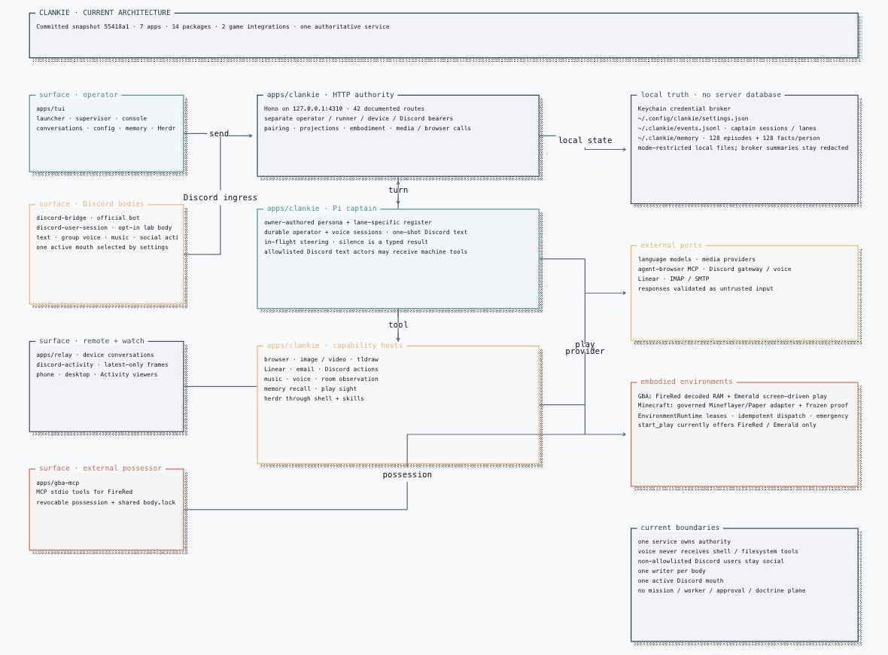
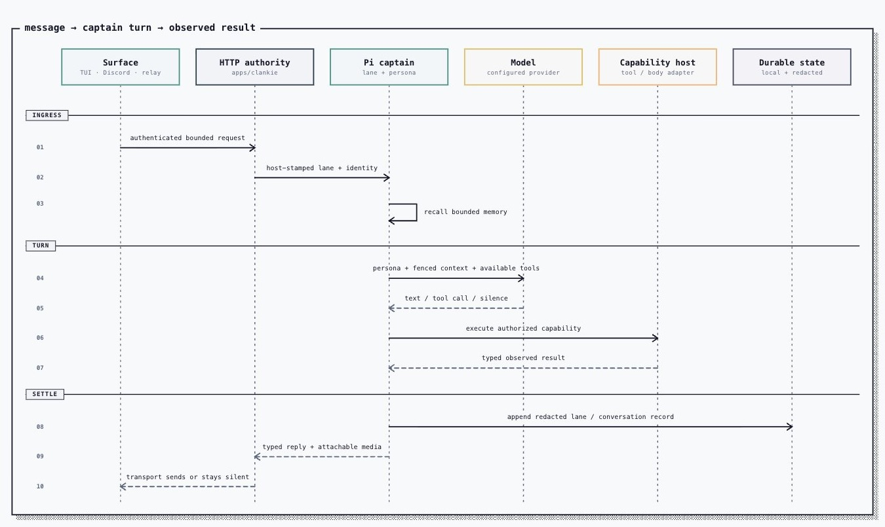
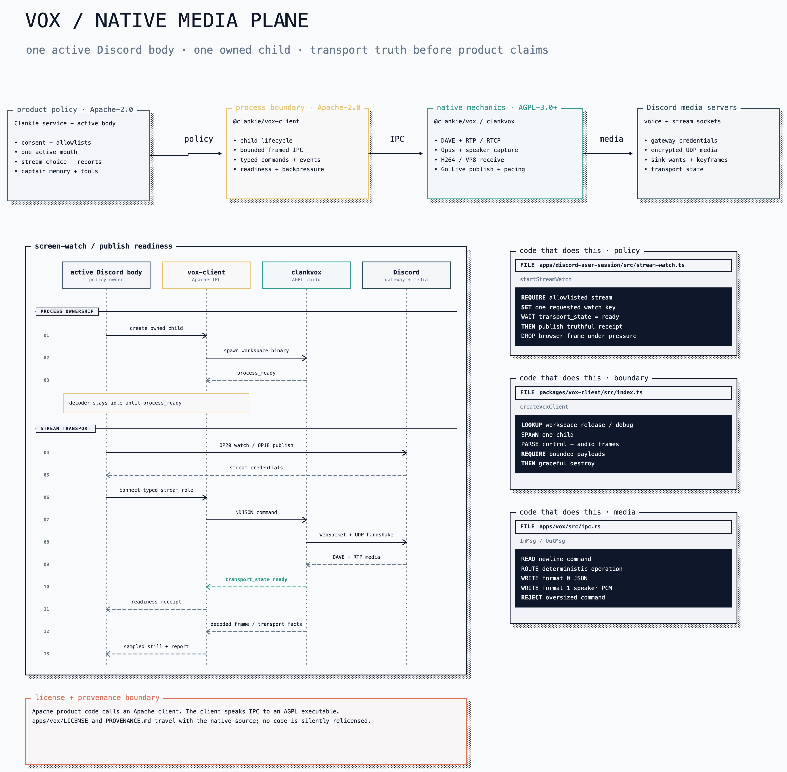

# Architecture

Clankie is one service plus the surfaces that reach it. The service owns the
captain (a [pi](https://pi.dev)-based agent with durable sessions), his tools,
his game bodies, and the HTTP API every surface speaks.

[Editable Turbopuffer tldraw source](diagrams/clankie-current-architecture.tldraw)

## How a message becomes a turn

A Discord message reaches the bridge, which posts it to
`POST /v1/captain/channel-turns`. The service normalizes it — untrusted body
fenced and labelled, images resolved to bytes at the last hop, channel context
attached — and prompts a pi session. Voice channels and operator conversations
get continuing sessions (pi JSONL trees that survive restarts); text turns are
one-shot, because the channel history rides in with each request. A one-shot
still writes its tree — one per turn under `~/.clankie/captain/turns/` — so the
tools it ran are readable afterwards
([ADR 0107](adr/0107-a-one-shot-turn-still-leaves-a-trail.md)). The reply
carries the turn's last screenshot or generated image with it, and replying
with the silence sentinel sends nothing: silence is a real answer. A one-shot
text run has a 10-minute hard ceiling so model reasoning and multiple bounded
tool calls can finish; expiry aborts its pi session and settles the turn as
`captain_turn_timeout`. The bridge separately stops refreshing Discord typing
after 60 seconds, so cosmetic presence cannot remain stuck.

The TUI and relay speak the same operator-conversation contract
(`/operator/v1/dispatch`): revision-fenced sends, cursored replay, long-polled
tails. A TUI process creates a fresh conversation unless `--chat` explicitly
resumes one. Conversation and Pi session are one lifetime: bounded retention
removes their shared directory, while public event logs rotate with typed cursor
recovery ([ADR 0111](adr/0111-a-console-process-starts-one-conversation.md)).
Conversations are files under `~/.clankie/captain/`. The full HTTP
surface is listed in [`apps/clankie/openapi.yaml`](../apps/clankie/openapi.yaml);
[`apps/clankie/scripts/setup-yaak.py`](../apps/clankie/scripts/setup-yaak.py)
builds a local Yaak workspace against it.

Operator input can invoke an exact loaded skill as `/name task` or
`/skill:name task`. The service rewrites that verified invocation to Pi's native
skill command and enables expansion for that prompt only. Discord input and
ordinary operator prompts keep expansion disabled.

Before each Pi run, a hidden host extension reads the newest bounded episode
card into the system prompt. The host supplies the destination lane, filters
operator-private notes out of ambient lanes, and refreshes recall without
persisting duplicate cards in the conversation. Discord turns also receive the
newest visible person facts for their authenticated guild/user identity. The
global 128-episode ring and per-person fact files live under
`~/.clankie/memory/`; the TUI's `/memory` command browses, edits, and forgets
that same store through operator-only routes. [`docs/memory.md`](memory.md) is
the full picture — what each store holds, who may read it, and what bounds it.

## Where things run

- **Captain tools.** Coding tools (read/bash/edit/write) are pi built-ins. They
  attach to the operator console and to Discord turns — text or voice — whose
  trigger actor is on `discord.systemActorUserIds`
  ([ADR 0095](adr/0095-discord-system-actors.md),
  [ADR 0105](adr/0105-voice-is-as-capable-as-the-room-it-is-in.md)). A
  privileged turn always runs on a one-shot session, so the grant never
  outlives the actor who earned it on the shared voice lane. They
  land in the conversation's workspace — the directory a workspace-scoped
  operator conversation names, this repository for every other lane
  ([ADR 0104](adr/0104-clankie-works-where-you-launched-him.md)). Voice join/leave
  are the same argument-free tools on Discord and the operator console: a
  Discord turn follows the authenticated speaker, an operator turn follows the
  configured owner ([ADR 0062](adr/0062-voice-join-by-asking.md)). The
  canonical authored-tool registry is
  [`apps/clankie/src/captain/tools.ts`](../apps/clankie/src/captain/tools.ts),
  connected-service additions live in
  [`captain/connect-tools.ts`](../apps/clankie/src/captain/connect-tools.ts), and
  the HTTP surface is
  [`apps/clankie/openapi.yaml`](../apps/clankie/openapi.yaml). This document does
  not duplicate their changing census.
- **Browser catalog.** The service registers the complete paginated
  `agent-browser` catalog with pi, but only everyday navigation tools and
  `browser_tool_search` start active. Browser calls are sequential across rooms;
  the subprocess receives no Clankie credentials, but true filesystem/network
  isolation requires a VM or remote broker ([ADR 0082](adr/0082-clankie-holds-the-browser.md)).
- **Leading agents.** Clankie leads coding agents through the herdr CLI over
  bash, guided by skills — there is no worker protocol. The service is his
  durable body; joining a herdr session (the operator console in a pane)
  is how he acquires the fleet. A seated turn attaches a live agent census
  so he can lead, route, and harvest without rediscovering the room. The
  herdr-lead board is the companion dashboard
  ([ADR 0097](adr/0097-herdr-lead-is-the-companion-dashboard.md)). Agents
  coordinate through herdr and plain files.
- **Game bodies.** `runFreePlay` drives one seam, `GbaDriverIo`; its mind,
  voice, progress, learned transitions, and behavior loop do not branch on
  where the body is. The shared journal format does preserve body-aware
  provenance at each causal stage, so evaluation can distinguish local state
  from a hosted body generation without creating a second play loop.
  Two bodies implement that seam. The local one is
  [`integrations/gba-emulator`](../integrations/gba-emulator/README.md), booted
  and leased by the local play host; `body-lock` keeps one writer on it across
  the free-play CLI, GBA MCP, and live session. The hosted one is a seat in a
  PokeAgent MMO world, reached through the published
  `@pokeagents/world-protocol` contract and entered with the `pokeagent_join_mmo`
  tool ([ADR 0103](adr/0103-a-hosted-world-is-another-body.md)). A hosted world
  cannot be paused, changes without him acting, and can replace his body under
  him. Owner settings independently enable the local emulator and hosted MMO;
  both may be available while the shared play host allows one live session
  across them. Frames from either flow to the Discord activity surface.
- **Auth.** Provider keys and OAuth tokens live in the credential broker
  (Keychain), written by the TUI `/auth` flow and read by pi through a
  credential-store bridge. Compatibility model/media provider keys may fall
  back to existing shell values or the gitignored root `.env.local` when the
  broker has no entry; Discord account and body credentials remain broker-only
  except documented operator/captain/runner test overrides. Persona is owner-authored in
  `~/.config/clankie/settings.json` and can never be set by a caller.
  `/connect` stores Linear and mailbox credentials the same way; Discord
  remains a body configured by `/discord` ([credential guide](credentials.md),
  [ADR 0093](adr/0093-owner-authored-service-connections.md)). A seat in a
  hosted world is a broker credential too — `pokeagent_mmo_world`, with the
  environment variant refused outright. An optional lab
  user-session body watches Discord screen shares and publishes Go Live through
  the owned `@clankie/vox` native media package ([Discord media guide](discord-media.md),
  [ADR 0100](adr/0100-vox-is-an-owned-native-media-package.md)).
  `/discord` Active body picks which process is the mouth; the launcher
  starts only that one ([ADR 0048](adr/0048-discord-user-session-transport.md)).
  Who may ask him to drive this machine from Discord is
  `discord.systemActorUserIds` ([ADR 0095](adr/0095-discord-system-actors.md)).

## Native media plane

[Editable Turbopuffer tldraw source](diagrams/vox-architecture.tldraw)

The active user-session body owns one `clankvox` child. Apache product code
speaks through `@clankie/vox-client`; the AGPL executable owns DAVE, RTP/RTCP,
codecs, capture, screen-watch, and Go Live publishing. Product receipts wait
for native `transport_state=ready` instead of treating process spawn as media
readiness.

## Current architecture constraints

Clankie uses pi's `ModelRuntime` and `createAgentSession` for the captain's
models, sessions, tools, skills, and compaction. The captain, HTTP surface, and
play host share one service
([ADR 0101](adr/0101-pi-owns-the-captain-model-runtime.md)).
Herdr exposes the coding-agent fleet as visible panes coordinated through its CLI
and plain files. Untrusted input stays fenced, secrets stay in the credential
broker, and every report describes observed outcomes rather than intentions.

[`adr/`](adr/) records the active decisions for play mechanics, voice, presence,
media, browsing, and operator control.

## Canonical Homes

| Concern                        | Canonical reference                                                                       |
| ------------------------------ | ----------------------------------------------------------------------------------------- |
| HTTP API                       | [`apps/clankie/openapi.yaml`](../apps/clankie/openapi.yaml)                               |
| Operator console and launcher  | [`apps/tui/README.md`](../apps/tui/README.md)                                             |
| Official Discord bot operation | [`apps/discord-bridge/README.md`](../apps/discord-bridge/README.md)                       |
| Shared Discord behavior        | [`packages/discord-presence-core/README.md`](../packages/discord-presence-core/README.md) |
| Personal-lab Discord body      | [`apps/discord-user-session/README.md`](../apps/discord-user-session/README.md)           |
| Possessor commentary/hearing   | [`packages/possessor-voice/README.md`](../packages/possessor-voice/README.md)             |
| Native media                   | [`apps/vox/README.md`](../apps/vox/README.md)                                             |
| Discord media surfaces         | [`docs/discord-media.md`](discord-media.md)                                               |
| Durable memory                 | [`docs/memory.md`](memory.md)                                                             |
| Credential identities/setup    | [`docs/credentials.md`](credentials.md)                                                   |
| Credential implementation      | [`packages/credential-broker/README.md`](../packages/credential-broker/README.md)         |
| Models                         | [`packages/model-provider/README.md`](../packages/model-provider/README.md)               |
