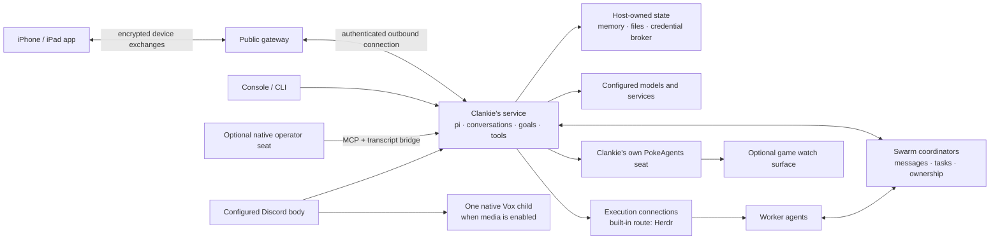

# Architecture

Clankie is a persistent assistant implemented as one service plus the clients
and connections around it. The service owns his built-in pi runtime,
conversations, goals, memory, tools, credentials, and authority. It can run on
an owner's machine or a hosted machine. The app and console are clients of
that service; a worker runtime and a work tracker are independent connections.

For a product overview, read [How he works](https://docs.clankie.bot/how-it-works/).
For source setup and the subsystem map, use [Contributing](../CONTRIBUTING.md)
and the [library index](README.md). This document owns the current system shape
and cross-component request flows. Historical diagrams remain in the ADR archive.

```mermaid
flowchart LR
  App["iPhone / iPad app"] <-->|"encrypted device exchanges"| Gateway["Public gateway"]
  Gateway <-->|"authenticated outbound connection"| Service["Clankie's service<br/>pi · conversations · goals · tools"]
  Console["Console / CLI"] --> Service
  Native["Optional native operator seat"] -->|"MCP + transcript bridge"| Service
  Discord["Configured Discord body"] --> Service
  Service --> State["Host-owned state<br/>memory · files · credential broker"]
  Service --> Models["Configured models and services"]
  Service <--> Swarm["Swarm coordinators<br/>messages · tasks · ownership"]
  Service --> Runtime["Execution connections<br/>built-in route: Herdr"]
  Runtime --> Workers["Worker agents"]
  Workers <--> Swarm
  Service --> World["Clankie's own PokeAgents seat"]
  World --> Viewer["Optional game watch surface"]
  Discord --> Vox["One native Vox child<br/>when media is enabled"]
```

Capabilities are configured per host. A managed Linux deployment does not
implicitly provide desktop input, Discord media, or a game world.
The [Linux guide](../infra/hosted/README.md) owns that deployment's capability
set; [Swarm](../packages/swarm/README.md#support-at-a-glance) owns worker-route
support. [ADR 0181](adr/0181-clankie-is-independent-of-his-connections.md)
records the separation between Clankie and his connections.

## Device and host authority

The host issues pairing offers and device sessions and decides every grant.
The public gateway carries bounded exchanges to an authenticated host over its
outbound connection. A paired device follows the returned host-scoped route;
its encrypted application payload stays between that device and the host.
Optional push delivery has a separate metadata store and authorization contract.
The [network reference](https://docs.clankie.bot/network/) owns the public
host-route table and transport boundary.

On a self-managed Mac, account sign-in enrolls the host at that doorway. On a
managed machine, signed bootstrap and pairing contracts supply the host identity.
The service-side contracts are documented in [credentials](credentials.md) and
[Linux deployment](../infra/hosted/README.md). Account, gateway deployment, and
managed provisioning implementation belong in the private operations repository
([ADR 0183](adr/0183-the-harness-is-public-the-hosted-service-is-private.md)).

## How a message becomes a turn

Each surface authenticates a request and selects a conversation. The service
runs or steers the turn, retains its result and exposes replay or live tails.
Discord transport, operator clients and native seats use the paths below;
autonomous continuations re-enter the same conversation queue.

### Discord ingress

The older [message-to-captain JPG](diagrams/clankie-message-turn-sequence.jpg)
is a historical snapshot; the present flow is described below.

A Discord message reaches the active bridge. A text-only message in the live
voice channel's attached chat enters that room's existing `VoiceFloor`; the
realtime room thread may answer aloud, ask Clankie to act, or stay silent,
and no separate text turn races it ([ADR 0124](adr/0124-one-self-has-many-local-threads.md)).
Every other message posts to `POST /v1/captain/channel-turns`. The service normalizes it — untrusted body
fenced and labelled, images resolved to bytes at the last hop, channel context
attached — and prompts a pi session. Every room gets a continuing session (a pi
JSONL tree that survives restarts): operator conversations, voice channels under
`~/.clankie/captain/voice/`, and text channels under `~/.clankie/captain/rooms/`
([ADR 0118](adr/0118-a-text-room-is-a-durable-lane.md)). A message that arrives
while that room's run is streaming is steered into it and reported `absorbed`,
so a burst of messages gets one merged reply rather than one reply each
([ADR 0091](adr/0091-a-mid-turn-message-steers-the-turn.md)). The channel
backlog still rides in with the request, and is used only when the lane does not
already hold that conversation. A privileged turn drops to a one-shot, which
writes its own tree under `~/.clankie/captain/turns/` so the tools it ran are
readable afterwards ([ADR 0107](adr/0107-a-one-shot-turn-still-leaves-a-trail.md)).
The reply carries the turn's last screenshot or generated image with it — and
when that artifact cannot be resolved, the words still post and say the picture
did not — while replying with the silence sentinel sends nothing: silence is a
real answer. Nothing caps how long a turn may take — looking something
up properly is work, not a fault — but a turn that emits no event at all for 5
minutes is a dead stream, so the stall watchdog aborts its pi session and
settles it as `captain_turn_stalled`. While someone waits on a slow requested
turn, he can post one short `send_text_update` message to the channel ("hang on,
pulling the bracket up") without ending it; work he elects to do on his own
stays quiet. In channels where the owner enables `/clankie tools mode:on`, the
host also edits one quiet tool-activity card with public-safe work categories,
counts, elapsed time, and a terminal state; tool names, arguments, and results
stay in the local Pi trail ([ADR 0134](adr/0134-discord-tool-work-is-a-status-card.md)).
Discord shows him typing as soon as ingress accepts a live message asked of
him (a DM, a mention, or one of his names), before calling Clankie, and it
stays visible through thinking and tool work. Room chatter he is merely shown
lights only when his reply stream can no longer be the silence sentinel, so a
turn he ends in silence never shows the room a reply being written. Buffered,
dropped, duplicate, and backlog catch-up messages do not start typing.

### Operator conversations and fleet views

The TUI and relay speak the same operator-conversation contract
(`/operator/v1/dispatch`): durable agent personas, their current fleet seats,
one coherent cursor-long-polled fleet snapshot, revision-fenced sends, cursored replay,
and long-polled tails. A tail carries two things: the durable events, and the
message the captain is typing right now — a volatile draft held in memory,
never in the event log, that the settled `message` event replaces in the block
it streamed into ([ADR 0141](adr/0141-the-console-watches-him-type.md)). Herdr
persona conversations are direct-send lanes with no Pi session. The persona
owns its name, full appearance tuple, DM, and channel memberships; its current
Herdr seat supplies live status, terminal routing, and its placement — the
Herdr workspace and tab it sits in, read from `herdr api snapshot` beside the
agent list — so a roster can be laid out the way the owner arranged the work.
Their readable
history folds the complete active user/assistant branch from Herdr's native
Claude Code, Codex, Pi, or Grok session identity; raw terminal bytes stay on the
terminal lane ([ADR 0135](adr/0135-a-herdr-seat-is-a-conversation.md)). The app
and controlled swarm-home Discord project those same host-owned records and
logs. Discord faces are app-baked PNGs served under content-hashed HTTPS paths
by the existing Activity origin
([ADR 0147](adr/0147-an-agent-persona-outlives-its-herdr-seat.md)).
Herdr's native event subscription advances the volatile fleet cursor; persona,
seat, channel, and stance changes advance the same cursor. Foreground apps
therefore render one current seats/personas/channels moment without polling or
persisting a second world projection
([ADR 0150](adr/0150-the-fleet-is-a-live-cursor.md)).

### Native operator seats

`clankie seat --harness codex` selects the [Codex plugin](../integrations/codex-plugin/README.md).
Its trusted native hooks add the shared identity, service context and memory card,
and sync redacted transcript entries to the selected conversation. The real Codex
TUI creates a thread on its owned app-server; the launcher reuses the same Codex
seat driver as fleet hires and the existing outbox pump for wakes, watches and
escalations. Hook trust is an owner step in `/hooks`. Until those hooks run, the
launcher does not bind the outbox. Claude remains the default harness.

The operator seat is a place any harness can sit
([ADR 0152](adr/0152-a-harness-takes-the-operator-seat.md)). `clankie seat`
opens Claude Code, on the owner's own plan, as Clankie: the plugin at
[`integrations/claude-plugin`](../integrations/claude-plugin/README.md) forces
his identity as the output style, injects the owner persona, reach, address,
and service model card at session start (`clankie prompt`) and the newest
memory card once per session and again when it changes (`clankie memory-card --hook`), and names one stdio MCP
server, `clankie mcp`, that bridges to the service's lane tool bank at
`/v1/mcp` with the operator bearer read from the broker. The bank is the same
authored registry the pi session is built from, wrapped once at runtime and
scoped by the bearer's lane, so a Codex pane with the same entry is the same
seat. A herdr pane named `clankie` is his head: the census binds it to his own
persona rather than a fleet contact and projects its transcript into the
conversation the app pins. While a seat is bound, self-wakes, herdr completion
watches, and room escalations reach it as channel events pushed by `clankie
mcp`; with no seat open they run the TUI operator lane on pi as before. Social
lanes never sit in the seat: the owner's plan carries only the owner. Every
fleet seat has a mailbox of its own, and a Claude Code seat launched with the
channel runs `clankie mcp --seat`, a channel-only bridge that polls it: a DM or
room turn then lands as a channel event instead of keystrokes typed into the
pane's pty. Local briefed Codex hires use a dedicated app-server: the native TUI
creates the session, `turn/start` and `turn/steer` deliver messages, and
`turn/completed` supplies completion. A native Codex TUI in Herdr connects to
that same server and thread for viewing and owner takeover. The adapter reports
the thread ID explicitly, so the fleet census does not depend on shared-daemon
hooks. Existing unmanaged Codex seats retain `codex queue` and terminal fallback,
so programmatic messages leave the owner's draft alone
([ADR 0161](adr/0161-a-fleet-seat-reads-its-mail-instead-of-its-keyboard.md)).

### Conversation selection and retention

A TUI process opens the existing main Clankie conversation unless `--chat`
selects another. `/new` creates a fresh conversation explicitly. A captain conversation and its Pi session are one lifetime: bounded
retention removes their shared directory, while public event logs rotate with
typed cursor recovery ([ADR 0111](adr/0111-a-console-process-starts-one-conversation.md)).
`/btw` temporarily selects an ephemeral child made with Pi's native current-leaf
fork, opening it on a clean screen at that boundary. A hidden boundary makes the
inherited branch reference-only; Ctrl+X swaps between the child and its parent
without discarding either, and Ctrl+C cancels and deletes the child, restores
the parent transcript, and replays any parent events that arrived meanwhile
([ADR 0143](adr/0143-btw-is-an-ephemeral-pi-fork.md)).
Discord text and voice captain rooms also appear in the operator conversation
registry under `room` scopes. Their native Pi trees remain in `rooms/`, `voice/`,
and `turns/`; the existing native-transcript projection folds context, messages,
and tools into the same replay/tail API used by the TUI and CLI. One room groups
its social, trusted, and one-shot session histories without merging their model
contexts or authority. Source checkpoints prevent duplicate replay after restart.
These records are read-only from operator surfaces: only the authenticated
Discord transport submits room turns. See
[ADR 0176](adr/0176-every-room-is-an-inspectable-conversation.md).

Conversations are files under `~/.clankie/captain/`. Each settled operator or
Discord captain turn also appends one metrics line to
`~/.clankie/captain/turn-settled.jsonl`: tool-name counts, first mutating tool,
context-token occupancy, the model/provider/effort that actually executed the
turn, and the provider-reported `totalTokens` summed over the turn with the
number of reports that contributed. Execution identity is read off the live pi
session as the turn executes, so a `/model` or `/effort` change under a live
conversation lands on the next turn to execute rather than being reconstructed
from a settings snapshot afterwards. Unknown is said out loud: a row from before
the capture, or a provider that reported nothing, reads back as `null` — never
zero, and context occupancy is never treated as usage or a charge.
`GET /v1/captain/turn-metrics` and `clankie metrics` return the same bounded
rows, newest first. The file sits beside `autonomy.json`, outside the
conversation directory the retention pass deletes. It is not `~/.clankie/events.jsonl` —
that log already uses `captain.turn.settled` for presence idle/waiting_user, and
the captain does not write domain events. An absorbed steer
([ADR 0091](adr/0091-a-mid-turn-message-steers-the-turn.md)) shares the owning
run's line. The full HTTP
surface is listed in [`apps/clankie/openapi.yaml`](../apps/clankie/openapi.yaml);
[`apps/clankie/scripts/setup-yaak.py`](../apps/clankie/scripts/setup-yaak.py)
imports that canonical catalog into Yaak and adds a Keychain-backed `Local`
environment for authenticated requests.

### Goals and autonomous continuation

The service also keeps `autonomy.json`: one owner-approved goal and one
replaceable self-wake per operator conversation, plus a global enable switch.
An unreadable file fails closed and surfaces `state_unreadable` to operator
clients instead of silently re-enabling autonomous work.
An active goal queues host-authored continuation turns through the same
conversation chain as operator messages, so every tool call and reply stays in
the existing Pi session and public event log. A human message that arrives
while that run is streaming steers it by default; in-flight tool calls still
finish. Explicit `delivery: "steer"` also joins a human-started Pi turn, while
`delivery: "queue"` waits for a separate turn on the conversation FIFO
([ADR 0091](adr/0091-a-mid-turn-message-steers-the-turn.md)). A
token budget moves a goal to `budget_limited`; `/goal` owns activation,
pause/resume, and clearing, while `/autonomy off` stops new continuations and
wakes. A due wake queues one turn with Clankie's recorded reason and may be
replaced by another. Neither path changes the conversation's tool set or
authority ([ADR 0130](adr/0130-goals-and-self-wakes-share-the-operator-thread.md)).
Each conversation also keeps an append-only goal decision journal under
`~/.clankie/captain/goal-journal/` — one line per real choice made while
working a goal, written through `note_goal_decision` and returned by
`get_goal` so a continuation resumes from what was already decided
([ADR 0132](adr/0132-a-goal-keeps-a-decision-journal.md)).

### Independent evaluation

The optional independent evaluator captures settled Pi turns and native Herdr
reply projections under `~/.clankie/captain/evaluator/`. Its durable queue dispatches
one Codex or Claude Code assessment at a time in a separate Herdr pane; structured
reports retain outcome, efficiency, tool and harness judgments plus issue/MR
links. Goal identity groups continuations, while conversation checkpoints leave
task boundaries to the evaluator. Evaluator descendants are excluded from capture.
`clankie evaluator` and `/evaluator` expose the operator API controls. Linear
following remains independent. See [ADR 0178](adr/0178-the-evaluator-has-its-own-seat.md)
for scheduling, restart recovery and evidence limits.

Exact Discord speech is available through a bounded captain read that returns
content only while owner-controlled transcript retention is enabled. The TUI
and `clankie discord transcripts` use this shared transcript store.

Operator input can invoke an exact loaded skill as `/name task` or
`/skill:name task`. The service rewrites that verified invocation to Pi's native
skill command and enables expansion for that prompt only. Discord input and
ordinary operator prompts keep expansion disabled.

Before each Pi run, a hidden host extension reads the newest bounded episode
card into the system prompt. The host supplies the destination lane, filters
operator-private notes out of ambient lanes, and refreshes recall without
persisting duplicate cards in the conversation. Discord turns also receive the
newest visible person facts for their authenticated guild/user identity. The
bounded recent and retained episodes and per-person fact files live under
`~/.clankie/memory/`; the TUI's `/memory` command browses, edits, and forgets
that same store through operator-only routes. [`docs/memory.md`](memory.md) is
the full picture — what each store holds, who may read it, and what bounds it.

A second hidden extension appends the model card: the name, ref, and provider he
is actually running on, his reasoning effort, and his context and output limits.
It resolves the same selection Pi executes, on every run rather than once per
session, because `/model` and `/effort` swap the model under a live conversation.
Asked what he runs on, he answers from the prompt like he answers with his own
address — no tool call, no guess, and silence if the selection cannot be resolved.

## Where things run

- **Machine tools.** Coding tools (read/bash/edit/write) are pi built-ins. They
  attach to the operator console and to Discord turns authorized by the
  machine-control grants
  ([ADR 0095](adr/0095-discord-system-actors.md),
  [ADR 0105](adr/0105-voice-is-as-capable-as-the-room-it-is-in.md),
  [ADR 0133](adr/0133-a-machine-grant-belongs-to-a-discord-lane.md)). An
  individually granted actor gets a one-shot tool-bearing turn in shared rooms
  and a durable tool-bearing lane in an official-bot DM. Explicitly trusted
  guilds, optionally narrowed to channels, give every admitted member the same
  durable tool-bearing lane. Social and system histories have separate session
  keys, so revocation routes the next message away from the old tool bank. They
  land in the conversation's workspace — the directory a workspace-scoped
  operator conversation names, this repository for every other lane
  ([ADR 0104](adr/0104-clankie-works-where-you-launched-him.md)). Voice join/leave
  are the same argument-free tools on Discord and the operator console: a
  Discord turn follows the authenticated speaker, an operator turn follows the
  configured owner ([ADR 0062](adr/0062-voice-join-by-asking.md)). The
  canonical authored-tool registry is
  [`apps/clankie/src/captain/tools.ts`](../apps/clankie/src/captain/tools.ts),
  connected-service additions live in
  [`captain/connect-tools.ts`](../apps/clankie/src/captain/connect-tools.ts), and
  the HTTP surface is
  [`apps/clankie/openapi.yaml`](../apps/clankie/openapi.yaml). This document does
  not duplicate their changing census.
- **Browser catalog.** The service registers the complete paginated
  `agent-browser` catalog with pi, but only everyday navigation tools and
  `browser_tool_search` start active. Browser calls are sequential across rooms;
  the subprocess receives no Clankie credentials, but true filesystem/network
  isolation requires a VM or remote broker ([ADR 0082](adr/0082-clankie-holds-the-browser.md)).
  The persistent profile holds his own accounts, signed up for by hand: the
  catalog's `headed` argument relaunches the browser visible on the operator's
  screen, so he can hand over the window for a signup, a CAPTCHA, or a phone
  check rather than grinding at it ([ADR 0127](adr/0127-his-accounts-are-his.md)).
  Browsing defaults to headless. After 60 seconds without a browser call, the
  host saves any recording and closes the burst's tabs/windows, including a
  takeover window. Persistent logins remain; the next burst starts headless.
  Startup retires the private daemon so stale headed settings cannot carry over.
  Hard work in the owner's own apps and Chrome goes to a hired computer-use
  harness where one is ready; the service detects them and the reach card
  lists them on machine-access lanes
  ([ADR 0199](adr/0199-hard-computer-work-goes-to-a-computer-use-harness.md)).
- **Leading agents.** Swarm MCP owns cross-session messages and task ownership,
  guided by `lead` and `swarm-lead`. The per-conversation host and supported
  worker delivery paths live in [the Swarm package](../packages/swarm/README.md).
  Herdr supplies terminals and process control for the built-in worker route;
  `herdr-lead` is the explicit fallback for unenrolled agents. The service's
  selected runtime supplies every console's fleet view. Current binding and
  fallback behavior live in [the CLI reference](cli.md#herdr-statusopencreate--herdr-use-name).
  Native Herdr events wake fleet readers across workspaces
  ([ADR 0150](adr/0150-the-fleet-is-a-live-cursor.md)); the optional herdr-lead
  board is a view, not a second coordination authority.
- **His body.** `runFreePlay` drives one seam, `GbaDriverIo`
  ([`packages/play`](../packages/play/README.md)); its mind, voice, progress,
  learned transitions, and behavior loop hold no emulator and never learn what
  implements the seam. One body implements it: Clankie's separately
  credentialed seat in a PokeAgents world, reached through `WorldPlayerClient`
  on `@pokeagents/world-protocol/ipc` (`WORLD_ADDRESS` unix, tcp, or tls —
  defaulting to the world's own socket under `WORLD_STATE_DIR`) and entered
  with the `pokeagent_join_mmo` tool
  ([ADR 0103](adr/0103-a-hosted-world-is-another-body.md),
  [ADR 0145](adr/0145-the-world-is-the-only-body.md)). Clankie is the
  parent of that sitting; `@clankie/play` is the driver — the same split other
  harnesses get from an MCP Task, a subagent, or a CLI loop. That seam consumes
  verified FireRed adapter-v2 and Emerald adapter-v2 payloads, selected by the
  observation's `(gameId, adapterVersion)` pair; unknown pairs and
  game-specific extras the selected schema does not verify fail closed. A
  hosted world cannot be paused, changes without him acting, and can replace
  his body under him, so the loop offers no save, load, or restart action —
  the world persists its own cartridge. `pokeagentMmoEnabled` is the owner
  setting; with it off, or with no world reachable, the ask refuses out loud
  rather than falling back. Frames flow to the Discord activity surface.
  Every sitting carries a stable journey identity separate from its run id, the
  bounded story spans that journey, and the next sitting receives the last
  self-authored notes and objective while exact world state stays with the
  cartridge save
  ([ADR 0126](adr/0126-game-state-history-and-memory-have-separate-owners.md)).
  The journal records body provenance at each causal stage, and its `venue`
  still reads both values because journals written before ADR 0145 are on disk.
  Other harnesses reach the same world through PokeAgents' own front doors —
  `@pokeagents/world-mcp`, its CLI, or the `pokeagent-mmo` skill — each on its
  own credentialed seat, as the same parent-plus-driver sitting (MCP Task,
  host subagent, or CLI loop; PokeAgents ADR 0023), with no control over
  Clankie, Activity publication, play voice, or room input.
  `EnvironmentRuntime` leases remain internal
  action/session fences within the owning runtime; they are not cross-process
  possession.
- **Spider-Man.** Rivals Agent owns tactical decisions and the guarded real-time
  pad loop. Clankie's `rivals` tool and operator API manage bounded sittings,
  objectives, fresh observations, and read-only sharing; the existing Go Live
  PNG publisher carries its video. The Pokémon seam remains unchanged in scope.
  See [ADR 0175](adr/0175-rivals-agent-is-a-gameplay-skill.md) and [setup](rivals.md).
- **PokeAgents boundary.** The sibling PokeAgents repository owns the
  `WORLD_OPERATIONS` catalog, capability schemas, native client transport, and
  the MCP projection derived from that catalog. MCP carries calls; the world
  contract and host enforce player identity, authority, and gameplay semantics.
  Clankie currently imports only the pinned `@pokeagents/world-protocol`
  package (including `/ipc`) and keeps host, emulator, persistence, and
  world-MCP packages out of product source. Hosted play composes
  `WorldPlayerClient`. Every catalog operation is classified body or mind;
  unclassified names stay off `pokeagent_world` until classified. The play loop
  owns BODY (`world.join`, `world.leave`, `play.observe`, `play.act`,
  `play.frame`, `play.watch`); the mind owns session, who, regions, travel, and
  challenges.
- **Auth.** Provider keys and OAuth tokens live in the credential broker
  (Keychain), written by the TUI `/auth` flow and read by pi through a
  credential-store bridge. Compatibility model/media provider keys may fall
  back to existing shell values or the gitignored root `.env.local` when the
  broker has no entry; Discord account and body credentials remain broker-only
  except documented operator/captain test overrides. Persona is owner-authored in
  `~/.config/clankie/settings.json` and can never be set by a caller.
  `/connect` stores Linear and mailbox credentials the same way; Discord
  remains a body configured by `/discord` ([credential guide](credentials.md),
  [ADR 0093](adr/0093-owner-authored-service-connections.md)). The mailbox is
  his own address, not the owner's inbox: `email.fromAddress` carries the
  identity when the provider login differs, Clankie states that address
  from settings, and mail stays console-only because sign-in codes arrive there
  ([ADR 0127](adr/0127-his-accounts-are-his.md)). That address is public, so every
  message the mail tools return is labelled untrusted sender text the way a
  Discord body is ([ADR 0081](adr/0081-an-image-is-part-of-what-is-said.md)). A seat in a
  hosted world is a broker credential too — `pokeagent_mmo_world`, with the
  environment variant refused outright. Each media-enabled active Discord body
  owns one `clankvox` child through the Apache `@clankie/vox-client` boundary.
  A text-only official-bot process does not spawn Vox. Both media-enabled bodies
  use its primary role for voice, TTS, and music; the lab user body can
  concurrently watch screen shares and publish Go Live through separate roles
  ([Discord media guide](discord-media.md),
  [ADR 0128](adr/0128-vox-is-the-sole-discord-media-owner.md)).
  `/discord` Active body picks which process is the mouth; the launcher
  starts only that one ([ADR 0048](adr/0048-discord-user-session-transport.md)).
  Who may ask him to drive this machine from Discord is configured under
  `discord.systemActorUserIds`, `systemActorGuildIds`, and
  `systemActorChannelIds`
  ([ADR 0133](adr/0133-a-machine-grant-belongs-to-a-discord-lane.md)).

## Native media plane

Each media-enabled active bot or user-session body owns exactly one `clankvox`
child. A text-only official-bot process owns none. Apache product code speaks
through `@clankie/vox-client`; the AGPL executable owns DAVE, RTP/RTCP, codecs,
capture, TTS/music pacing, screen-watch, and Go Live publishing. The TypeScript
`DiscordVoiceSession` retains consent, attribution, floor, realtime-provider,
and captain-handoff policy.

Readiness is role-specific: versioned `process_ready` must exactly match the
client IPC protocol and proves only that the child can serve IPC;
`transport_state=ready` proves a role's Discord media transport; and positive
`dave_state=ready` proves that role's negotiated DAVE session. Primary voice
ready, connection, transport, DAVE, and error events are correlated by the
caller's `connectionId`. The detailed current diagram and evidence rules live in
[ADR 0128](adr/0128-vox-is-the-sole-discord-media-owner.md).

## Current architecture constraints

Clankie uses pi's `ModelRuntime` and `createAgentSession` for Clankie's
models, sessions, tools, skills, and compaction. The agent runtime, HTTP surface, and
play host share one service
([ADR 0101](adr/0101-pi-owns-the-captain-model-runtime.md)).
Swarm owns cross-session task coordination and messages. Herdr exposes the
current built-in workers as visible panes through its CLI; `herdr-lead` supplies
the fallback for unenrolled agents. Untrusted input stays fenced, secrets stay in the credential
broker, and every report describes observed outcomes rather than intentions.

[`adr/`](adr/) records the active decisions for play mechanics, voice, presence,
media, browsing, and operator control.

## Distribution

The macOS Apple silicon release preserves these process boundaries inside one
self-contained, versioned directory. A native `clankie` launcher starts the
bundled TUI and Node runtime; the supervisor starts compiled service entrypoints
instead of pnpm workspace scripts. Runtime state and credentials remain outside
the immutable release. [ADR 0136](adr/0136-a-release-is-one-command-and-one-runtime.md)
records the decision, and [`distribution.md`](distribution.md) documents the
artifact and installer. Product skills and `clankie doctor` travel with the
release so he can describe and set up this machine without a git tree
([ADR 0142](adr/0142-the-install-tells-him-the-truth.md)).

## Canonical Homes

The [documentation library](README.md) maps each concern to its owning reference.
Command syntax belongs in [CLI](cli.md), HTTP operations in
[OpenAPI](../apps/clankie/openapi.yaml), and subsystem implementation in the
owning package. This architecture document links to those contracts rather
than keeping a second catalog.

## Hosted Mac console

The launcher resolves local/hosted mode before starting services. Hosted mode
pairs a revocable operator device through account sign-in and carries requests
inside the existing encrypted device envelope. No local body or operator bearer
is started or exported. See the [ADR 0173 amendment](adr/0173-the-gateway-cannot-read-device-traffic.md#amendment-the-mac-can-be-a-hosted-operator-device-2026-09-27-vuh-1110)
for authority and the [CLI contract](cli.md#local-and-hosted-connection-modes)
for supported commands and recovery. Fleet ticket issuance stays private.
