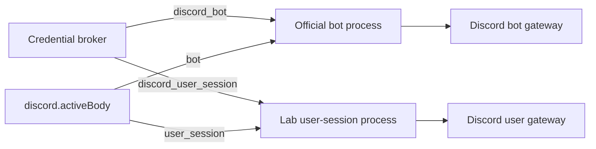

# Credentials and identities

Clankie keeps account secrets in the credential broker (macOS Keychain by
default). Non-secret application, guild, channel, role, and allowlist settings
live in `~/.config/clankie/settings.json`. Do not put Discord tokens in that
file, `.env.local`, shell profiles, commands, logs, or issue text.

## Discord bot token versus user token

These credentials are not interchangeable.

| Credential         | Broker id              | Owner                     | Used by                     | Authorization form       |
| ------------------ | ---------------------- | ------------------------- | --------------------------- | ------------------------ |
| Official bot token | `discord_bot`          | A Discord application bot | `apps/discord-bridge`       | Discord bot gateway/REST |
| Normal-user token  | `discord_user_session` | A normal Discord account  | `apps/discord-user-session` | Bare user gateway/REST   |

The official bot token comes from the Discord Developer Portal's **Bot** page.
It is the supported default for text, voice, slash commands, and the embedded
Activity. There is one `discord_bot` slot and one running bot client; Clankie
does not implement a bot-token pool.

The user token is the credential of a normal account, not an application bot
token. Discord forbids automating normal user accounts. Clankie keeps this
personal-lab body off by default and requires explicit enablement, non-empty
allowlists, a durable owner acknowledgement, and `activeBody=user_session`.
Only this body can watch another person's share or publish Go Live.

Both account tokens may remain stored, but the launcher starts exactly one
Discord body. The processes do not share credentials or gateways.

## Configure Discord

Use the TUI's direct `/discord` flow. `/auth` is for model/vendor credentials;
using its advanced custom-provider entry for Discord reaches the same broker but
skips the Discord-specific setup and checks.

### Official bot

1. Create a Discord application and bot, enable the required intents, and copy
   the bot token.
2. Run `/discord`, store **Bot token**, and set the application, guild/channel,
   text, voice, and Activity identifiers you use.
3. Generate/install the invite from `/discord` or `/discord invite`.
4. Select the **Official bot** active body and run `clankie restart discord`.
5. Verify with `/discord status`, `pnpm discord:readiness`, and, when voice is
   enabled, `pnpm discord:voice-readiness`.

### Personal-lab user body

1. Run `/discord` directly, store **User token**, and enable the lab body.
2. Set non-empty guild, text-channel, and voice-channel allowlists.
3. Record the ToS/account-risk acknowledgement in that flow.
4. When spoken requests are required, set
   `discord.userSessionVoiceEnabled=true` in `settings.json`; `/discord status`
   shows the effective value. Enter explicit voice-channel ids in the lab
   wizard rather than relying on a blank fallback.
5. Select the **Lab user body** and build Vox with
   `pnpm --filter @clankie/vox build`.
6. Run `clankie restart` and
   `pnpm --filter @clankie/discord-user-session readiness`.

Replacing either account token requires restarting the process that logged into
that gateway. Revoking the lab opt-in blocks the next privileged action without
waiting for a restart.

## Local Clankie bearers

Local bearers authenticate Clankie processes to each other. They are not
Discord account tokens and must never be pasted into the Discord portal.

| Broker id                           | Principal                                         |
| ----------------------------------- | ------------------------------------------------- |
| `clankie_operator`                  | Trusted local operator APIs                       |
| `clankie_captain`                   | Captain dispatch and lane APIs                    |
| `clankie_runner`                    | Embodiment/runner APIs                            |
| `clankie_discord_bridge`            | Official-bot text lane                            |
| `clankie_discord_voice_bridge`      | Official-bot voice lane                           |
| `clankie_discord_user_bridge`       | User-body text lane                               |
| `clankie_discord_user_voice_bridge` | User-body voice lane                              |
| `clankie_activity_producer`         | Private Activity frame producer/snapshot listener |
| `clankie_possessor_voice`           | Local gameplay commentary/hearing seam            |

The owning service mints these values. Models never receive them. The four
Discord lane bearers are intentionally distinct, so a body or text lane cannot
claim another transport by changing a request field.

Discord also issues short-lived voice and stream-server credentials after a
gateway session is established. Those runtime values go directly to the media
owner and are neither operator configuration nor broker entries.

## Provider credentials

`/auth` manages model/vendor API keys and OAuth credentials such as `openai`,
`openai-codex`, `anthropic`, `xai`, and `elevenlabs`. `/connect` manages service
credentials such as Linear and email. Provider consumers may use their declared
environment fallback when no broker entry exists; Discord account and internal
body credentials remain broker-only. The only internal bearer environment
exceptions are the documented operator/captain/runner test and CI overrides.

Storage implementation and grant validation details live in
[`@clankie/credential-broker`](../packages/credential-broker/README.md).
