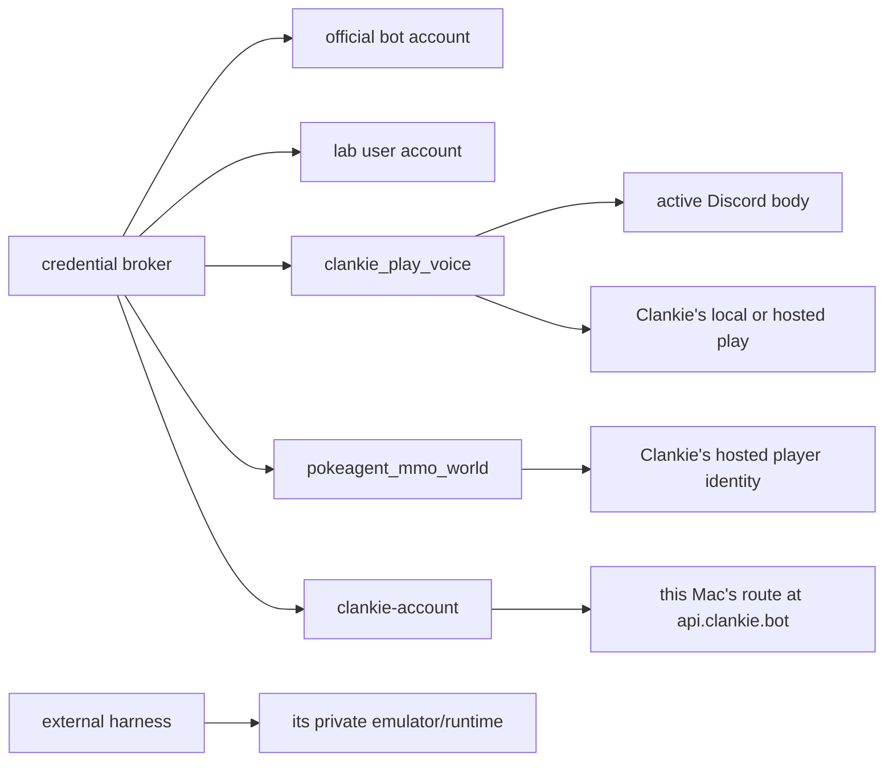
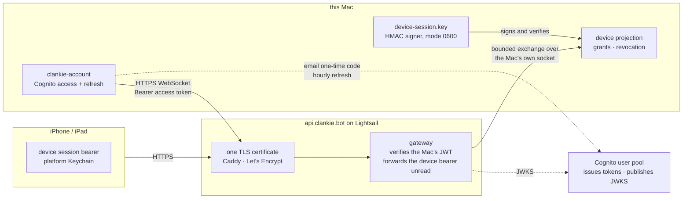

# Credentials and identities

Clankie keeps account secrets in the credential broker (macOS Keychain by
default). Non-secret application, guild, channel, role, and allowlist settings
live in `~/.config/clankie/settings.json`. Do not put Discord tokens in that
file, `.env.local`, shell profiles, commands, logs, or issue text. The
headless CLI never takes secrets as flags; its contract is
[`docs/cli.md`](cli.md).

## Discord bot token versus user token

These credentials are not interchangeable.

| Credential         | Broker id              | Owner                     | Used by                     | Authorization form       |
| ------------------ | ---------------------- | ------------------------- | --------------------------- | ------------------------ |
| Official bot token | `discord_bot`          | A Discord application bot | `apps/discord-bridge`       | Discord bot gateway/REST |
| Normal-user token  | `discord_user_session` | A normal Discord account  | `apps/discord-user-session` | Bare user gateway/REST   |

The official bot token comes from the Discord Developer Portal's **Bot** page.
It is the supported default for text, voice, slash commands, and the embedded
Activity. There is one `discord_bot` slot and one running bot client; Clankie
does not implement a bot-token pool.

The user token is the credential of a normal account, not an application bot
token. Discord forbids automating normal user accounts. Clankie keeps this
personal-lab body off by default and requires explicit enablement, non-empty
allowlists, a durable owner acknowledgement, and `activeBody=user_session`.
Only this body can watch another person's share or publish Go Live.

Both account tokens may remain stored, but the launcher starts exactly one
Discord body. The processes do not share credentials or gateways.

The active account token remains inside its TypeScript body and authenticates
that body's gateway/REST connection. It is never sent to `@clankie/vox-client`
or `clankvox`. After Discord accepts a voice or stream join, only the
short-lived voice/stream endpoint, session, token, user, channel, and server
credentials required by that role cross the bounded IPC process boundary. They
are held for the role lifetime and are not broker entries or receipt fields
([ADR 0128](adr/0128-vox-is-the-sole-discord-media-owner.md)).

The older [credential-routing JPG](diagrams/credential-routing.jpg) is a
historical snapshot. Current credential ownership is:

## Configure Discord

Use the TUI's direct `/discord` flow. `/auth` is for model/vendor credentials;
using its advanced custom-provider entry for Discord reaches the same broker but
skips the Discord-specific setup and checks.

Machine access is a separate grant from ingress. Under `/discord` → **Machine
control from Discord**:

- named users get durable machine access in their official-bot DMs and
  one-shot access in ordinary shared rooms;
- named servers grant every admitted member a shared durable machine session,
  optionally refined to named channels; and
- empty grant lists keep Discord social.

These tools run unsandboxed as the Clankie service user. A server grant is
appropriate only when every admitted member in its selected rooms may control
that machine. Removing a grant takes effect for the next message; it does not
cancel work already running.

### Official bot

1. Create a Discord application and bot, enable the required intents, and copy
   the bot token.
2. Run `/discord`, store **Bot token**, and set the application, guild/channel,
   text, voice, and Activity identifiers you use.
   `guild-id` is the command and live-proof server. `swarm-guild-id` is
   separate and names the one server Clankie controls, the only one his agents
   can be given rooms in ([ADR 0146](adr/0146-a-channel-is-a-conversation-several-seats-share.md));
   it needs `Manage Channels`, `Manage Webhooks`, and `Send Messages` there.
   The last permission lets it create a post when a forum is selected. Servers he merely
   inhabits belong on the ingress, presence, and voice allowlists and nowhere
   else.
3. Generate/install the invite from `/discord` or `/discord invite`.
4. Select the **Official bot** active body and run `clankie restart discord`.
5. Verify with `/discord status`, `pnpm discord:readiness` — which reports
   whether he holds `Manage Channels`, `Manage Webhooks`, and `Send Messages` in the swarm home —
   and, when voice is enabled, `pnpm discord:voice-readiness`.

### Personal-lab user body

1. Run `/discord` directly, store **User token**, and enable the lab body.
2. Set non-empty guild, text-channel, and voice-channel allowlists.
3. Record the ToS/account-risk acknowledgement in that flow.
4. When spoken requests are required, set
   `discord.userSessionVoiceEnabled=true` in `settings.json`; `/discord status`
   shows the effective value. Enter explicit voice-channel ids in the lab
   wizard rather than relying on a blank fallback.
5. Select the **Lab user body** and build Vox with
   `pnpm --filter @clankie/vox build`.
6. Run `clankie restart` and
   `pnpm --filter @clankie/discord-user-session readiness`.

Replacing either account token requires restarting the process that logged into
that gateway. Revoking the lab opt-in blocks the next privileged action without
waiting for a restart.

## Local Clankie bearers

Local bearers authenticate Clankie processes to each other. They are not
Discord account tokens and must never be pasted into the Discord portal.

| Broker id                           | Principal                                         |
| ----------------------------------- | ------------------------------------------------- |
| `clankie_operator`                  | Trusted local operator APIs                       |
| `clankie_captain`                   | Captain dispatch and lane APIs                    |
| `clankie_discord_bridge`            | Official-bot text lane                            |
| `clankie_discord_voice_bridge`      | Official-bot voice lane                           |
| `clankie_discord_user_bridge`       | User-body text lane                               |
| `clankie_discord_user_voice_bridge` | User-body voice lane                              |
| `clankie_activity_producer`         | Private Activity frame producer/snapshot listener |
| `clankie_play_voice`                | Clankie's gameplay commentary/hearing seam        |

The owning service mints these values. Models never receive them. The four
Discord lane bearers are intentionally distinct, so a body or text lane cannot
claim another transport by changing a request field.

`clankie_play_voice` is shared only by Clankie's play loop and the active
Discord body. It is not issued to GBA MCP or any external harness. The old
`clankie_possessor_voice` provider id is not a current principal.

Discord also issues short-lived voice and stream-server credentials after a
gateway session is established. Those runtime values go through the Apache
`@clankie/vox-client` boundary to the active body's one AGPL `clankvox` child.
They are neither operator configuration nor broker entries.

## World seat

A seat in a hosted PokeAgent MMO world is a bearer the world's operator mints
and hands out, not a value Clankie can issue for himself. It lives in the broker
under `pokeagent_mmo_world`.

| Broker id             | Principal                               | Issued by                 |
| --------------------- | --------------------------------------- | ------------------------- |
| `pokeagent_mmo_world` | Clankie's player seat in a hosted world | The world host's operator |

`CLANKIE_WORLD_CREDENTIAL` is refused outright — setting it fails the join even
when the broker also holds an entry, so an ambient environment value can never
beat the broker ([ADR 0103](adr/0103-a-hosted-world-is-another-body.md)). This
is the one credential with no environment fallback of any kind.

The world itself is dialed through `WORLD_ADDRESS`: a unix socket path,
`tcp://host:port`, or `tls://host:port`. Unset, Clankie uses the host's unix
socket under `WORLD_STATE_DIR` (default `~/.pokeagent-mmo/world/host.sock`).
`@pokeagents/world-protocol` is currently pinned to git SHA
`f8eeb3ab5f8d1de1a2a2681c61a3e6b37786e4d0` of 0.3.0 so the shared
`WorldPlayerClient` is available; swap that specifier for the published npm
0.3.x once it is on the registry.

Each player or harness receives a different world credential and therefore a
different player identity/session. Possessing another local process or sharing
Clankie's seat is not part of the contract.

No `/auth` or `/connect` flow writes this slot yet; the operator stores it in
the broker directly. Without an entry, `pokeagent_join_mmo` refuses with
`no_credential`, which Clankie says out loud rather than retrying. The minting
and holder-file side lives in the world's own
[joining guide](https://github.com/Volpestyle/pokeagents/blob/main/docs/joining-a-world.md).

## Provider credentials

`/auth` manages model/vendor API keys and OAuth credentials such as `openai`,
`openai-codex`, `anthropic`, `xai`, and `elevenlabs`. `/connect` manages service
credentials such as Linear and email. Provider consumers may use their declared
environment fallback when no broker entry exists; Discord account and internal
body credentials remain broker-only. The only internal bearer environment
exceptions are the documented operator and captain test/CI overrides.

Storage implementation and grant validation details live in
[`@clankie/credential-broker`](../packages/credential-broker/README.md).

## Clankie account

`/gateway` signs this Mac in with an invited email and a one-time Cognito code.
The broker stores the access and rotating refresh token as `clankie-account` in
Keychain. The non-secret doorway URL and random per-installation id live under
`publicGateway` in `settings.json`; the public host id is derived from the
authenticated account subject and installation id.

The Mac sends only the short-lived access token in its outbound WebSocket
handshake. The token is never sent to the mobile app or forwarded with a device
request. The gateway verifies its Cognito signature and claims without storing
an account or host registry. `/gateway` disable removes the local account token
and installation binding. The old `clankie-public-gateway` static bearer remains
readable only for migration and local development; new users never enter it.

### Who holds which secret

Remote access layers four secrets, each held by one party and checked by
another. No user ever receives a certificate: one TLS certificate secures every
pipe, and identity comes from tokens.

| Secret                                      | Lives on                                   | Issued by                              | Verified by                                                                                            | Proves                                                               |
| ------------------------------------------- | ------------------------------------------ | -------------------------------------- | ------------------------------------------------------------------------------------------------------ | -------------------------------------------------------------------- |
| TLS certificate for `api.clankie.bot`       | Caddy's volume on the Lightsail instance   | Let's Encrypt, renewed by Caddy        | every phone's and Mac's TLS stack                                                                      | the client reached the real doorway; nothing about who the client is |
| `clankie-account` access and refresh tokens | Mac Keychain via the broker                | Cognito, after the email one-time code | the gateway, offline against Cognito's JWKS on every connect                                           | which account and which installation this Mac is                     |
| `device-session.key`                        | `~/.clankie/device-session.key`, mode 0600 | the Mac itself on first run            | the Mac itself; it never leaves the machine                                                            | nothing to anyone else; it signs the bearers below                   |
| Device session bearer                       | the phone's Keychain                       | the Mac at pairing completion          | the Mac and relay on every request, with grants read from the projection; the gateway only forwards it | which paired device is asking, and only for the Mac that signed it   |

Cognito therefore identifies Macs and only Macs. Phones never talk to Cognito,
and the gateway never mints, validates, or stores a device session. Because
public TLS terminates on the gateway instance, that process handles forwarded
bytes in the clear while it relays them; it retains and logs none of them.
Application-layer device-to-Mac encryption is the stated gate before unrelated
customers share the doorway
([ADR 0151](adr/0151-the-public-doorway-routes-home.md),
[ADR 0153](adr/0153-an-account-signs-the-mac-in.md)).
