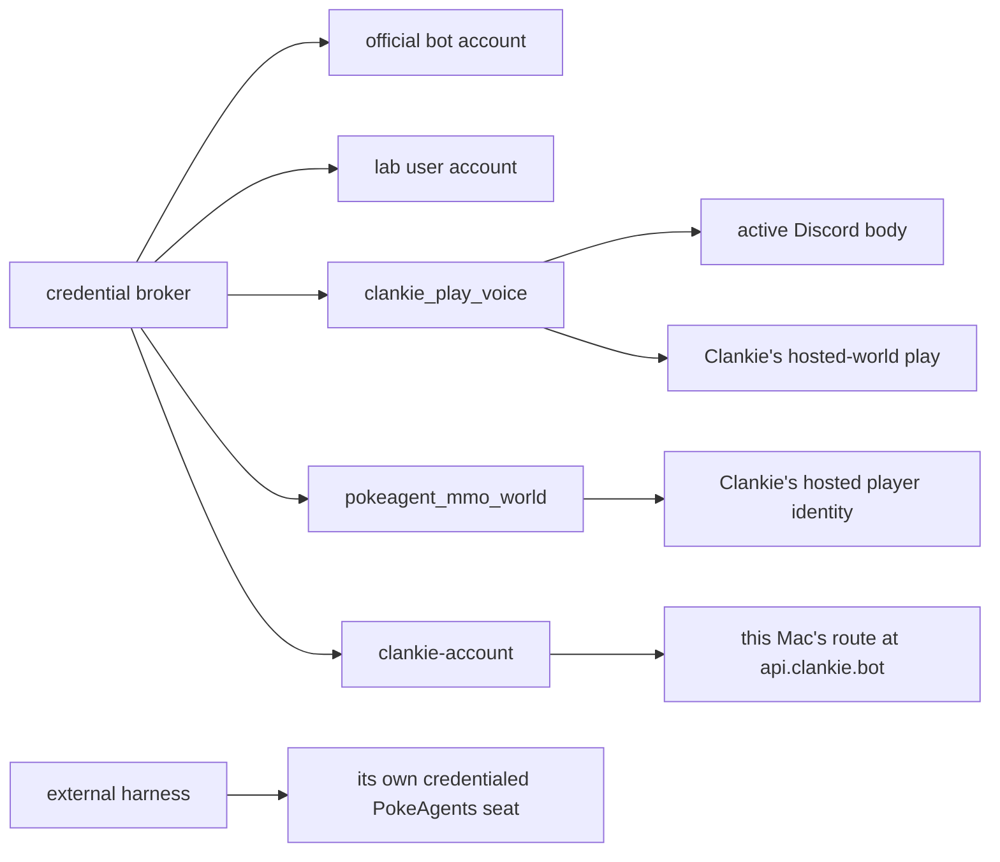
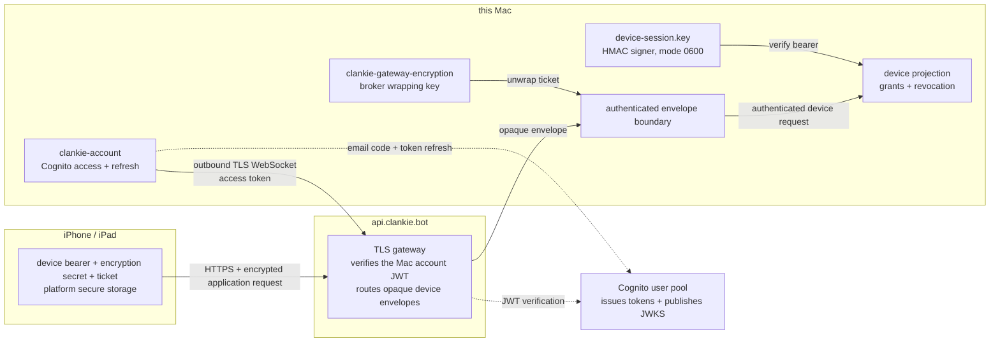

# Credentials and identities

Clankie keeps account secrets in the credential broker (macOS Keychain by
default; a private file backend on Linux). Non-secret persona, account,
runtime, Discord, voice, and game preferences live in
`~/.config/clankie/settings.json`. Non-secret settings can still be private.
Do not put Discord tokens in that
file, `.env.local`, shell profiles, commands, logs, or issue text. The
headless CLI never takes secrets as flags; its contract is
[`docs/cli.md`](cli.md).

For Linear worker names and portraits, connect a verified workspace-owned app
through `/connect linear` or `accounts connect linear-app --client-id ID --secret-stdin`.
Its client credentials and renewable app token stay in the broker's `linear`
entry. [Worker posts](linear-worker-posts.md) covers setup, account verification
and replacement of existing grants.

For initial setup, use [Get started](https://docs.clankie.bot/get-started/).
This reference owns credential identities and trust boundaries. The
[broker implementation](../packages/credential-broker/README.md) owns storage
and locking; [worker access](worker-access.md) owns restricted delegation.

## Discord bot token versus user token

These credentials are not interchangeable.

| Credential         | Broker id              | Owner                     | Used by                     | Authorization form       |
| ------------------ | ---------------------- | ------------------------- | --------------------------- | ------------------------ |
| Official bot token | `discord_bot`          | A Discord application bot | `apps/discord-bridge`       | Discord bot gateway/REST |
| Normal-user token  | `discord_user_session` | A normal Discord account  | `apps/discord-user-session` | Bare user gateway/REST   |

The official bot token comes from the Discord Developer Portal's **Bot** page.
It is the supported default for text, voice, slash commands, and the embedded
Activity. There is one `discord_bot` slot and one running bot client; Clankie
does not implement a bot-token pool.

The user token is the credential of a normal account, not an application bot
token. Discord forbids automating normal user accounts. Clankie keeps this
personal-lab body off by default and requires explicit enablement, non-empty
allowlists, a durable owner acknowledgement, and `activeBody=user_session`.
Only this body can watch another person's share or publish Go Live.

Both account tokens may remain stored, but the launcher starts exactly one
Discord body. The processes do not share credentials or gateways.

The active account token remains inside its TypeScript body and authenticates
that body's gateway/REST connection. It is never sent to `@clankie/vox-client`
or `clankvox`. After Discord accepts a voice or stream join, only the
short-lived voice/stream endpoint, session, token, user, channel, and server
credentials required by that role cross the bounded IPC process boundary. They
are held for the role lifetime and are not broker entries or receipt fields
([ADR 0128](adr/0128-vox-is-the-sole-discord-media-owner.md)).

The older [credential-routing JPG](diagrams/credential-routing.jpg) is a
historical snapshot. Current credential ownership is:

```mermaid
flowchart LR
  Broker[credential broker]
  Broker --> Bot[official bot account]
  Broker --> User[lab user account]
  Broker --> PlayVoice[clankie_play_voice]
  Broker --> Seat[pokeagent_mmo_world]
  Broker --> Account[clankie-account]
  Account --> Doorway[this Mac's route at api.clankie.bot]
  PlayVoice --> Active[active Discord body]
  PlayVoice --> ClankiePlay[Clankie's hosted-world play]
  Seat --> ClankieSeat[Clankie's hosted player identity]
  Harness[external harness] --> Private[its own credentialed PokeAgents seat]
```

## Configure Discord

Use the TUI's direct `/discord` flow. `/auth` is for model/vendor credentials;
using its advanced custom-provider entry for Discord reaches the same broker but
skips the Discord-specific setup and checks.

Machine access is a separate grant from ingress. Under `/discord` → **Machine
control from Discord**:

- named users get durable machine access in their official-bot DMs and
  one-shot access in ordinary shared rooms;
- named servers grant every admitted member a shared durable machine session,
  optionally refined to named channels; and
- empty grant lists keep Discord social.

These tools run unsandboxed as the Clankie service user. A server grant is
appropriate only when every admitted member in its selected rooms may control
that machine. Removing a grant takes effect for the next message; it does not
cancel work already running.

### Official bot

1. Create a Discord application and bot, enable the required intents, and copy
   the bot token.
2. Run `/discord`, store **Bot token**, and set the application, guild/channel,
   text, voice, and Activity identifiers you use.
   `guild-id` is the command and live-proof server. `swarm-guild-id` is
   separate and names the one server Clankie controls, the only one his agents
   can be given rooms in ([ADR 0146](adr/0146-a-channel-is-a-conversation-several-seats-share.md));
   it needs `Manage Channels`, `Manage Webhooks`, and `Send Messages` there.
   The last permission lets it create a post when a forum is selected. Servers he merely
   inhabits belong on the ingress, presence, and voice allowlists and nowhere
   else.
   Set the managed server in `/discord` → **Server, application, and roles**
   (`none` clears it) or with `clankie discord set --swarm-guild-id ID`, then
   restart. Agent channels then reach Discord from the app's channel page or the
   CLI: `clankie conversations rooms` lists the managed server's rooms, and
   `clankie conversations channel [ID] --title T --member PERSONA_ID ...
--discord provision [--room ROOM_ID]` creates or projects a room
   (`--discord off` removes the projection; `--webhook-stdin` takes a
   hand-made webhook URL on stdin). Both use the operator dispatch API's
   `channel`, `channels`, and `discord_rooms` operations.
3. Generate/install the invite from `/discord` or `/discord invite`.
4. Select the **Official bot** active body and run `clankie restart discord`.
5. Verify with `/discord status`, `pnpm discord:readiness` — which reports
   whether he holds `Manage Channels`, `Manage Webhooks`, and `Send Messages` in the managed server —
   and, when voice is enabled, `pnpm discord:voice-readiness`.

### Personal-lab user body

1. Run `/discord` directly, store **User token**, and enable the lab body.
2. Set non-empty guild, text-channel, and voice-channel allowlists.
3. Record the ToS/account-risk acknowledgement in that flow.
4. When spoken requests are required, run
   `clankie discord set --user-session-voice-enabled true`; `/discord status`
   shows the effective value. Enter explicit voice-channel ids in the lab
   wizard rather than relying on a blank fallback.
5. Select the **Lab user body** and build Vox with
   `pnpm --filter @clankie/vox build`.
6. Run `clankie restart` and
   `pnpm --filter @clankie/discord-user-session readiness`.

Replacing either account token requires restarting the process that logged into
that gateway. Revoking the lab opt-in blocks the next privileged action without
waiting for a restart.

## Local Clankie bearers

Local bearers authenticate Clankie processes to each other. They are not
Discord account tokens and must never be pasted into the Discord portal.

| Broker id                           | Principal                                         |
| ----------------------------------- | ------------------------------------------------- |
| `clankie_operator`                  | Trusted local operator APIs                       |
| `clankie_captain`                   | Captain dispatch and lane APIs                    |
| `clankie_discord_bridge`            | Official-bot text lane                            |
| `clankie_discord_voice_bridge`      | Official-bot voice lane                           |
| `clankie_discord_user_bridge`       | User-body text lane                               |
| `clankie_discord_user_voice_bridge` | User-body voice lane                              |
| `clankie_activity_producer`         | Private Activity frame producer/snapshot listener |
| `clankie_play_voice`                | Clankie's gameplay commentary/hearing seam        |

The owning service mints these values. Models never receive them. The four
Discord lane bearers are intentionally distinct, so a body or text lane cannot
claim another transport by changing a request field.

`clankie_play_voice` is shared only by Clankie's play loop and the active
Discord body. It is not issued to any external harness. The old
`clankie_possessor_voice` provider id is not a current principal.

Discord also issues short-lived voice and stream-server credentials after a
gateway session is established. Those runtime values go through the Apache
`@clankie/vox-client` boundary to the active body's one AGPL `clankvox` child.
They are neither operator configuration nor broker entries.

## World seat

A seat in a hosted PokeAgent MMO world is a bearer the world's operator mints
and hands out, not a value Clankie can issue for himself. It lives in the broker
under `pokeagent_mmo_world`.

| Broker id             | Principal                               | Issued by                 |
| --------------------- | --------------------------------------- | ------------------------- |
| `pokeagent_mmo_world` | Clankie's player seat in a hosted world | The world host's operator |

`CLANKIE_WORLD_CREDENTIAL` is refused outright — setting it fails the join even
when the broker also holds an entry, so an ambient environment value can never
beat the broker ([ADR 0103](adr/0103-a-hosted-world-is-another-body.md)). This
is the one credential with no environment fallback of any kind.

The world itself is dialed through `WORLD_ADDRESS`: a unix socket path,
`tcp://host:port`, or `tls://host:port`. Unset, Clankie uses the host's unix
socket under `WORLD_STATE_DIR` (default `~/.pokeagent-mmo/world/host.sock`).
Clankie uses the published `@pokeagents/world-protocol` package's shared
`WorldPlayerClient`; the installed version is pinned in `apps/clankie/package.json`.

Each player or harness receives a different world credential and therefore a
different player identity/session. Possessing another local process or sharing
Clankie's seat is not part of the contract.

No `/auth` or `/connect` flow writes this slot yet; the operator stores it in
the broker directly. Without an entry, `pokeagent_join_mmo` refuses with
`no_credential`, which Clankie says out loud rather than retrying. The minting
and holder-file side lives in the world's own
[joining guide](https://github.com/Volpestyle/pokeagents/blob/main/docs/joining-a-world.md).

## Provider credentials

`/auth` manages model/vendor API keys and OAuth credentials such as `openai`,
`openai-codex`, `anthropic`, `xai`, and `elevenlabs`. `/connect` manages service
credentials such as Linear and email. Provider consumers may use their declared
environment fallback when no broker entry exists; Discord account and internal
body credentials remain broker-only. The only internal bearer environment
exceptions are the documented operator and captain test/CI overrides.

For compatibility, the clankie service also fills absent environment keys from
a gitignored root `.env.local`; existing shell values win. `pnpm doctor`
reports broker status and exported OpenAI/Anthropic fallbacks without loading
`.env.local` or printing secret values.

Storage implementation and grant validation details live in
[`@clankie/credential-broker`](../packages/credential-broker/README.md).

## Clankie account

`/gateway` signs this Mac in with an invited email and a one-time Cognito code.
The broker stores the access and rotating refresh token as `clankie-account` in
Keychain. The non-secret doorway URL and random per-installation id live under
`publicGateway` in `settings.json`; the public host id is derived from the
authenticated account subject and installation id.

The pool rotates refresh tokens, so each refresh kills the one it spent: the
broker writes the replacement to Keychain before it validates anything else in
the answer. A malformed access token then costs one retry instead of remote
access. A refresh the pool answers with an error is terminal — including
`Refresh token reuse detected`, which is how rotation reports a spent token and
revokes the chain. The connector parks, `clankie gateway status` and `doctor`
report `sign_in_required`, and `/gateway` signs this Mac back in. Only a rate
limit or Cognito's own failure is retried.

The Mac sends only the short-lived access token in its outbound WebSocket
handshake. The token is never sent to the mobile app or forwarded with a device
request. The gateway verifies its Cognito signature and claims without storing
an account or host registry. `/gateway` disable removes the local account token
and installation binding. The old `clankie-public-gateway` static bearer remains
readable only for migration and local development; new users never enter it.

### Who holds which secret

Self-hosted remote access uses account credentials to connect the Mac and device
credentials to authorize the phone. Device application traffic is encrypted
between those endpoints, in addition to TLS on each network connection.

```mermaid
flowchart LR
  subgraph Phone["iPhone / iPad"]
    Device["device bearer + encryption secret + ticket<br/>platform secure storage"]
  end
  subgraph Edge["api.clankie.bot"]
    Gateway["TLS gateway<br/>verifies the Mac account JWT<br/>routes opaque device envelopes"]
  end
  subgraph Mac["this Mac"]
    Account["clankie-account<br/>Cognito access + refresh"]
    WrappingKey["clankie-gateway-encryption<br/>broker wrapping key"]
    Encryption["authenticated envelope boundary"]
    DeviceKey["device-session.key<br/>HMAC signer, mode 0600"]
    Devices["device projection<br/>grants + revocation"]
  end
  Cognito["Cognito user pool<br/>issues tokens + publishes JWKS"]
  Device -->|"HTTPS + encrypted application request"| Gateway
  Account -->|"outbound TLS WebSocket<br/>access token"| Gateway
  Account -. "email code + token refresh" .-> Cognito
  Gateway -. "JWT verification" .-> Cognito
  Gateway -->|"opaque envelope"| Encryption
  WrappingKey -->|"unwrap ticket"| Encryption
  Encryption -->|"authenticated device request"| Devices
  DeviceKey -->|"verify bearer"| Devices
```

| Credential                                  | Stored by                                                         | Purpose                                                                                                     |
| ------------------------------------------- | ----------------------------------------------------------------- | ----------------------------------------------------------------------------------------------------------- |
| TLS certificate for `api.clankie.bot`       | Gateway TLS terminator                                            | Authenticates the public origin and protects the network connection                                         |
| `clankie-account` access and refresh tokens | Mac credential broker                                             | Cognito authenticates the account; the gateway verifies the access token and derives the installation route |
| `device-session.key`                        | Mac private state, mode 0600                                      | Signs and verifies device bearers locally                                                                   |
| Device session bearer                       | Phone secure storage                                              | Identifies the paired device; the Mac and relay check its live grants and revocation                        |
| `clankie-gateway-encryption` wrapping key   | Mac credential broker                                             | Seals tickets so the gateway cannot recover their contents                                                  |
| Device encryption secret and wrapped ticket | Phone secure storage; secret sealed inside the host-issued ticket | Authenticates and encrypts device application requests and responses                                        |

A secure QR or full link transfers the initial pairing secret in its fragment,
which is never sent as an HTTP URL. Pairing completion returns a new device
secret and ticket. Refresh rotates them with the session; revocation is checked
against the live device projection. A ticket does not replace the device bearer.

The gateway sees routing metadata, ciphertext lengths and timing, but cannot
read device bearers, conversations or terminal bytes. Plaintext application
routes are refused. There is no forward secrecy: a later endpoint-key compromise
can expose recorded traffic from that key's lifetime. Push routing metadata,
Cognito sign-in and signed Linear webhooks have separate contracts.

Managed bodies use fleet-issued host credentials and additional pairing and
restore protections described in the [hosted guide](../infra/hosted/README.md).
[ADR 0173](adr/0173-the-gateway-cannot-read-device-traffic.md) records the device
encryption boundary and recovery procedure. Matching gateway, host and app
versions and deployment evidence are required before external release; source
implementation alone does not establish production readiness.
