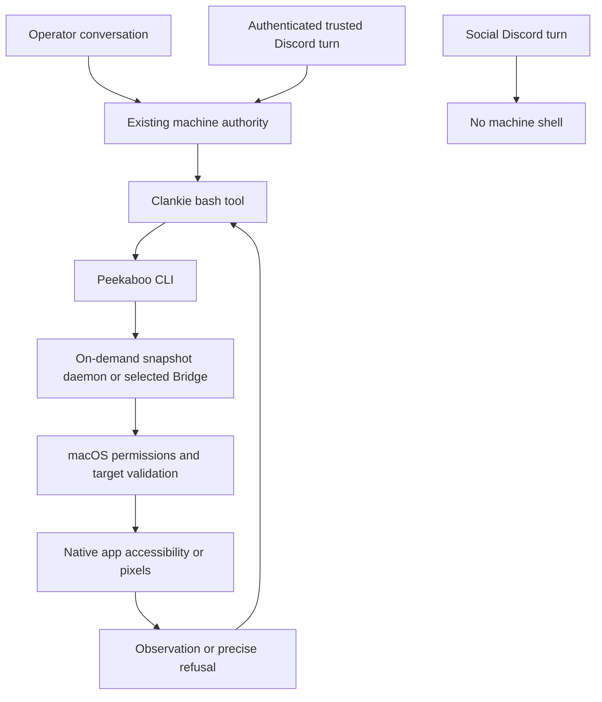

# Native desktop control

Clankie's native macOS desktop integration uses the standalone
[Peekaboo CLI](https://github.com/openclaw/Peekaboo/releases/tag/v4.3.0) through
his existing machine-authorized shell. The
[desktop-control skill](../.agents/skills/desktop-control/SKILL.md) supplies
discovery, exact-target observation, snapshot handling, and verification.
Operator conversations have machine tools. Authenticated Discord machine
grants use the same tools, while social turns remain without a shell; the
[authority plan](../apps/clankie/src/captain/system-authority.ts) owns this
distinction.

## Current readiness

The local CLI is Peekaboo **4.3.0**, source
`44eff916c3330739108cc1d73683338d4250503a`. Version/help and strict signature
and notarization checks pass. The selected snapshot host reports Screen
Recording, Accessibility, and Event Synthesizing granted.

Read-only Spotify observation is **partial**: the exact-window tree request
returns nine application-level elements, zero interactable elements,
`semantic_scope: application_partial`, `snapshot_id: null`,
`snapshot_reusable: false`, and `mutation_targeting_available: false`. Its
warning identifies an incomplete accessibility read, not a traversal budget
limit. The pixel-only exact-window request refuses with `CAPTURE_FAILED`:
the selected host reports incompatible process-lifetime ScreenCaptureKit
ownership, with no capture dispatched. A granted permission and a successful
partial response do not establish usable song-row or menu control.

These observations come from the installation shell. Clankie's service-shell
path and Spotify interactions require independent proof. Full native desktop
parity is unproven; no permission grant, focus change, playback command, or
library modification is part of the installation proof.

## Installation and permissions

The official universal release archive is installed intact, including its
Swift compatibility library and MIT license:

| Item                   | Location or identity                                               |
| ---------------------- | ------------------------------------------------------------------ |
| Executable on PATH     | `~/.local/bin/peekaboo`                                            |
| Versioned distribution | `~/.local/share/peekaboo/cli/4.3.0/`                               |
| Executable link target | `../share/peekaboo/cli/4.3.0/peekaboo`                             |
| Archive SHA-256        | `fec965e4bd6371b8fb017fb582e8d31c6a59628f77e266878f45cf1d4844836f` |
| Signing identity       | `Developer ID Application: OpenClaw Foundation (FWJYW4S8P8)`       |

The distribution's README documents putting the CLI on PATH. This user-owned
installation needs no `sudo` or shell configuration change. The
[official installation guide](https://github.com/openclaw/Peekaboo/blob/v4.3.0/docs/install.md)
also provides Homebrew and npm distributions. Verify a release's archive
against its published checksum and preserve its signed executable and adjacent
libraries. Avoid an unpinned download during a captain turn.

For this non-app executable, the relevant notarization check is:

```sh
codesign --verify --strict --verbose=4 -R='notarized' --check-notarization \
  ~/.local/share/peekaboo/cli/4.3.0/peekaboo
```

`spctl --type execute` reports that this raw binary is valid but is not an
app; that result is not a passed app assessment. Signature and explicit
notarization verification cover both the CLI and its adjacent
`libswiftCompatibilitySpan.dylib`.

Check the executable and permissions from the actual execution context:

```sh
command -v peekaboo
peekaboo --version --json
peekaboo permissions status --all-sources --json
```

The [permission guide](https://github.com/openclaw/Peekaboo/blob/v4.3.0/docs/permissions.md)
requires macOS 15 or later, Accessibility for native UI automation, and Screen
Recording for capture. Relevant keyboard/synthetic-input paths also need
Event Synthesizing. The selected source and runtime socket identify the host
whose permissions matter. Pin that socket with `--bridge-socket` when comparing
permission and observation results; an initial default host and the
build-scoped snapshot host can differ.

If a permission is denied, report that host and the missing permission. The
human enables the identified host in System Settings → Privacy & Security →
Accessibility or Screen & System Audio Recording, then repeats the check.
Do not change TCC, remove quarantine, replace signatures, or route through
Codex's permissions. Runtime compatibility refusals are distinct from missing
permissions; permission changes are not a demonstrated fix for the current
Spotify result.

## Observe through the existing tools



Inventory the app, then select the observed exact window. `WINDOW_ID` below
is assigned from the returned inventory, never copied from an old receipt:

```sh
peekaboo window list --app Spotify --json
peekaboo see --app Spotify --window-id "$WINDOW_ID" --tree --no-screenshot --json
```

[Tree-only observation](https://github.com/openclaw/Peekaboo/blob/v4.3.0/docs/commands/see.md)
does not focus the target or save screenshots. `--web-focus` is a separate
focus-changing operation and is inappropriate for read-only proof. Check
partial-read warnings and snapshot eligibility before using element IDs.
Successful CLI exit alone is insufficient. A snapshot-like string in a debug
log does not supersede `snapshot_id: null` in the result.

The supported on-demand daemon holds snapshots in memory and exits after its
idle timeout. It uses local Unix sockets, not an added HTTP/TCP service or a
login item. Default permission inspection can select `daemon.sock`; `see`
can select a build-scoped `daemon-<build-id>.sock`. Explicit socket selection
keeps a sequence on one host. A concrete snapshot reference belongs to its
live producer; process exit invalidates that continuity. Do not assume two
`--no-remote` CLI invocations share snapshots.

For authorized visual observation, pass a private temporary screenshot path
and use Clankie's existing image-capable `read` tool. Pixel evidence does not
establish accessible rows. Keep only the receipt needed for the task; library
dumps and screenshots do not belong in this repository.

## Interaction and verification boundary

An authorized interaction uses an element and reusable snapshot from fresh
observation. [Click](https://github.com/openclaw/Peekaboo/blob/v4.3.0/docs/commands/click.md)
and [named AX actions](https://github.com/openclaw/Peekaboo/blob/v4.3.0/docs/commands/action.md)
have different foreground rules. In particular, `action AXPress` and
`action AXShowMenu` require explicit foreground mode. Inspect the installed
help and the task's authorization before choosing a route. Observe again
after every action; a dispatched event does not prove a visible effect.

The independent proof follows the actual Clankie operator conversation →
shell tool → installed CLI → real host → Spotify path. Record version,
execution host, permissions, exact target, semantic completeness, snapshot
eligibility, and outcome. Report observation and interaction separately.
Read-only proof excludes focus changes, clicks, menu opening, playback, and
library edits. A later authorized interaction proof can open and dismiss a
specific More options menu without choosing an entry, then confirm the prior
state; it remains a separate unit.

## Interface choice

Peekaboo's [MIT license](https://github.com/openclaw/Peekaboo/blob/v4.3.0/LICENSE)
and public CLI support reuse without copying Codex's proprietary desktop
plugin or helper. Pi's existing shell and skill mechanism supplies the
integration; no extra model runtime or Spotify automation script is needed.
Use purpose-built interfaces for basic playback and browser tools for page
content.

Peekaboo also provides a supported
[stdio MCP server](https://github.com/openclaw/Peekaboo/blob/v4.3.0/docs/MCP.md).
Clankie's [MCP host](../apps/clankie/src/mcp-host.ts) currently projects only
text results and distinguishes operator-only servers from servers available
everywhere. Direct desktop MCP exposure needs image/metadata fidelity and
authenticated machine-turn authority at that boundary. Enabling an
`everywhere` desktop server would give social rooms machine access; it is not
the CLI integration. [ADR 0109](adr/0109-mcp-is-how-he-reaches-a-service.md)
remains the ownership model for any future MCP connection.
