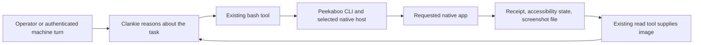

# Native computer use

Clankie uses [Peekaboo](https://github.com/openclaw/Peekaboo) as his general macOS
computer-use provider. His existing machine-authorized shell calls the CLI;
his existing image-capable file reader shows screenshots to his model. Clankie
interprets the interface and chooses the next action. Peekaboo supplies capture,
accessibility inspection, clicks, typing, keys, scrolling, dragging, and menus.
There is no additional agent/model or app-specific automation engine in this path.

The [desktop-control skill](../.agents/skills/desktop-control/SKILL.md) is the
agent-facing workflow. Use browser tools for web pages and purpose-built APIs
when they directly cover a task.

## Execution and authority



The [authority plan](../apps/clankie/src/captain/system-authority.ts) controls
machine access. Social turns do not acquire a shell. UI content remains untrusted
data. A model choice does not grant desktop capabilities or macOS permissions.

CLI plus image-file reading uses the existing captain tools and needs no MCP
adapter changes. The current generic [MCP host](../apps/clankie/src/mcp-host.ts)
projects text results only, so direct image-returning MCP integration requires
image preservation before it can replace this path. `peekaboo agent` and
`--analyze` are not needed: Clankie already supplies the reasoning loop.

## Installed provider

The official Peekaboo **4.3.0** universal CLI archive is installed intact, with
its Swift compatibility library and MIT license.

| Item             | Value                                                              |
| ---------------- | ------------------------------------------------------------------ |
| Command          | `~/.local/bin/peekaboo`                                            |
| Distribution     | `~/.local/share/peekaboo/cli/4.3.0/`                               |
| Source           | `44eff916c3330739108cc1d73683338d4250503a`                         |
| Archive SHA-256  | `fec965e4bd6371b8fb017fb582e8d31c6a59628f77e266878f45cf1d4844836f` |
| Signing identity | `Developer ID Application: OpenClaw Foundation (FWJYW4S8P8)`       |

Strict signature and notarization verification pass for this release. The
[installation guide](https://github.com/openclaw/Peekaboo/blob/v4.3.0/docs/install.md)
and [release](https://github.com/openclaw/Peekaboo/releases/tag/v4.3.0) describe
supported installation. Preserve the signed executable and adjacent libraries.
No permission, quarantine, signing, or ownership bypass is part of integration.

```sh
peekaboo --version --json
peekaboo permissions status --all-sources --json
peekaboo window list --app "$APP" --json
```

`APP` is the requested application; choose `WINDOW_ID` from current inventory.
Use a verified absolute executable path if the service's PATH omits it. A
permission result applies to its reported host, not every possible caller.

## General observation and action loop

Assign `IMAGE_PATH` to a temporary PNG path and capture the exact target:

```sh
peekaboo see --app "$APP" --window-id "$WINDOW_ID" --path "$IMAGE_PATH" --json
```

Read the receipt, then the actual screenshot using Clankie's `read` tool.
Use accessibility element IDs when present and screenshots when AX is sparse.
For text-only inspection use `--tree --no-screenshot`; increase depth to 48
only when traversal depth explains the missing content. A partial application
fallback is not an exact-window action target.

Choose an authorized primitive such as `click`, `type`, `press`, `scroll`,
`drag`, `set-value`, or `action`. Element actions require a fresh reusable
snapshot and actual element IDs. Coordinate actions require screenshot-backed
coordinate mapping and a valid live producer receipt. After each action,
observe again and verify the intended effect before continuing. See the
[automation guide](https://github.com/openclaw/Peekaboo/blob/v4.3.0/docs/guide/automation.md)
and installed command help for each primitive.

Normal CLI observations use an on-demand host that owns snapshots in memory.
Keep an explicitly selected Bridge socket consistent across observation and
action. A short-lived `--no-remote` CLI process cannot hand a reusable snapshot
to a later process. Matching filenames, titles, or IDs do not replace ownership.

Observation does not request foreground focus. Preserve task restrictions:
`--web-focus` can change keyboard focus and input commands can require explicit
`--foreground`. Neither is an automatic fallback for a refused background
operation. Do not infer a no-focus guarantee for an untested interaction.

## Current capture readiness

Default and explicit classic capture through the installed 4.3.0 remote host
refuse before dispatch with an ownership-capability error despite granted
permissions. [Upstream #684](https://github.com/openclaw/Peekaboo/pull/684) is
merged but is not in the latest published 4.3.0 release. It separates implemented
support from startup readiness and restores proven same-host classic recovery.
The current remote refusal is not evidence that the selected host is old or
that another application actually captured the screen.

Peekaboo's documented **caller-local classic capture works for read-only pixels**:

```sh
peekaboo see --app "$APP" --window-id "$WINDOW_ID" --no-elements \
  --no-remote --capture-engine classic --path "$IMAGE_PATH" --json
```

The operator-shell receipt identifies the `CGWindowList` engine and a real
exact-window PNG. Clankie's existing file reader emits that PNG as an image
attachment; the selected model must support image input. This path does not
enter ScreenCaptureKit and requires the caller's own existing permission.
It does not change the remote host or its safety checks.
Its returned snapshot expires with the local process, so this observation does
not qualify subsequent coordinate input from another CLI invocation.

This verifies capture and image attachment construction. A successful Clankie
model turn and persistent action-host interaction still require live proof.
No completed menu operation or no-focus parity is claimed from read-only evidence.
