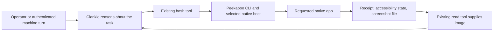
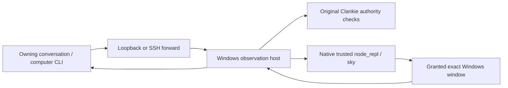

# Native computer use

Clankie uses [Peekaboo](https://github.com/openclaw/Peekaboo) as his general macOS
computer-use provider. His existing machine-authorized shell calls the CLI;
his existing image-capable file reader shows screenshots to his model. Clankie
interprets the interface and chooses the next action. Peekaboo supplies capture,
accessibility inspection, clicks, typing, keys, scrolling, dragging, and menus.
There is no additional agent/model or app-specific automation engine in this path.

The [desktop-control skill](../.agents/skills/desktop-control/SKILL.md) is the
agent-facing workflow. Use browser tools for web pages and purpose-built APIs
when they directly cover a task.

Peekaboo is Clankie's own hands. Where a computer-use harness is installed and
signed in (Codex computer use, Claude in Chrome), hard multi-step work in the
owner's apps usually goes to a hired seat instead; see
[ADR 0199](adr/0199-hard-computer-work-goes-to-a-computer-use-harness.md) and
the [computer-use-delegation skill](../.agents/skills/computer-use-delegation/SKILL.md).
`clankie browser harnesses` lists what this machine has.

## Execution and authority


```mermaid
flowchart LR
  O[Operator or authenticated machine turn] --> C[Clankie reasons about the task]
  C --> B[Existing bash tool]
  B --> P[Peekaboo CLI and selected native host]
  P --> T[Requested native app]
  T --> R[Receipt, accessibility state, screenshot file]
  R --> I[Existing read tool supplies image]
  I --> C
```

The [authority plan](../apps/clankie/src/captain/system-authority.ts) controls
machine access. Social turns do not acquire a shell. UI content remains untrusted
data. A model choice does not grant desktop capabilities or macOS permissions.

CLI plus image-file reading uses the existing captain tools and needs no MCP
adapter changes. The current generic [MCP host](../apps/clankie/src/mcp-host.ts)
projects text results only, so direct image-returning MCP integration requires
image preservation before it can replace this path. `peekaboo agent` and
`--analyze` are not needed: Clankie already supplies the reasoning loop.

## Recorded provider installation

The installation examined for this guide used the official Peekaboo **4.3.0**
universal CLI archive, with its Swift compatibility library and MIT license.
This is evidence for that installation, not a claim about every Clankie host
or the latest upstream release. Inspect the target machine before using it.

| Item             | Value                                                              |
| ---------------- | ------------------------------------------------------------------ |
| Command          | `~/.local/bin/peekaboo`                                            |
| Distribution     | `~/.local/share/peekaboo/cli/4.3.0/`                               |
| Source           | `44eff916c3330739108cc1d73683338d4250503a`                         |
| Archive SHA-256  | `fec965e4bd6371b8fb017fb582e8d31c6a59628f77e266878f45cf1d4844836f` |
| Signing identity | `Developer ID Application: OpenClaw Foundation (FWJYW4S8P8)`       |

Strict signature and notarization verification passed for that archive. The
[installation guide](https://github.com/openclaw/Peekaboo/blob/v4.3.0/docs/install.md)
and [release](https://github.com/openclaw/Peekaboo/releases/tag/v4.3.0) describe
supported installation. Preserve the signed executable and adjacent libraries.
No permission, quarantine, signing, or ownership bypass is part of integration.

```sh
peekaboo --version --json
peekaboo permissions status --all-sources --json
peekaboo window list --app "$APP" --json
```

`APP` is the requested application; choose `WINDOW_ID` from current inventory.
Use a verified absolute executable path if the service's PATH omits it. A
permission result applies to its reported host, not every possible caller.

## General observation and action loop

Assign `IMAGE_PATH` to a temporary PNG path and capture the exact target:

```sh
peekaboo see --app "$APP" --window-id "$WINDOW_ID" --path "$IMAGE_PATH" --json
```

Read the receipt, then the actual screenshot using Clankie's `read` tool.
Use accessibility element IDs when present and screenshots when AX is sparse.
For text-only inspection use `--tree --no-screenshot`; increase depth to 48
only when traversal depth explains the missing content. A partial application
fallback is not an exact-window action target.

Choose an authorized primitive such as `click`, `type`, `press`, `scroll`,
`drag`, `set-value`, or `action`. Element actions require a fresh reusable
snapshot and actual element IDs. Coordinate actions require screenshot-backed
coordinate mapping and a valid live producer receipt. After each action,
observe again and verify the intended effect before continuing. See the
[automation guide](https://github.com/openclaw/Peekaboo/blob/v4.3.0/docs/guide/automation.md)
and installed command help for each primitive.

Normal CLI observations use an on-demand host that owns snapshots in memory.
Keep an explicitly selected Bridge socket consistent across observation and
action. A short-lived `--no-remote` CLI process cannot hand a reusable snapshot
to a later process. Matching filenames, titles, or IDs do not replace ownership.

Observation does not request foreground focus. Preserve task restrictions:
`--web-focus` can change keyboard focus and input commands can require explicit
`--foreground`. Neither is an automatic fallback for a refused background
operation. Do not infer a no-focus guarantee for an untested interaction.

## Recorded capture readiness

Default and explicit classic capture through the installed 4.3.0 remote host
refuse before dispatch with an ownership-capability error despite granted
permissions. [Upstream #684](https://github.com/openclaw/Peekaboo/pull/684) is
the subsequent fix referenced by this investigation, outside the examined 4.3.0
archive. It separates implemented
support from startup readiness and restores proven same-host classic recovery.
The current remote refusal is not evidence that the selected host is old or
that another application actually captured the screen.

Peekaboo's documented **caller-local classic capture works for read-only pixels**:

```sh
peekaboo see --app "$APP" --window-id "$WINDOW_ID" --no-elements \
  --no-remote --capture-engine classic --path "$IMAGE_PATH" --json
```

The operator-shell receipt identifies the `CGWindowList` engine and a real
exact-window PNG. Clankie's existing file reader emits that PNG as an image
attachment; the selected model must support image input. This path does not
enter ScreenCaptureKit and requires the caller's own existing permission.
It does not change the remote host or its safety checks.
Its returned snapshot expires with the local process, so this observation does
not qualify subsequent coordinate input from another CLI invocation.

The live TUI path verifies Clankie discovering a window, invoking capture,
reading the PNG as an image attachment, and describing its visible contents.
However, two classic captures returned identical PNG bytes despite different
window titles. Pixel freshness remains unverified; a new capture receipt does
not establish that the app has repainted its contents.

Persistent action-host interaction still requires live proof. No completed
menu operation or no-focus parity is claimed from read-only evidence.

## Shared computer body

`clankie computer request JSON` and `POST /v1/computer` expose one computer
contract over the existing Peekaboo path. An operator selects a runnable
conversation; the service rechecks its authority before each input. Social
turns cannot use this endpoint. No worker, native Codex reasoning loop or
provider computer-use loop is started by the contract.

Acquire the `macos:console` body, inventory its current PID/window IDs, then
capture an exact target. Inventory reports whether its results are complete;
missing or refused window discovery stays partial. Screenshot metadata has a fresh UUID, sequence, expiry,
actual PNG dimensions, global display bounds, observed elements and digest.
Retrieve PNG bytes separately with `frame`; only the newest, action-ready,
unexpired screenshot can authorize input. Coordinates in requests are image
pixels. The host maps them through the capture's bounds, including Retina and
cropped windows, without assuming a scale factor.

Inputs are an ordered batch of click, element click, type, key, scroll or drag.
Background delivery remains the default; a foreground choice is explicit, and
Peekaboo drag requires it. A batch stops at the first failed or uncertain input.
Receipts distinguish `confirmed`, `failed` and `uncertain`; an exit code or event
dispatch alone is not confirmation. Any attempted batch invalidates its screenshot.
Observe again before choosing another action.

The persistent conversation body registry owns one driver lease, with the
interactive-environment lease clock conventions. Renew it within five minutes;
`revoke` blocks the next input even during an admitted batch; expiry and restart
also block further effects until recovery. An input request UUID
and its payload digest are persisted before dispatch, then its semantic receipt
is persisted without typed text or pixels. An identical retry reconciles that
receipt; a changed payload with the same UUID refuses. Never replay an uncertain
input with a new UUID. Each lease admits at most 256 input batches; retained
screenshots are bounded to four, expire after thirty seconds, and have a separate
16 MiB PNG ceiling. The legacy `/v1/body-leases` projection keeps its original
resource set; computer status and mutations use `/v1/computer`.

Today's classic caller-local capture remains read-only. The adapter does not
bypass Peekaboo's remote-host refusal, change focus to rescue an operation, or
change macOS permissions. The shared Bridge does not provide a quiescence
receipt, so the macOS adapter refuses recovery after uncertainty or restart;
closing a CLI process cannot prove queued native input stopped. The lease stays
held until a host stop-proof capability is supplied. Raw Peekaboo invocations
outside this contract are not fenced by its driver lease; overlapping drivers
must still be avoided.

Hosted bodies can implement the same `ComputerAdapter` seam with their own
inventory, capture bounds and host-confirmed input/recovery. The service registers its local macOS adapter; Windows can explicitly attach
the read-only native observation host below. Hosted Linux displays and native
Codex/provider reasoning routes are not implemented. The explicit
[manual comparison harness](../scripts/manual/computer-use/README.md) freezes the
tasks and grades artifacts independently. James starts that comparison and picks
the model route; builds and checks never run it.

## Windows observation host

The Windows adapter uses Codex's existing `@oai/sky` window2 API inside its
trusted `node_repl`. It lists native apps and captures the exact returned window
without activating it. It starts no app, model, worker or native helper of its
own, and does not use `C:\desk` to inject input. Native app grants and turn-stop
checks stay with the harness. The installed package is supplied by Codex; it is
not copied or redistributed by Clankie.

This first Windows step is **read-only**. It registers the existing
`ComputerBody` contract in an explicitly attached loopback observation host.
Its body ID is `windows:MACHINE:console`, bound to one conversation. Incoming
operator credentials are delegated to the original Clankie service's
`POST /v1/computer/authority`; that service rechecks its existing conversation
authority before and after observation. A selected conversation ID cannot
create a grant. Credentials are neither persisted nor returned. Body leases,
input journals and media retain the common contract's conventions.


```mermaid
flowchart LR
  C[Owning conversation / computer CLI] --> F[Loopback or SSH forward]
  F --> H[Windows observation host]
  H --> A[Original Clankie authority checks]
  H --> S[Native trusted node_repl / sky]
  S --> W[Granted exact Windows window]
  W --> H
  H --> C
```

In a source checkout, `pnpm computer:windows:build` produces
`.local/windows-computer/native-host.mjs`; it only builds JavaScript. Transfer
that artifact to the Windows checkout when building on another machine. Load
it in Clankie's own native Windows Codex view, with the computer-use plugin
installed and enabled, after reading that plugin's Windows skill. No new seat
or independent reasoning loop is required:

```js
var { sky } = await import("@oai/sky");
var { startWindowsComputerHost } =
  await import("file:///C:/path/to/clankie/.local/windows-computer/native-host.mjs");
globalThis.clankieWindowsComputer = await startWindowsComputerHost({
  sky,
  machineId: "pc",
  conversationId: "OWNING_CONVERSATION",
  directory: "C:\\path\\to\\private-state\\computer-pc",
  authorityURL: "http://127.0.0.1:CLANKIE_OR_FORWARDED_PORT",
});
nodeRepl.write(
  JSON.stringify({
    bodyId: clankieWindowsComputer.bodyId,
    url: clankieWindowsComputer.url,
    inputReady: clankieWindowsComputer.inputReady,
  }),
);
```

Use one stable private state directory per machine; the existing lease-store
process lock refuses another host or an uncleared crash lock. When Clankie leads
from a Mac, use authenticated SSH loopback forwards for the authority service
and the returned observation port. His existing `clankie computer request`
command targets that listener through `CLANKIE_CONTROL_PLANE_URL`, retaining
its broker-resolved operator credential. Keep both ends loopback; never expose
an unauthenticated desktop listener. Stop only the host/forwards you created.
`await clankieWindowsComputer.close()` closes its listener, not Codex or the
owner's apps. Closing a listener is not native driver stop proof.

Inventory is explicitly partial: native grants can omit apps. Capture requires
one bounded PNG belonging to the requested native window, with explicit logical
screen origin and dimensions. Actual PNG dimensions determine image pixels;
logical bounds determine their screen mapping, including display scaling and
negative monitor origins. Missing geometry, ambiguous windows, multiple transient
screenshots or a reused native screenshot reference refuse rather than guessing.
The native reference stays host-private; the body issues its own fresh UUID and
bounded media. Captures have `inputReady: false`; all input is refused before
dispatch. Recovery remains refused without an independent native stop receipt.

`clankie browser harnesses` also probes Windows hosts and registered PowerShell
fleets, reporting `platform: win32`, fleet `machineId`, signed-out or disabled
Codex installs, and missing Windows plugins. Reach/TUI text names that machine.
These probes do not open apps or prove their grants or input readiness. A native
harness on `pc` belongs to that machine; use its fleet-qualified terminal ID.
Never drive while the person is using it. Keep sign-ins, codes, CAPTCHAs,
payments and destructive steps with the person under ADR 0127.

Read-only SSH inspection found Codex CLI 0.160.0 and Windows computer-use plugin
26.928.40906 on the examined PC. This is an installation observation, not a
minimum version, default model, successful capture or input claim. The supported
API's mouse/keyboard methods return `Promise<void>`; a returned call cannot
stand in for observed effect or quiescence. Native Windows fixture proof and
input actions are a separate, approved driving window. The local
`pnpm test:windows-observation` lane uses a real Chromium page and HTTP authority
service to prove the adapter's response mapping and refusals. It does not prove
Windows native behavior and is excluded from default tests and checks.
