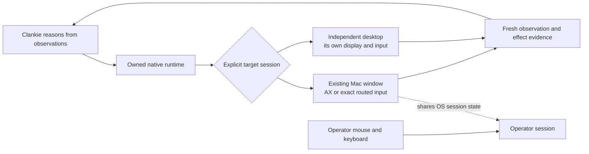

# An owned desktop runtime for Clankie

Status: design proposal, 2026-09-05. The installed provider remains Peekaboo.
No independent desktop runtime is implemented or live-proven by this document.

## Product requirement

Clankie needs general computer use while the operator keeps working: observe a
specific window, move a logical agent cursor, click, type, scroll, drag, and use
menus without moving the operator's pointer or taking their keyboard focus.
Windows on another Space are part of the requested coverage. The runtime must
report what worked, what was dispatched without confirmation, and what cannot
be delivered under that constraint. App-specific helpers do not satisfy it.

Owning the runtime means owning its source, build, signing identity, installation,
updates, native process lifetime, and evidence. An upstream provider release is
not a prerequisite for shipping an owned runtime. This does not itself add new
macOS input-isolation primitives.

## Two different target models

| Target | What ownership provides | Limit to establish |
| --- | --- | --- |
| Existing windows in the operator's macOS session | Exact-window capture, semantic AX actions, PID/window-routed events, a logical cursor per agent, and app-local focus where it works | Another Space is window organization, not an independent input session. Opaque controls, app activation, same-process windows, hidden rendering, and concurrent operator typing need real proof. |
| Apps in Clankie's separate desktop session | A session/VM-owned display, pointer, keyboard focus, clipboard, and app instances; foreground interaction inside that session does not require taking the operator's desktop | These are separate app instances and logins. It does not control the operator's already-open native windows. |

The operator preference between these models is pending. A VM is not silently
substituted for existing-window control. The isolated model is the stronger
architecture if uninterrupted independent pointer/focus is the hard requirement.

## What the inspected implementations establish

`~/dev/codex` contains computer-use access configuration and MCP integration.
The installed unified computer-use plugin loads `@oai/sky/service` from ChatGPT's
bundled Node modules and selects the separate `Codex Computer Use.app` native
service. The inspected package is version 0.6.26. Its window API includes capture,
click, drag, text, keys, scroll, and value/action operations. This inspection does
not establish a supported standalone redistribution or prove its native focus
mechanism. No Codex implementation or permission identity is copied.

Peekaboo's local patch at
`29f36e3f34ec27bb2b6bce0acbedb683fcee16b7` connects no-AX single-left clicks to its
existing window-routed events. Its inert tests and CLI build pass. Its installed
signed host remains unchanged, and the patch does not establish cross-Space or
independent keyboard-focus support. Source: `~/dev/Peekaboo`. The installed
workflow and its current limits remain in [desktop control](desktop-control.md).

Cua Driver is another relevant source reference. The inspected commit is
`95817401b8bfc627fa577adb018578e119715f3d` in `trycua/cua`. Its macOS
`input/skylight.rs::activate_without_raise` sends a defocus record to the previous
front process and a focus record to the target. The pixel-click caller can then
reactivate the previous app. That source-level behavior is not evidence of
independent concurrent keyboard focus, even when no window visibly rises. Its
background-input plan also explicitly identifies unresolved off-Space windows
and opaque surfaces as limits. These mechanisms are references, not a certified
implementation for this product requirement.

## Maintained native fixture

[`tools/desktop-fixture`](../tools/desktop-fixture/README.md) is the first executable
part of the proof work. It builds an input recipient with an opaque click target,
an accessible editor, two same-process target windows, and a separate operator
role. It records native activation/key-window events and samples foreground state.
Its bounded `--run` mode is explicit; default/help and rejected arguments do not
create an application. Build and eight inert CLI cases pass. No live mode has
been run. This is test infrastructure, not a computer-use backend.

## Implementation order

1. Establish the target model and a Clankie-owned native application identity.
   Reuse maintained open-source native primitives where they fit; retain their
   license/provenance. Keep Clankie as the only reasoning agent. Use his existing
   shell and image reader for the first CLI integration.
2. Build a native acceptance fixture before broad integration: one target window
   and an operator window, with observable click/key counters. Exercise capture,
   one click, and literal typing while the operator window receives its own
   input. Repeat with the target on another Space, with multiple windows in one
   process, and with an opaque web/canvas control. The test records fresh pixels,
   target identity, pointer position, active Space, foreground process, and both
   windows' input logs. A restored foreground at the end is insufficient evidence
   that no focus was stolen during the action.
3. Keep target authority through immediate dispatch: session identity, process
   generation, exact window, captured bounds, and freshness deadline. After any
   possible mutation, observe before deciding on another action. Never replay an
   uncertain click or key sequence automatically. A logical cursor does not grant
   a second OS input session.
4. Ship only routes that pass that native proof. If a same-session route needs
   activation or affects concurrent typing, label it unsupported under the
   uninterrupted-work requirement; do not disguise an activate/restore loop as
   isolation. A separate desktop is an explicit product choice.
5. Once the native path passes, expose the complete primitive set through the
   owned CLI/API, document the runtime in the desktop-control skill, and expose
   any configuration in the TUI. Source commits, binary hashes, runtime identity,
   test evidence, and rollback mapping travel together.

No UI actions, focus/Space changes, permission changes, virtual-machine creation,
account creation, or runtime installation are part of this research pass. Those
remain unperformed. The existing Clankie capability is not declared complete.

## Primary references

- [Apple: Quartz event model and per-process posting](https://developer.apple.com/documentation/coregraphics/cgevent)
- [Apple: Spaces organize application windows](https://support.apple.com/en-ae/guide/mac-help/mh14112/mac)
- [Apple: virtual-machine keyboards and pointing devices](https://developer.apple.com/documentation/virtualization/keyboards-and-pointing-devices)
- [Apple: virtual-machine graphics](https://developer.apple.com/documentation/virtualization/graphics)
- [Cua native focus records at the inspected commit](https://github.com/trycua/cua/blob/95817401b8bfc627fa577adb018578e119715f3d/libs/cua-driver/rust/crates/platform-macos/src/input/skylight.rs#L488)
- [Cua pixel-click activation and restoration](https://github.com/trycua/cua/blob/95817401b8bfc627fa577adb018578e119715f3d/libs/cua-driver/rust/crates/platform-macos/src/tools/click.rs#L1132)
- [Cua background-input scope and explicit limits](https://github.com/trycua/cua/blob/95817401b8bfc627fa577adb018578e119715f3d/libs/cua-driver/docs/macos-background-input-v1-plan.md)
