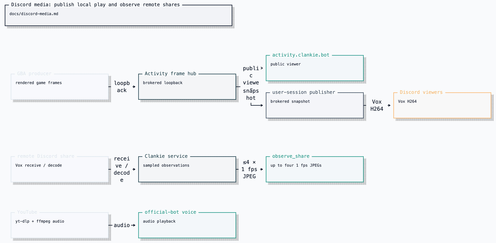

# Discord media and visual surfaces

Clankie has three distinct ways to show or inspect moving pictures and one
ordinary voice path. They use different Discord identities and should not be
described as one generic stream.

| Surface                                     | Active body             | Direction                   | What viewers get                                          |
| ------------------------------------------- | ----------------------- | --------------------------- | --------------------------------------------------------- |
| Ordinary Discord voice and YouTube music    | Official bot by default | Clankie to voice channel    | Audible voice/music through `@discordjs/voice`            |
| Embedded Activity at `activity.clankie.bot` | Official bot            | Clankie to Activity viewers | Live GBA frames and synchronized cartridge sound          |
| Go Live publish                             | Personal-lab user body  | Clankie to Discord viewers  | H264 video through Vox; currently no source audio         |
| Screen-share watch                          | Personal-lab user body  | Discord sharer to Clankie   | Up to four chronological JPEG samples for `observe_share` |



[Editable Turbopuffer tldraw source](diagrams/clankie-docs-diagrams-2.tldraw)

## YouTube music

There is no `/music` command. Ask Clankie in ordinary TUI/Discord text or voice,
or paste a YouTube URL. Text requests use the captain's `youtube_search` and
`music_*` tools; voice exposes the same controls locally on its realtime
session.

Supported inputs are:

- a YouTube search query;
- a 1-based result number from that requester's latest search, valid for two
  minutes; or
- an HTTP(S) URL on `youtube.com`, `youtu.be`, `music.youtube.com`, or
  `m.youtube.com`.

Search returns at most five results. A playlist URL does not enqueue the whole
playlist because playback uses `--no-playlist`. Spotify, SoundCloud, local files,
and arbitrary media URLs are rejected by the product music queue.

`music_play` replaces the current track and clears the queue. `music_queue`
starts immediately when idle or appends up to 32 waiting tracks. Skip advances;
stop clears the current track and queue; pause/resume are idempotent. The queue
is process-global for the active body, not per guild or requester.

The official bot is the audible path. It must already be in voice and requires
`yt-dlp`, FFmpeg, native Opus, the brokered `discord_bot` token, the bot voice
bearer, and an `openai` API credential for spoken conversation. Music audio is
decoded to PCM and played through `@discordjs/voice`; no YouTube API key or
YouTube account credential is used.

Playback prefers YouTube's direct audio-only format. If that URL fails before
the first PCM frame (including YouTube's HTTP 403 response), the one retry uses
a low-bandwidth HLS format with audio instead of repeating the same request.
Receipts classify a detected downloader 403 as `http_403` without retaining the
URL or query.

The lab user body routes a requested YouTube URL to Go Live. The current H264
publisher strips source audio, so viewers see video but do not hear synchronized
music. End-of-track queue advancement is not wired on that path. Do not use the
lab body when the requirement is audible music.

## Embedded Activity

The official bot launches the supported watch-me-play Activity with
`/clankie watch` or the captain's `discord_watch_start` tool. The Activity viewer
holds no Discord token, emulator core, input channel, or machine authority. It
renders the latest producer frame and overlay, plays live cartridge sound after
the viewer presses **Enable sound** at whatever level the volume slider is set
to, and shows a present-tense work state so a
still-visible prior thought never makes a live model decision look stuck.

The local process has two listeners:

| Listener          | Default          | Access                                                 |
| ----------------- | ---------------- | ------------------------------------------------------ |
| Viewer            | `127.0.0.1:4320` | Public through the Cloudflare tunnel and Discord proxy |
| Producer/snapshot | `127.0.0.1:4322` | Loopback plus `clankie_activity_producer` bearer       |

The production hostname is `https://activity.clankie.bot`. The Discord
Developer Portal Activity URL Mapping and Entry Point must target that HTTPS
origin, while `~/.cloudflared/config.yml` maps only the viewer hostname to
`http://127.0.0.1:4320`. Never expose port 4322. The public viewer is
unauthenticated: anyone who can reach the hostname can see the current retained
frame.

Use `clankie restart activity`, `clankie restart tunnel`, and `clankie health`
for the launcher-owned services. A public `502` means the Cloudflare edge is
reachable but the local Activity origin is down. See the
[Activity operating guide](../apps/discord-activity/README.md) for first-time
tunnel setup and frame bounds.

## Go Live publish

Only the active personal-lab user body can Go Live. The same
`discord_watch_start` captain tool that launches an Activity on the bot body maps
to Go Live on the lab body. The process joins the allowlisted voice channel,
sends Discord OP18/OP22, passes Discord-issued stream credentials to Vox, and
publishes either:

- an allowed URL through `yt-dlp`/FFmpeg; or
- changed PNG snapshots from the private Activity listener.

Activity-backed Go Live depends on the local Activity process and producer
frame, but not on the public tunnel. Vox currently emits 1280x720 H264 video at
30 fps and strips source audio. A successful control request means publication
was accepted; native `transport_state=ready`/`publish_started` is the media-ready
evidence.

## Watching another share

Only the active personal-lab user body can receive someone else's Go Live
video. There is no manual start command. When an admitted non-self share appears,
the body watches one stream, sends Discord OP20, and gives the stream-server
credentials to Vox. The integrated product path decodes H264 frames and samples
one JPEG per second. The service retains up to four samples oldest-to-newest;
raw video never enters the semantic event log.

After a real share, verify with:

```bash
pnpm --filter @clankie/discord-user-session live-proof -- --wait=120
```

That proof requires the user body to be ready, a watch transport with
`decoder=ready`, and a decoded still from the same user. The official bot can
report that someone is sharing but cannot receive the pixels.

The [user-session guide](../apps/discord-user-session/README.md) owns account
risk and setup. The [Vox Go Live guide](../apps/vox/docs/go-live.md) owns native
transport mechanics. [Credential identities](credentials.md) explains why the
bot and user tokens never share a process.
