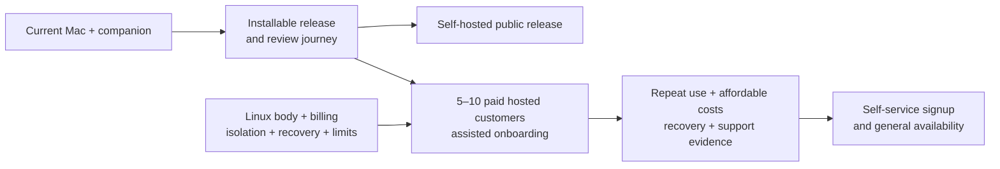

# First customers and general availability

Readiness assessment: 2026-09-04. Scope: `clankie`, its sibling
`clankie-app`, the public download and gateway, and the current Linear records.
This is release evidence and a proposed release boundary; the work queue stays
in the [Clankie project](https://linear.app/vuhlp/project/clankie-7f2de0de4a75).
It does not certify App Store approval, real-device reliability, or paid service
readiness.

## Product boundary

The current product runs on the customer's own Apple silicon Mac. The iPhone
and iPad app pairs with that Mac and exposes Messages, agent conversations,
fleet presence, and terminal access. The gateway routes traffic; it does not
host the customer's agent.

The existing commercial decision is **free self-hosting and companion apps,
paid managed hosting**. [VUH-1062](https://linear.app/vuhlp/issue/VUH-1062) and
the [hosted design](https://linear.app/vuhlp/document/hosted-clankie-subscriptions-dollar20-starter-dollar99-pro-c54f43bcb062)
describe $20 Starter and $99 Pro, customer-supplied model keys, persistent
isolated tenant machines, and bounded active compute. Those allowances remain
targets pending real costs. Shipping the current free app alone does not
implement that revenue model. Charging for the own-Mac app is a separate product
decision, not an assumed prerequisite.

The proposed first-release promise is: **ask an agent to work, leave, return,
read the result, and steer the next step from your phone**. One successful
repeatable job is sufficient; the entire feature backlog is not the launch gate.

[VUH-1109](https://linear.app/vuhlp/issue/VUH-1109) adds a pinned, supervised
Herdr runtime to the release ([ADR 0157](adr/0157-herdr-is-an-owned-runtime.md)).
The Clankie TUI and external vanilla Herdr workflow remain supported. This
handles native worker ownership; the full hosted service image, account
provisioning, billing, and remote TUI authentication remain separate work.

## Evidence and remaining gates

| Area                         | Evidence at assessment                                                                                                                                                                          | Remaining gate                                                                                                                                                                                                                  |
| ---------------------------- | ----------------------------------------------------------------------------------------------------------------------------------------------------------------------------------------------- | ------------------------------------------------------------------------------------------------------------------------------------------------------------------------------------------------------------------------------- |
| Mac distribution             | Installer is publicly reachable; GitHub Releases API returns an empty list and the installer's latest archive URL returns 404. Build, checksum, smoke, and release workflow exist.              | Publish a tested version and prove install, upgrade, and rollback outside the checkout, including the Herdr setup needed for the advertised fleet.                                                                              |
| App distribution             | Local `Clankie 1.0.0 (202609022211)` archive succeeds. Its export log and the latest VUH-1095 comment report missing Apple distribution credentials.                                            | Confirm the app record, distribution signing, upload, processing, iPhone/iPad screenshots, and review metadata in App Store Connect. Repository preparation is not evidence of submission.                                      |
| External testing             | Review notes and durable review pairing offers exist. VUH-1100 and VUH-1101 remain Backlog.                                                                                                     | External TestFlight approval and the exact uploaded build's off-network iPhone and iPad journey, then App Store review.                                                                                                         |
| Gateway and enrollment       | Public `/health` returns `{"ok":true}`; `/gateway/v1/config` advertises `selfSignUpEnabled: false`.                                                                                             | Invites suffice for a cohort. Open signup only with delivery, abuse limits, capacity, and support in place.                                                                                                                     |
| Email delivery               | Latest VUH-1098 thread has verified DKIM and a prepared SES case reply; production delivery remains unproven. Today's AWS read fails because the login session is expired.                      | Confirm the SNS subscription, resolve the SES production case, and deliver an OTP to a never-verified recipient. This assessment does not claim the AWS account's current approval state.                                       |
| Unrelated customers' traffic | Gateway forwards bodies and authorization through TLS terminated on the gateway. ADR 0151 explicitly reserves device-to-host application encryption as a customer gate.                         | Implement and verify that encryption, including pairing identity, revocation, reconnect, and native terminal traffic; preserve the existing grant and routing checks.                                                           |
| App privacy and support      | Public policy and support pages return 200. App source exposes no privacy/support link from pairing or Settings.                                                                                | Add reachable links and reconcile the exact release's disclosures with operational metadata and provider processing.                                                                                                            |
| Visible app behavior         | Image selection is exposed in `Composer.tsx`; `liveCaptainSession.ts` rejects nonempty attachments. Pairing already has a ten-second request deadline despite VUH-1035's Backlog status.        | Remove the unsupported attachment action from the shipped capability or finish its transport; keep user-visible claims accurate. Prove retry and reconnect on devices instead of counting stale issue status as an unfixed bug. |
| Paid hosting                 | VUH-1053 and VUH-1063–1070 describe Linux proof, EC2/EBS, commerce, lifecycle, wake, limits, onboarding, and recovery. No customer billing/hosted fleet implementation is found in these repos. | A customer must be able to pay, obtain one isolated persistent agent, pair, use it, reach a budget limit, cancel, and recover without losing their data.                                                                        |
| Operations                   | Existing gateway logs, bounded requests, host metrics, and release workflow provide a starting point.                                                                                           | Meet the monitoring, exercised-alert, and synthetic-journey requirements in the public gateway gate; add hosted cost and restore evidence. A green health endpoint is insufficient.                                             |
| Public promise               | Landing page has App Store/Google Play badges and says the product is open source “top to bottom”; the app source is proprietary and downloadable releases are unproven.                        | Point each CTA to an available install/signup path; accurately state prerequisites, source licenses, supported platforms, model costs, and hosted availability.                                                                 |

The existing review work is [VUH-1093](https://linear.app/vuhlp/issue/VUH-1093):
upload [VUH-1095](https://linear.app/vuhlp/issue/VUH-1095), listing
[VUH-1097](https://linear.app/vuhlp/issue/VUH-1097), SES
[VUH-1098](https://linear.app/vuhlp/issue/VUH-1098), device journey
[VUH-1099](https://linear.app/vuhlp/issue/VUH-1099), external TestFlight
[VUH-1100](https://linear.app/vuhlp/issue/VUH-1100), and submission
[VUH-1101](https://linear.app/vuhlp/issue/VUH-1101). Code and issue comments
take precedence over stale checkbox/status summaries when assessing what exists.

## Small paid cohort versus general availability

**First paid cohort:** propose 5–10 customers with assisted onboarding, one
monthly BYOK offer from the existing plan, and a clear supported-workload list.
Manual provisioning is acceptable at this size if tenant identity, ownership,
billing state, and recovery remain durable and auditable. Require enforced
spend limits, isolation, backups with a restore proof, cancellation/suspension
without data deletion, and a working private support channel. If the offer
includes sleeping and waking, its wake authorization must work before sale.
Measure costs before promising the current $20/$99 allowances. An assisted
cohort is not yet self-service GA.

**General availability:** a stranger can discover the offer, install or
subscribe, receive email, provision/pair, finish a useful task, return later,
and obtain help or cancel without the founder repairing the journey. Self-serve
commerce and enrollment, failed-payment recovery, export/deletion/retention
policy, operational alerts, tested rollback/restore, and measured capacity are
part of that promise. Launch geography and billing/tax setup must match the
countries actually offered service. Do not open signup merely by flipping the
existing Cognito flag.

Keep iPhone and iPad in the release gate. Additional Android/macOS client
launches, elaborate garden behavior, workspace browsing, more integrations,
annual billing, automated overages, and multi-region infrastructure can follow.
For the first cohort, clearly disclose foreground-only delivery if push is
absent. [VUH-1052](https://linear.app/vuhlp/issue/VUH-1052) becomes a launch
dependency if the product promises to notify users when work finishes.

## Review decisions that hosting changes

The current listing, review notes, and public privacy policy repeatedly promise
the user's own Mac and no hosted agent/content. Hosted service requires accurate
replacement disclosures and review access to the real hosted journey. Approval
of the own-Mac journey is not approval of an undisclosed hosted product.

Apple's [Guidelines 3.1.3(f) and 4.2.7](https://developer.apple.com/app-store/review/guidelines/)
are separate questions. The free companion exception can support a paid web
tool with no in-app purchase flow or external purchase CTA, if Clankie qualifies;
that qualification is not confirmed by calling the app a companion. The remote
desktop rule is not limited to third-party software and explicitly includes a
local-network condition. First-party ownership and a Tailscale route alone do
not establish compliance. If Apple applies that rule, restrict or omit the
affected terminal functionality openly; do not enable a rejected path after
review. StoreKit is required when applicable to the chosen sale, not an automatic
new dependency for every free companion app.

The first App Store release can be held for
[manual release](https://developer.apple.com/help/app-store-connect/manage-your-apps-availability/overview-of-publishing-your-app-on-the-app-store/)
while the live service is verified. Apple's
[phased release](https://developer.apple.com/help/app-store-connect/update-your-app/release-a-version-update-in-phases)
is for updates; it is not the admission control for the first cohort.

## Practical testing and iteration

Proposed cohort evidence: five people outside the development setup perform
the promised task, return on another day, and complete it again. Include at
least one physical iPhone and iPad, a clean Mac or newly provisioned hosted
tenant, and real repositories/model credentials belonging to the tester.

Exercise Wi-Fi/cellular changes, app background/kill/relaunch, host restart or
sleep/wake, expired credentials, revoked devices, delayed replies, an unavailable
gateway, and an update followed by rollback. For hosting also exercise duplicate
billing events, failed payment, cancellation, budget exhaustion, cross-tenant
denial, and restoration of the same identity/files onto replacement compute.
Record failures with build versions and timings, without prompts, credentials,
terminal content, or repository data in central telemetry.

Track time to first completed task, successful return visits, failed sends and
reconnects, support interventions, and infrastructure cost per paying customer.
Use those observations to select the next fixes. Release small changes promptly
through the existing checks and store review; the supported job and customer
data must survive each update. Missing speculative features are not a reason to
delay a working, honestly described release.

## Verification boundary

- `clankie-app`: `pnpm check` passes, including 584 package tests and the static
  and asset checks. This is not a physical-device or App Store upload proof.
- `clankie`: the combined `pnpm check` passes, including 1,919 TypeScript tests
  (one skipped), 123 Rust tests, and Vox IPC. The two public HTML pages are
  formatted to satisfy the repository gate.
- Bundled Herdr's native lifecycle passes on macOS ARM64 and Linux ARM64:
  worker execution, exclusive ownership, session restoration, crash recovery,
  reconnect, and cleanup after the parent dies. Extracted macOS release smoke
  passes without taking over the already-running local Clankie singleton.
  These checks do not prove a complete hosted Clankie deployment or paid-model
  execution.
- Public gateway, config, installer/release availability, policy, support, and
  landing content are checked directly. App Store Connect state is inferred only
  from local artifacts and the latest issue comments, not a live Connect login.
- AWS production email state is unverified because the current AWS session is
  expired. No release, deployment, billing activation, or signup change is part
  of this assessment.

Detailed operational gates: [public gateway launch](public-gateway-launch.md).
Mac packaging: [distribution](distribution.md). App submission sources:
`clankie-app/docs/app-store/`. Physical test evidence belongs beside the existing
archives under `docs/testing/` in the repo whose journey is exercised.
