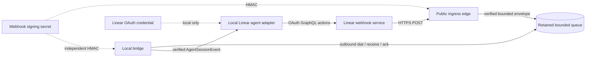

# Linear agent-session webhook ingress

Linear agent-session events enter through a public HTTPS edge while Clankie's runner and private sockets remain local. The edge verifies the webhook and retains a bounded delivery; a local bridge dials an outbound channel and verifies the same signed bytes again before producing a typed event.

The ingress has the webhook signing secret because signature verification requires it. It has no Linear OAuth credential and cannot query or mutate Linear. The ingress-to-bridge envelope contains only bounded delivery metadata, the original raw body encoded as canonical base64, and its HMAC signature. Outbound-channel authentication is transport state and never becomes part of the envelope.

## Edge processing

`LinearWebhookIngress` is a framework-neutral HTTPS request handler. A host adapter passes the exact unparsed bytes and headers; `createLinearWebhookFetchHandler` adapts the Fetch `Request`/`Response` API. The Fetch adapter rejects a declared oversized body before reading it, then reads the body stream incrementally with a hard 256 KiB accumulation ceiling even when `Content-Length` is absent or false-small. It cancels the stream on overflow and never passes partial bytes to the ingress. A separate 4.5-second response deadline cancels a stalled under-limit reader and returns `408`, leaving margin below Linear's five-second receiver limit. Hosts also set their native request limit at or below 256 KiB as defense in depth.

The edge performs these checks in order:

1. Require `POST` and JSON content.
2. Bound the raw body to 256 KiB.
3. Require `Linear-Delivery`, `Linear-Event`, `Linear-Signature`, and `Linear-Timestamp`.
4. Verify the hex HMAC-SHA256 in `Linear-Signature` over the exact raw bytes with a timing-safe comparison.
5. Parse only a bounded `AgentSessionEvent` with action `created` or `prompted`; prompted bodies use Linear's recorded `agentActivity.content.body` shape.
6. Require the signed body's `webhookTimestamp` and type to match the headers and fall inside the 60-second replay window.
7. Enqueue one versioned `linear.agent-session-webhook` envelope keyed by `Linear-Delivery`.

Linear requires the webhook receiver to respond within 5 seconds; the Fetch adapter enforces 4.5 seconds rather than merely documenting that limit. A retained delivery or known duplicate returns `200`. A stalled body returns `408`; an offline bridge or full queue returns `503` with `Retry-After: 60`, so Linear owns the retry instead of the ingress silently accepting work it cannot retain. Linear retries a failed delivery up to three times, after approximately 1 minute, 1 hour, and 6 hours. Invalid signatures, malformed events, and replays return non-2xx and emit rejection evidence.

The downstream agent-session adapter has a separate product target: acknowledge a newly created session with an agent activity or external URL within 10 seconds. Webhook receipt never waits for that GraphQL action.

## Queue and offline behavior

`RetainedLinearWebhookQueue` is deterministic and process-local. Its defaults are:

| Setting            |              Default | Behavior                                                                                      |
| ------------------ | -------------------: | --------------------------------------------------------------------------------------------- |
| Capacity           | 64 active deliveries | The next unique delivery receives `503`; it is not marked deduplicated.                       |
| Retention          |           55 seconds | A retained delivery never outlives the 60-second verification window.                         |
| Local retry delays |          1s, 5s, 15s | A consumer failure is retried while retained, then dead-lettered with evidence.               |
| Dedupe key         |    `Linear-Delivery` | Pending, in-flight, delivered, rejected, and failed records remain deduplicated until expiry. |

No bridge connection means the edge returns `503` and does not queue or deduplicate the delivery. If a connected bridge disconnects after leasing a delivery, the queue releases it for a deterministic retry. Capacity rejection, retry scheduling, terminal rejection, dead-lettering, and retention expiry all emit structured evidence; none of these transitions silently discard a delivery.

The process-local queue proves the boundary and deterministic semantics but is not a production durability claim. A hosted deployment uses the same `LinearWebhookOutboundTransport` contract with a durable queue and authenticated outbound receive/ack channel before it acknowledges deliveries across process or region failures.

## Local bridge verification

`LinearWebhookLocalBridge.dial` initiates the delivery channel from the local side. The local machine opens no webhook, PTY, Herdr, runner, or bridge listener to the public internet.

The delivery channel wraps each untrusted hosted payload with an opaque local receipt. The transport retains the receipt-to-lease association, permits at most one outstanding receipt per channel, and settles a delivery only when the bridge returns that receipt. Delivery IDs and envelope fields never identify the transport lease.

For every leased payload the bridge:

1. validates the strict envelope schema and canonical base64;
2. recomputes the HMAC over the recovered original bytes using its own signing-secret copy;
3. reparses the typed `AgentSessionEvent`;
4. compares the delivery metadata and independently checks timestamp/retention;
5. emits the typed `linear.agent-session-event` only after every check passes;
6. acknowledges success, schedules a bounded consumer retry, or records terminal rejection through the opaque receipt, including when the payload is too malformed to recover any envelope field.

The bridge treats the public ingress and outbound transport as untrusted. A claim that the edge already verified an event never substitutes for local verification.

## Structured evidence

The components emit `LinearWebhookEvidence` records through an injected sink. Hosted and local adapters send those records through the repository observability logger. Records contain `service`, `outcome`, `timestampMs`, and, when available, `deliveryId`, `correlationId`, queue depth, and attempt. Reasons are fixed operational codes.

Evidence never contains raw or parsed payload bodies, signatures, signing secrets, authorization headers, or OAuth credentials. `correlationId` is derived as `linear-delivery:<Linear-Delivery>` so edge, queue, bridge, and downstream work can be joined without content.

## Development tunnel

A tunnel stands in for the hosted edge only during webhook development:

1. Run a small host adapter for `createLinearWebhookFetchHandler` on a loopback address such as `127.0.0.1:8787`. Keep the signing secret in the adapter's environment and set its body limit to 256 KiB.
2. Start an outbound tunnel, for example `cloudflared tunnel --url http://127.0.0.1:8787` or `ngrok http 8787`.
3. Configure the generated HTTPS URL as the Linear agent application's webhook URL and subscribe to `AgentSessionEvent`.
4. Start the local bridge so it dials the ingress delivery transport before sending a fixture or mentioning the agent.
5. Confirm edge `accepted`, bridge `verified`, and bridge `delivered` evidence share the delivery and correlation IDs.

The development HTTP adapter remains loopback-only; the tunnel client makes the outbound public connection. Never point a tunnel at the relay control/terminal server, a runner port, PTY, Herdr socket, or another private operator surface. Stop the tunnel when the test ends and rotate a signing secret that was used in a shared development environment.
