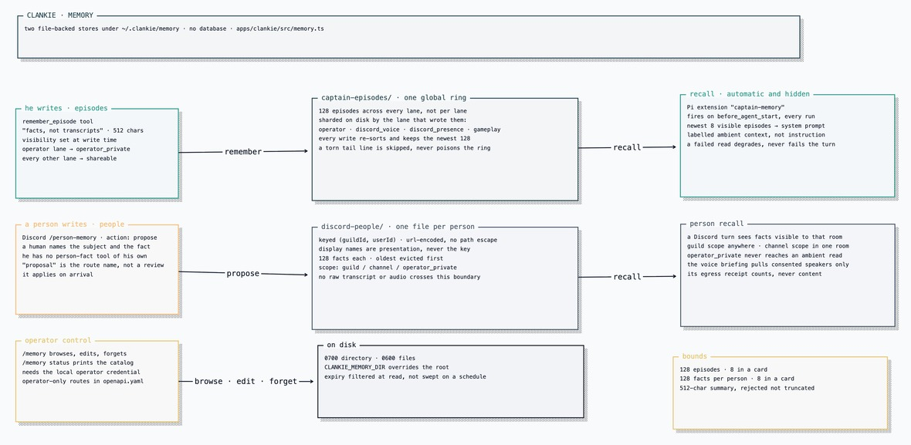

# Memory

Clankie keeps two durable memories under `~/.clankie/memory/`
(`CLANKIE_MEMORY_DIR` overrides the root). One is what he remembers doing; the
other is what he has been told about people. They have different keys, different
lifetimes, and different rules about who may read them, so they are separate
stores rather than one namespace with a policy field
([ADR 0042](adr/0042-discord-person-memory-projection.md)).

There is no database. Both stores are files the service owns, created `0700`
with `0600` contents, and the implementation is one module —
[`apps/clankie/src/memory.ts`](../apps/clankie/src/memory.ts).



[Editable Turbopuffer tldraw source](diagrams/clankie-memory.tldraw)

## Episodes — what he remembers doing

An episode is his own short note about something that happened in a room:
"facts, not transcripts." He writes them himself with the `remember_episode`
tool; nothing else authors one. A summary is capped at 512 characters.

Episodes are one global ring of 128 across every lane, sharded on disk by the
lane that produced them:

```
~/.clankie/memory/captain-episodes/operator.jsonl
                                  /discord_voice.jsonl
                                  /discord_presence.jsonl
                                  /gameplay.jsonl
```

The ring is global, not per-lane — a busy gameplay session ages out old operator
notes. Writes re-sort every lane chronologically and keep the newest 128. A torn
tail line is skipped rather than allowed to poison the ring, so a JSONL file
truncated mid-write costs one episode instead of the file.

**Recall is automatic and hidden.** A Pi extension named `captain-memory` runs on
`before_agent_start` for every captain run and appends a card of the newest
eight visible episodes to the system prompt
([`captain/captain.ts`](../apps/clankie/src/captain/captain.ts)). He does not
call a tool to remember; the card is simply there. It is labelled as ambient
context rather than instruction or established fact, because his own past notes
are still model output. Recall failure is swallowed — a broken memory store
degrades the prompt, it does not fail the turn.

**Visibility is decided at write time.** An episode written on the operator lane
defaults to `operator_private`; every other lane defaults to `shareable`. He can
override per call. Only the operator lane's recall sees `operator_private`
episodes; Discord and gameplay lanes see `shareable` only. The default matters
more than the filter — the gate in recall is only real if writes honor it, so
what he notes at the console stays at the console unless he says otherwise.

## Person facts — what he knows about people

A person fact is a bounded note about a Discord user, keyed by
`(guildId, userId)` — one JSON file per person under `discord-people/`, with the
identity URL-encoded so a hostile id cannot climb out of the directory. Display
names are presentation only and are never the key. Raw transcripts and audio
never cross this boundary.

Each fact carries a kind, a confidence, a visibility scope, optional expiry, and
content-free provenance. The store holds 128 facts per person and evicts oldest
first.

Visibility is enforced on every ambient read:

| Scope              | Reaches a Discord turn                 |
| ------------------ | -------------------------------------- |
| `guild`            | Yes, anywhere in that guild            |
| `channel`          | Only in the channel it was recorded in |
| `operator_private` | Never — operator surfaces only         |

An expired fact is filtered at read time rather than deleted on a schedule, so
expiry is honest even if nothing has swept the file.

Two paths read them. A Discord turn gets facts visible to its own room, matched
against the turn's query. The voice briefing pulls facts for each consented
speaker before a voice session starts, and reports only counts and lengths in
its egress receipt — never content.

**A person writes them, not Clankie.** He has a tool for remembering an episode
and no tool for remembering a person — he cannot decide on his own to keep a
note about someone. Facts arrive through the Discord `person-memory` slash
command (`action: propose`, with the subject, body, kind, visibility, and
optional expiry), which the bridge forwards to
`POST /v1/memory/discord-people/proposals`. The same command with
`action: recall` reads back what is visible in that room.

"Proposal" is the name of the route, not a workflow: the fact applies on
arrival. The approval ceremony left with the governance machinery, and the
command's own wording about reviewed and approved facts is left over from it.

## Who reads what

| Lane / surface     | Episodes it sees       | Person facts it sees                     |
| ------------------ | ---------------------- | ---------------------------------------- |
| `operator`         | All, including private | All, via the operator catalog            |
| `discord_voice`    | `shareable` only       | Guild + this channel, consented speakers |
| `discord_presence` | `shareable` only       | Guild + this channel, on the turn        |
| `gameplay`         | `shareable` only       | None                                     |

## Operator control

`/memory` in the TUI browses both stores and can edit or forget any entry;
`/memory status` prints the catalog without opening the browser. Both need the
local operator credential — the console says so plainly rather than showing an
empty memory when the credential is missing.

The operator-only routes behind it are `/v1/memory` (full catalog),
`/v1/memory/discord-people/…` (recall, export, edit, forget), and
`/v1/memory/captain-episodes/…` (record, edit, forget), specified in
[`apps/clankie/openapi.yaml`](../apps/clankie/openapi.yaml).

## Bounds

| Bound                     | Value | Effect                                |
| ------------------------- | ----- | ------------------------------------- |
| Episodes, all lanes       | 128   | Oldest evicted on write               |
| Episodes in a recall card | 8     | Newest visible, per lane              |
| Facts per person          | 128   | Oldest evicted on write               |
| Facts in a recall card    | 8     | Newest matching the query             |
| Episode summary           | 512   | Rejected at the schema, not truncated |

## Decisions

- [ADR 0042](adr/0042-discord-person-memory-projection.md) — why person memory
  is its own projection rather than a namespace in a shared fact store.
- [ADR 0054](adr/0054-cross-lane-presence-and-episodic-self-memory.md) — why
  presence is shared across lanes while notes stay fenced.
