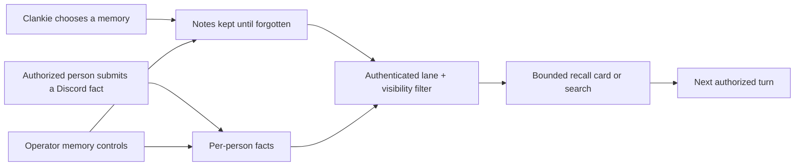

# Memory

This is the storage and authority reference. For using memory in a conversation,
start with [Memory and personality](https://docs.clankie.bot/using-clankie/#memory-and-personality).
Conversation history, goal state, and game saves have their own owners; this
document covers selected memories that can inform a later turn.

Clankie keeps two durable memories under `~/.clankie/memory/`
(`CLANKIE_MEMORY_DIR` overrides the root). One is what he remembers experiencing; the
other is what he has been told about people. They have different keys, different
lifetimes, and different rules about who may read them, so they are separate
stores rather than one namespace with a policy field
([ADR 0042](adr/0042-discord-person-memory-projection.md)).

There is no database. Both stores are files the service owns, created `0700`
with `0600` contents, and the implementation is one module —
[`apps/clankie/src/memory.ts`](../apps/clankie/src/memory.ts).


```mermaid
flowchart LR
  Agent["Clankie chooses a memory"] --> Notes["Notes kept until forgotten"]
  Person["Authorized person submits a Discord fact"] --> Facts["Per-person facts"]
  Notes --> Filter["Authenticated lane + visibility filter"]
  Facts --> Filter
  Filter --> Recall["Bounded recall card or search"]
  Recall --> Turn["Next authorized turn"]
  Operator["Operator memory controls"] --> Notes
  Operator --> Facts
```

## Notes — what he remembers experiencing

A note is his own short memory of something that happened in a room or
something he wants to carry into his developing personality: an experience,
reflection, changed opinion, meaningful exchange, taste, commitment, or work in
progress. He writes them himself with the `memory` tool; nothing else
authors one, and a person does not need to ask him first. It is a concise memory,
not a transcript. A summary is capped at 512 characters.

One tool handles the whole lifecycle. Set `action` and the corresponding arguments:

| Action   | Arguments    | What it does                              |
| -------- | ------------ | ----------------------------------------- |
| `write`  | `text`       | Add a note in the current conversation    |
| `search` | `query`      | Find visible notes                        |
| `edit`   | `id`, `text` | Replace a note this conversation authored |
| `forget` | `id`         | Delete a note this conversation authored  |

The host supplies the source conversation, room, lane, and visibility. There
are no retention, visibility, or correction flags to choose. Every note stays
until forgotten; a busy room does not age an older note out of storage.

Whether a turn is worth a line is entirely his call, and the identity prompt's
`# Remembering` section is where he learns to make it
([`captain/instructions.md`](../apps/clankie/src/captain/instructions.md)) — a
tool nobody tells him he owns is a tool he never reaches for.

The realtime voice model has no direct writer. When it decides that something
in a conversation is worth keeping, it uses `ask_clankie` to ask the continuing
Clankie conversation to write the note. Conversation that it does not choose to save
remains ordinary bounded session context.

Notes live in one store, sharded on disk by the lane that produced them:

```
~/.clankie/memory/captain-episodes/operator.jsonl
                                  /discord_voice.jsonl
                                  /discord_presence.jsonl
                                  /gameplay.jsonl
```

Writes re-sort every lane chronologically without evicting older notes. A torn
tail line is skipped rather than allowed to poison the store, so a JSONL file truncated
mid-write costs one note instead of the file.

**Recall is automatic and hidden.** A Pi extension named `captain-memory` runs on
`before_agent_start` for every Clankie turn and appends a bounded card of
visible notes to the system prompt. Notes with more matching query terms of at
least three characters rank first, then by newest date; with no query, the card takes the newest eight
([`captain/captain.ts`](../apps/clankie/src/captain/captain.ts)). He does not
call a tool to remember; the card is simply there. It is labelled as ambient
context rather than instruction or established fact, because his own past notes
are still model output. Recall failure is swallowed — a broken memory store
degrades the prompt, it does not fail the turn.

Rendered note text and search headings collapse whitespace to stay on one
reference line. Stored text is preserved, including line breaks.

An empty store still renders a card, saying so and naming the tool. A missing
card reads as having no memory at all, and nothing else in the prompt would
prompt the first write; the floor line retires itself once one note exists.
A recall _failure_ stays silent instead — a broken store must not claim he
remembers nothing. The floor lives in the extension, not the store, so the
voice briefing keeps omitting an empty section rather than handing the realtime
speech model a tool it does not have.

**Visibility is decided at write time.** A note written on the operator lane
defaults to `operator_private`; every other lane defaults to `shareable`. The
memory tool has no visibility argument. Only the operator lane's recall sees `operator_private`
notes; Discord and gameplay lanes see `shareable` only. The default matters
more than the filter — the gate in recall is only real if writes honor it, so
what he notes at the console stays at the console. Existing notes keep their
visibility, including previously shared console notes. This tool change does
not broaden the console-to-Discord privacy boundary.

Notes are not operational journals. Game joins, retries, checkpoint ids,
routine progress, and the objective of an active adventure live in the game
body's checkpoints and append-only play journals. New journal headers carry a
stable journey identity; the current or latest bounded story and the player's
last self-authored notes/objective are projected from runs in that journey
([ADR 0126](adr/0126-game-state-history-and-memory-have-separate-owners.md)). A
game moment becomes a note only when its meaning is worth carrying outside
the adventure itself.

## Search — recall past the card

`memory` with `action: search` searches the whole store on demand: every
whitespace-separated term must appear in the note or its room. Matches come
back newest first, eight by default and at most 32 through the storage/API
surface. The automatic card and search results are bounded independently of
storage, so having more notes does not make a turn's prompt grow without limit.

Search obeys the same lane filter as the card, so an operator-private memory can
never surface in a Discord or gameplay search. Each line carries the lane, the
room, the stable source conversation when known, the date it happened, and its id — the source and date of the
recollection, and the handle a correction needs.

Both branches of `GET /v1/memory/captain-episodes` answer with a rendered card
and never with note records. The card already carries what a lane needs;
returning records would hand a social bearer the `provenance` character and
session ids that the recent-card branch withholds — a second door to more fields
on a lane it already reaches.

## Edit and forget — managing his notes

`memory` with `action: edit`, `id`, and `text` replaces that note in
place rather than appending a contradicting one, and stamps `correctedAt`. Its
room, its date, and its provenance are never rewritten: a corrected memory still
says where and when it came from, and recall shows that it was corrected.
`action: forget` deletes that one record. An unavailable or unauthorized id
does not create another note or change the original.

**Being able to read a note is not authority to edit or forget it.** Both actions
need a visible note stamped with the exact host-admitted source conversation.
This also holds between conversations on the operator lane. Sharing a note does
not give another room control over it. Explicit operator management through
PATCH/DELETE is the other way in and remains available across conversations.

## Recording never edits

`recordEpisode` only ever adds. A note is a record of something that
happened, so a write landing on an id the store already holds is a conflict
(HTTP 409), not an upsert — a byte-identical retry returns the original, and
anything else is refused with the existing memory untouched. Without that rule a
bearer allowed to write its own room could delete a memory it could never
correct, simply by re-declaring its id.

A Discord bearer may only author the lane it serves: the text bridge writes
`discord_presence`, the voice bridge writes `discord_voice`, and anything else is 403. The request body names its own lane, so this is the write-side counterpart
to the read-side rule that a bearer — not a body — decides which lane it is.

## Person facts — what he knows about people

A person fact is a bounded note about a Discord user, keyed by
`(guildId, userId)` — one JSON file per person under `discord-people/`, with the
identity URL-encoded so a hostile id cannot climb out of the directory. Display
names are presentation only and are never the key. Raw transcripts and audio
never cross this boundary.

Each fact carries a kind, a confidence, a visibility scope, optional expiry, and
content-free provenance. The store holds 128 facts per person and evicts oldest
first.

Visibility is enforced on every ambient read:

| Scope              | Reaches a Discord turn                 |
| ------------------ | -------------------------------------- |
| `guild`            | Yes, anywhere in that guild            |
| `channel`          | Only in the channel it was recorded in |
| `operator_private` | Never — operator surfaces only         |

An expired fact is filtered at read time rather than deleted on a schedule, so
expiry is honest even if nothing has swept the file.

Two paths read them. A Discord turn gets facts visible to its own room, matched
against the turn's query. The voice briefing pulls facts for each consented
speaker before a voice session starts, and reports only counts and lengths in
its egress receipt — never content.

**Person facts come through the owner's `/person-memory` command.** He can remember his own experience of an
interaction, but he has no tool for authoring a durable factual profile about a
person. This owner-configured command is available to Discord users or roles
admitted to the ambient command tier, in a guild rather than DMs. A fact arrives
with `action: propose`, the subject, body, kind, visibility, and
optional expiry, which the bridge forwards to
`POST /v1/memory/discord-people/proposals`. The same command with
`action: recall` reads back what is visible in that room.

"Proposal" is the name of the route, not a workflow: the fact applies on
arrival. The approval ceremony left with the governance machinery, and the
command's own wording about reviewed and approved facts is left over from it.

## Who reads what

The same filter applies to the automatic card and to search — recall on demand
is not a second door into another lane's memory. Writing is narrower still: a
turn authors its host-admitted conversation and edits or forgets only notes stamped with
that exact source conversation, including within the same lane. Explicit operator
management through PATCH/DELETE remains available across conversations. Reading or
sharing a note never grants edit or forget authority.

| Lane / surface     | Notes it sees, carded or searched | Person facts it sees                     |
| ------------------ | --------------------------------- | ---------------------------------------- |
| `operator`         | All, including private            | All, via the operator catalog            |
| `discord_voice`    | `shareable` only                  | Guild + this channel, consented speakers |
| `discord_presence` | `shareable` only                  | Guild + this channel, on the turn        |
| `gameplay`         | `shareable` only                  | None                                     |

## Operator control

`/memory` in the TUI browses both stores and can edit or forget any entry;
`/memory status` prints the catalog. `clankie memory` is the same reach without a TTY:

| Command                                      | What it does                                |
| -------------------------------------------- | ------------------------------------------- |
| `clankie memory [status]`                    | The newest 20 notes                         |
| `clankie memory search <terms…>`             | The operator's view, private notes included |
| `clankie memory correct <id> --summary TEXT` | Supersede a stale note                      |
| `clankie memory forget <episodeId>`          | Delete the one record                       |

Notes are addressed by id alone; the lane is resolved from the catalog,
because an id is what recall and search print. All of it needs the local operator
credential — both surfaces say so plainly rather than showing an empty memory
when it is missing.

The operator-only routes behind it are `/v1/memory` (full catalog),
`/v1/memory/discord-people/…` (recall, export,
edit, forget), and `/v1/memory/captain-episodes/…` (record, search, edit,
forget), specified in
[`apps/clankie/openapi.yaml`](../apps/clankie/openapi.yaml).

## Bounds

| Bound                      | Value           | Effect                                   |
| -------------------------- | --------------- | ---------------------------------------- |
| Notes in an automatic card | 8               | Most matching terms, then newest visible |
| Notes in a search          | 8               | Newest matching; 32 through API          |
| Memory card length         | 8000 characters | Fewer notes render when needed           |
| Facts per person           | 128             | Oldest evicted on write                  |
| Facts in a recall card     | 8               | Newest matching the query                |
| Note text                  | 512             | Rejected at the schema, not truncated    |

Selected notes have no count quota. Automatic recall and search cards have
bounded lengths; the full store remains available for later searches.

## Source provenance and migration

New internal notes carry host-stamped `sourceConversationId`. The host captures
the admitted conversation before asynchronous authority checks; a replaced or
revoked turn cannot mutate memory. Edits preserve that source. Existing notes
remain readable under their original visibility. A note with preserved
`sourceConversationId` stays editable and forgettable from that exact admitted
conversation. Older notes without that field receive no invented owner and
cannot be edited or forgotten through an ordinary conversation. Explicit
operator management can still edit or delete them.

POST `/v1/memory/captain-episodes` requires an exact `episodeSource` supplied by
the trusted authenticator. A generic captain or Discord bearer proves only its
lane and receives `403 captain_episode_source_required`; a request cannot supply
this authority. The host stamps conversation, character and session provenance,
and rejects a mismatched lane or target. No in-repository production client uses
this POST: `memory` uses the internal host-bound dependency, and the
operator client uses PATCH/DELETE for management. External producers must
provide an independently authenticated source binding before using POST.

The existing filenames, routes, ids, summary field, and provenance remain readable
for existing clients and notes. `retained`, `correctedAt`, and catalog retention
fields remain compatibility data; capacity values describe the old bounds,
and the retained flag no longer controls a note's
lifetime or a quota. Upgrading keeps every valid note still on disk, whether
previously recent or retained. New writes do not evict those notes.

The old recent ring has no separate archive. Notes already evicted before the
upgrade cannot be recovered from this store.

## Decisions

- [ADR 0042](adr/0042-discord-person-memory-projection.md) — why person memory
  is its own projection rather than a namespace in a shared fact store.
- [ADR 0054](adr/0054-cross-lane-presence-and-episodic-self-memory.md) — why
  presence is shared across lanes while notes stay fenced.
- [ADR 0158](adr/0158-retained-memory-refuses-rather-than-evicts.md) — the historical
  retention ceiling and scan-based search. Notes now persist until forgotten
  under the rules above.
