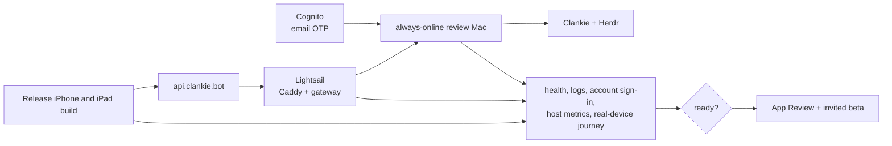

# Public gateway launch gate

The public gateway is the AWS doorway used by the App Store client. Deployment
instructions live in
[`infra/aws/public-gateway`](../infra/aws/public-gateway/README.md), and its
authority and transport boundary lives in
[ADR 0151](adr/0151-the-public-doorway-routes-home.md). This gate describes the
evidence available for App Review and the first invited users without claiming
an observability system that does not exist.

## Current evidence

The first deployment exposes only evidence already produced by the system:

- `GET https://api.clankie.bot/health` proves Caddy can reach the gateway;
- `GET https://api.clankie.bot/gateway/v1/config` publishes the exact non-secret
  Cognito issuer and client used by the Mac;
- the tagged Release workflow records the tested commit, protected production
  approval, private deployment, public health verification, and publication;
- Lightsail reports instance CPU, network, and status checks;
- Docker keeps bounded local gateway and Caddy logs;
- gateway logs report metadata-only host connects, disconnects, request status,
  byte count, and duration;
- Clankie's existing logs show the Mac connector and local service outcomes;
- physical off-network iPhone and iPad journeys prove user-perceived behavior.

Logs and manual notes never include message content, authorization headers,
pairing capabilities, terminal bytes, command text, or response bodies. The
gateway's opaque request id correlates its exchange with Mac-side investigation.

## App Store and invited-beta gate

Before submission or adding an invited user:

- `api.clankie.bot` resolves publicly and serves a valid HTTPS certificate;
- the production Release bundle contains that origin, no `*.ts.net` origin,
  and no cleartext ATS exception;
- the gateway and review Mac remain live for the intended review window;
- an invited email can complete `/gateway`, survive an access-token refresh and
  a Mac login, and connect without Tailscale, SSH, or a copied bearer;
- App Review receives a fresh QR or typed pairing code and exact setup notes
  (the README's Get started steps are that text; do not keep a second copy);
- pairing, reconnect, chat, fleet/agent control, and terminal observation pass
  on physical off-network iPhone and iPad devices;
- gateway and Caddy logs show no restart loop, repeated host disconnect, TLS
  failure, `gateway_busy`, timeout pattern, or unexpected 5xx response;
- Lightsail CPU and `docker stats` memory have headroom during the complete
  journey;
- privacy policy, privacy manifest, App Store privacy labels, and actual runtime
  behavior agree;
- the Guideline 4.2.7 contingency keeps remote chat and agent surfaces while
  selecting local transport for terminal observation/control if Apple requires
  it.

A health response alone is not release evidence. Record the complete physical
device journey and inspect the matching host, gateway, and Caddy evidence.

## Capacity decisions

The single gateway is deliberately sufficient for App Review and a small
invited beta. Change it only when evidence identifies the limiting layer:

| Evidence                                                      | Action                                                                                      |
| ------------------------------------------------------------- | ------------------------------------------------------------------------------------------- |
| Sustained CPU or memory pressure                              | Resize the one Lightsail instance and repeat the same journey.                              |
| `gateway_busy` without machine pressure                       | Measure the long-poll/stream mix before changing the bounded in-flight limit.               |
| Gateway timing is healthy but the app is slow                 | Investigate the phone network or Mac round trip; more AWS capacity does not help.           |
| One instance cannot meet measured concurrency or availability | Add a live-connection broker, then run multiple gateway processes behind one public origin. |

AWS IoT, a second mobile protocol, multiple gateway instances, and multi-region
deployment remain outside this launch boundary.

## Required before unrelated paid users

The repository does not yet implement dashboards, alert delivery, client UX
telemetry, or synthetic review journeys. Before a broad public beta, add:

- privacy-reviewed client timing for pairing, reconnect, send-to-ack,
  send-to-first-reply, terminal first frame, and terminal frame gaps;
- gateway/runtime dashboards for active hosts, in-flight work, errors, latency,
  event-loop lag, CPU, memory, network, restarts, and TLS failures;
- exercised alerts with traffic-aware thresholds rather than configuration-only
  checks;
- an always-on synthetic pairing, message, and terminal-observation journey.

Application-layer device-to-Mac encryption remains a prerequisite before
unrelated customers share the service. Obtain SES production access before
inviting an address that is not a verified sandbox recipient. Digital
features or subscriptions sold in the iOS app use StoreKit and App Store
Connect products. App privacy labels, the privacy policy, review notes, account
support, and actual data handling must agree before submission. An external
connection broker arrives only when horizontal scale is measured.
