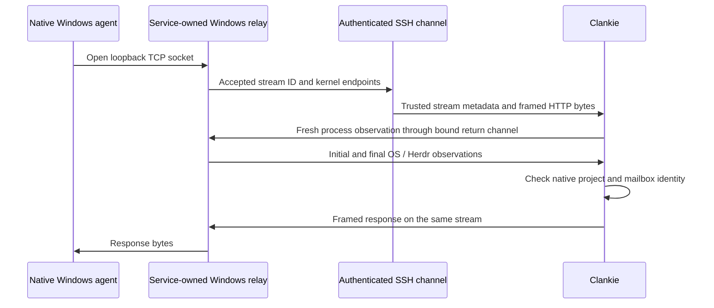

# Windows fleet process proof

A Windows fleet admits connected tools through its live service-owned SSH relay
stream. Fleet tools use the two-tool bridge described in [worker access](worker-access.md),
without native project proof. The process observations below remain the proof for
project/hire and mailbox identity. Hand-started agents and native hires use those
observations where those policies require identity.

## Binding a request to a process

OpenSSH's ordinary reverse TCP forward does not tell an HTTP listener which
remote process opened a particular channel. A caller-supplied PID, port, pane,
header or fleet bearer cannot fill that gap.

The service launches a fixed relay through the existing fleet SSH multiplexer.
The relay accepts only Windows loopback connections. For each accepted socket it
sends a new stream ID and the socket's own client/server endpoints over authenticated
SSH stdout. Client traffic is wrapped as data frames; it cannot introduce control
frames or choose another stream's identity. The local side opens a distinct TCP
pair to the restricted HTTP listener and matches both endpoints while that pair
and the SSH stream remain alive.

Windows PowerShell buffers stdin, so replies and observation commands use the
fleet's existing reverse forward. The relay generates a 32-byte random nonce in
memory, announces it only on authenticated SSH stdout, and presents it once on
its return connection. The service admits exactly one matching return connection.
The nonce never appears in discovery, arguments, environment, files or HTTP
headers. It binds the relay transport and does not authorize an agent.

A second PC process cannot borrow a victim's live proof: its connection has a
different kernel TCP tuple, and it cannot create a second live connection with
the victim's same four endpoints. Naming the victim's pane only causes Clankie
to compare that claim with the attacker's own observed socket ancestry. Direct
connections to the service listener have no trusted stream association.

## Fresh Windows evidence

The resident relay executes service-authored, bounded observations without
starting a new PowerShell process for each read. It caches the compiled native
reader, never a successful authorization result.

- `GetExtendedTcpTable` identifies the unique owner of the exact accepted tuple.
- Toolhelp process enumeration and kernel process handles supply parent PIDs,
  executable paths and full creation timestamps. Ancestry is bounded, cycle-safe,
  complete through the live pane shell, and checked for parent PID reuse.
- Herdr's configured session and live foreground process identify the pane.
  Native Claude/Codex executables are resolved from the SSH account's installed
  launchers; supported command wrappers may sit between shell and native agent.
- The x64 process parameters locate the current-directory **handle**. The reader
  duplicates that handle, resolves it with `GetFinalPathNameByHandle`, and compares
  the result with the separately canonicalized DOS path. Neither the SSH shell's
  cwd nor Herdr's startup directory supplies workspace authority.
- Initial and final native session, shell, foreground, process lifetimes, cwd,
  socket ownership and ancestry must match. The registered fleet and live stream
  are checked again before returning the proof.

The machine ID comes from service configuration. Windows workspace paths are
canonicalized on that machine; local Mac filesystem calls never validate them.
The same reader supplies fresh Git facts for enrolled repository worktree roots.

Before Herdr reports a native session ID, an independently started process may
receive workspace access under a disjoint process-lifetime identity. A pending
native session cannot establish a hired/private seat assignment.

## Dedicated hired Codex servers

A Windows hire may use one service-created native Codex app-server with a visible
native TUI in the allocated Herdr pane. The service launches the uniquely resolved
installed executable with `CreateProcessW`, suspended and outside the SSH job. It
captures the original process handle's full creation timestamp before resuming.
Inherited machine environment is preserved; the pane and socket discovery fields
come from the service allocation and live Herdr binding. No request can register
or adopt an existing process, port or shared daemon.

The private registry pins that server lifetime, executable, fleet configuration,
relay lifetime, pane binding and shell lifetime. It binds exactly one thread from
the held native protocol connection after `thread/loaded/list` and `thread/read`.
Each proof checks that the same sole thread is still loaded. A foreign thread
notification invalidates the registration regardless of notification method.
There is no private authority while startup is unbound.

The HTTP socket must independently descend from that exact server process. The
observer also proves the pane's installed native foreground view, shell, native
session and cwd; the server's cwd must agree. Listener ownership is checked before
and after the controller connects and again in each process snapshot. It does
not replace caller socket ancestry. Initial and final snapshots, the registry,
allocation and fleet must still agree before native project/hire proof applies.

Closing the server or its controller link releases registration. Cleanup opens
the original PID and checks its full creation timestamp on the held handle before
termination, so a reused PID is not killed. An unavailable SSH cleanup cannot
restore authority. A service restart does not adopt detached survivors.

Before a dedicated Windows launch, Clankie checks both worker manifests and the
SHA-256 bytes of the fixed installed `fleet-mcp.mjs`, `seat-channel.mjs`,
`link.mjs` and `inbound-receipt.mjs` against his own packaged worker. Canonical
paths must remain under the fixed worker root, and installed `node.exe` must be
unique. A stale, redirected or corrupt installation refuses before native launch;
hiring never prepares or rewrites it. The service chooses the fixed node command,
entry argv and trusted Herdr variables for both server and view. It clears only
that bridge's Node loader overrides (`NODE_OPTIONS`/`NODE_PATH`), preserves other
environment settings, and checks the same modules and paths again before the
first brief. This assumes the same installed-code trust boundary as native
executable discovery; it is not a defense against arbitrary same-user code tampering.

Only the service-owned dedicated remote launch overrides
`mcp_servers.clankie.required=false` in both server and view arguments. Other
servers retain their required flags; owner configuration is unchanged. An
optional asynchronous connection lets the native thread bind while its bridge
still receives denied responses for native project/mailbox identity. Fleet tools
use transport admission independently of thread binding.

After the thread binds and Herdr reports it, the trusted controller's `bound`
callback checks the exact pane, harness, session, fresh process proof, project
admission and allocation before recording project membership. It repeats host
identity and admission checks after that observation. The first brief then waits
at most 20 seconds for thread-specific `mcpServerStatus/list` to report Clankie
connected with `clankie_tools` and `clankie_call` while `fleet.tools` is on,
plus the worker bridge's `message_clankie`. With fleet tools off, no connected-tool
names are expected. Expected names are independent of project grants and account
catalog contents; this creates no identity or grant. Project admission is rechecked
after readiness, immediately before the first brief. This readiness check does
not prove a live provider call or substitute for per-call authorization.

The controller captures the expected names before launch and passes
`CLANKIE_EXPECTED_TOOL_NAMES` only to the dedicated bridge. It is a deny-only hint:
malformed JSON refuses discovery and no value adds authority. Nonempty expectations
require all expected names in `tools/list`; missing, denied or incomplete discovery
reports an MCP error after its bounded startup lookup. Fresh expectations must
still equal the captured set after binding and readiness; a changed fleet tool
setting prevents the brief. Generic bridges keep their existing fallback behavior.

Codex's status API combines a live-thread connection status with a separate
catalog snapshot. The fixed bridge contract is what closes that gap: Codex
constructs its connected managed client only after an uncached initial
`tools/list` succeeds. With this verified bridge, that success includes the
captured expected tools. A status snapshot or version by itself is insufficient.

The atomic launch inherits the remote machine's environment, including its
provider/account variables, and resolves the two Herdr discovery variables from
the live allocated pane. It executes the verified native binary directly;
wrapper-specific context selection is not imported. The selected remote account
therefore remains an explicit part of owner acceptance. As before, arbitrary Mac environment overrides are
unsupported. The full encoded PowerShell command is capped at 32,000 characters before SSH,
reserving 767 characters below the Windows limit for shell wrapping and the NUL.
The native argument string is checked separately before `CreateProcessW`. An
oversized configuration fails with no agent created. The earlier 21-qualified-Linear-name configuration, before the two-tool bridge,
plus model, provider, effort, account-storage and other-server configuration measured 30,266 characters (1,734 below the transport cap); its
full script passed a read-only Windows parser control. The Herdr socket path is
resolved on the PC rather than embedded in that encoded command, and remains
covered by the native argument bound.

The detached launch has no inherited SSH stdio or diagnostic log;
actual native app-server startup remains part of owner acceptance.

The atomic launch mechanism has an OS-only bounded sleeper check; native hired
Codex end-to-end acceptance still requires an owner-authorized native run. The
deterministic protocol fixture holds the bridge's first catalog through denied
startup, binds the sole native thread and returns granted tools without another
SessionStart. This is not evidence of a live native tool invocation.

## Failure and operational limits

SSH or return-channel loss invalidates every held stream and pending observation.
Malformed frames, replayed stream IDs, unavailable process memory, changed native
state, unsupported architecture, missing executables and ambiguous ownership
fail closed. Relay traffic is bounded to 64 streams, 64 KiB frames and bounded
pending buffers/observation queues. Unsupported POSIX remote fleets and local
platforms without a process observer receive no project or mailbox authority
from a legacy machine token.

A deployment is not a native acceptance result. The owner must prepare the
machine's bridge, register the intended machine workspaces or repository roots,
verify that fleet tools are on and the connected account is verified, then inspect
fresh native catalogs and a read through `clankie_call` after service/pane cutover. Isolated relay and
host-observer evidence does not claim those steps happened.
