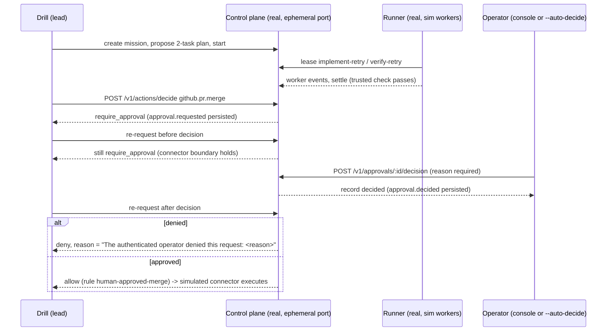

# VUH-698 approval-ceremony drill

The drill proves the human merge-approval boundary end-to-end against the real
control plane: a mission runs to verified success, the lead requests the final
simulated merge as a privileged action, the request lands as a durable pending
approval in the operator inbox, and the privileged connector is released only
after a recorded human approval. Rejection returns the request to the lead with
the human's reason attached.

## Invocations

```bash
# Scripted smoke, rejection path first, then approval path:
pnpm --filter @clankie/lead-agent-lab drill:approval-ceremony -- --auto-decide reject
pnpm --filter @clankie/lead-agent-lab drill:approval-ceremony -- --auto-decide approve

# Live ceremony (stays running until the operator decides in the console):
pnpm --filter @clankie/lead-agent-lab drill:approval-ceremony
```

`--timeout-ms <n>` (or `CLANKIE_CEREMONY_TIMEOUT_MS`) bounds startup and
mission waits (default 180 000). Exit code 0 means every boundary assertion
held; the temporary runtime directory is retained and printed for inspection.

## What one invocation does



Everything is isolated: an ephemeral loopback port per process, a temporary
event store, memory store, credential file, fixture repo, worktrees, and runner
state under one `clankie-approval-ceremony-*` tmp directory. Ports 4310, 4313,
4321, and 8082 stay untouched. The operator token is minted per run and passed
to the control plane via the `CLANKIE_OPERATOR_TOKEN` override, so the machine
keychain is never read or written.

## Doctrine profile

The control plane loads a profile derived at runtime from the frozen
`doctrine/profiles/self-build-lab.yaml` (which is read, never written). The
single change is an explicit release rule on `github.pr.merge`, mirroring the
canonical rule shape used by `apps/control-plane/test/approvals.test.ts`:

```yaml
github.pr.merge:
  default: require_approval
  rules:
    - id: human-approved-merge
      effect: allow
      when: { minHumanApprovals: 1, checksPassed: true }
      reason: A recorded human approval releases the simulated merge connector.
```

Without this rule the frozen profile keeps returning `require_approval` even
after an operator approval, so no policy decision would ever release the
connector. The derived profile's hash is printed at startup and stamped on
every mission, approval, and event.

## Attaching the console (live ceremony)

The interactive mode prints an exact environment block once the approval is
pending, for example:

```bash
export CLANKIE_CONTROL_PLANE_URL=http://127.0.0.1:<ephemeral-port>
export CLANKIE_OPERATOR_TOKEN=<per-run operator token>
export CLANKIE_EVENT_STORE=<runtime>/control-plane/events.db
pnpm --filter @clankie/tui dev   # or the `clankie` binary with the same environment
```

Open the `/approvals` inbox, select the pending `github.pr.merge` request,
review the mission plan, evidence, and policy rationale, and approve or reject
with a reason (the console requires one). The drill polls the approvals API and
resumes the moment the decision is recorded. The console only records the
decision; execution is released solely by the subsequent policy re-evaluation.

## Expected event sequence

One successful invocation records this sequence in the isolated, hash-chained
SQLite event store (`<runtime>/control-plane/events.db`):

```text
mission.created -> mission.drafted -> mission.planned -> mission.started
  -> mission.execution.started
  -> worker.leased / worker.native_session.bound / worker.status.resolved
  -> task.started / worker.settled / task.succeeded          (implement-retry)
  -> task.started / worker.settled / task.succeeded          (verify-retry)
  -> mission.succeeded
  -> approval.requested                                       (pending merge approval)
  -> approval.decided                                         (operator decision)
```

## Evidence fields (VUH-698 acceptance criteria 2 and 3)

Both approval events carry the audit envelope; the drill prints them verbatim
after the decision:

| Criterion                         | Where it is recorded                                                                                                                                                                    |
| --------------------------------- | --------------------------------------------------------------------------------------------------------------------------------------------------------------------------------------- |
| Approval identity                 | `approval.decided` → `data.approval.decidedBy` (the control plane's `CLANKIE_OPERATOR_ID`, default `local-operator`)                                                                    |
| Timestamp                         | `data.approval.decidedAt` and the event envelope `occurredAt`                                                                                                                           |
| Doctrine hash                     | `profileHash` on both the event envelope and the approval record                                                                                                                        |
| Rejection reason back to the lead | `data.approval.reason`, and the re-request decision `effect=deny`, `matchedPolicyIds=["operator-approval:denied"]`, `reason="The authenticated operator denied this request: <reason>"` |

The chain is verified (`SqliteEventStore.verify()`) before the excerpt is
printed, so the evidence is from an intact hash-chained log.

## Environment note: runner under current Node

`pnpm --filter @clankie/runner start` fails on current Node before any runner
code executes: `@xterm/headless` and `@xterm/addon-serialize` publish CJS mains
without an `exports` map, so Node cannot see their named exports from ESM. Both
packages ship `.mjs` builds, so the drill starts the unmodified runner via the
workspace `tsx` binary with a scoped `NODE_OPTIONS --import` resolver hook that
redirects exactly those two bare specifiers to the ESM builds. This is a
pre-existing runner/Node incompatibility worth its own fix; the hook lives in
the drill's temporary runtime and touches nothing else.
