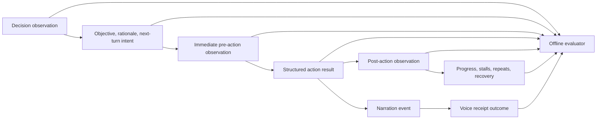

# PokeAgent performance evaluation

Date: 2026-08-16 America/Chicago

Live snapshot: 2026-08-17T03:32:41Z

Session: `embodiment-f9c39d68-c379-48a1-91c0-a41637d998fd`

Environment: hosted `pokemon-firered`

## Verdict

Clankie controls the real hosted FireRed body reliably, and the emulator,
world transport, and voice path are healthy. The dominant cost is the agent
loop: decisions arrive every ~22 seconds, only ~11% of wall time belongs to
explicit helper-controlled frames, and the run remains in Oak's intro after ten
minutes. Progress is also volatile when exact progress persistence is disabled.

The live proof covers boot, observation, actions, text entry, menu selection,
frame progression, and voice delivery. It does not yet cover hosted overworld
navigation, battles, multiplayer interaction, or a durable in-game save.

## Live run

| Metric                                     |                      Value |
| ------------------------------------------ | -------------------------: |
| Wall time                                  |                     616.5s |
| Turns                                      |                         27 |
| Accepted                                   |                 24 (88.9%) |
| Adapter rejections                         |                  3 (11.1%) |
| Mind failures                              |                          0 |
| Throughput                                 |             2.63 turns/min |
| Join to first action                       |                     30.74s |
| Turn gap median / mean                     |            22.07s / 22.53s |
| Turn gap P95 / max                         |            36.35s / 43.07s |
| Logical frame                              |                     34,836 |
| Effective emulator rate                    | 56.5 FPS (94.2% of 60 FPS) |
| Helper-controlled frame time               |              65.7s (10.7%) |
| Time outside helper-controlled frames      |             550.8s (89.3%) |
| Inputs executed                            |                         83 |
| Accepted actions reporting a screen change |              20/24 (83.3%) |
| Unique observation digests                 |                      27/27 |
| Unique framebuffer digests                 |                      23/27 |
| Replayed actions                           |                          0 |
| Badges                                     |                          0 |
| Cartridge save                             |                    0 bytes |
| Resumed checkpoint                         |                       none |

The three rejections are two `semantic_state_unavailable` results and one
`dialog_not_open`. Clankie changes strategy on the next turn each time, but the
rejected decisions account for ~65.5 seconds of the observed timeline.

## Timing attribution

The world transport is not the bottleneck. The delay from world-host action
completion to Clankie's journal is 5.4ms mean, 8ms P95, and 12ms maximum.
Logical emulation remains near real time while the model thinks.

`helperFramesSpent / 60` measures explicit action-helper frame budget, not CPU
time. The remaining 89.3% includes observation, inference, orchestration,
narration scheduling, and idle time; it must not be labeled pure model latency.

The hosted FireRed setup reaches the overworld around frame 7,900 with the
verified state-aware A-only intro path. This run is still in the intro at frame
34,836, 4.4x later in watcher-visible game time. It uses `START` twice and calls
semantic helpers on undecoded screens, both avoidable sources of intro churn.

The same milestones improve over the preceding fresh run:

| Milestone       | Previous |           Evaluated run |     Change |
| --------------- | -------: | ----------------------: | ---------: |
| Gender choice   |   7m 08s |                  4m 24s | 38% faster |
| Player named    |   8m 08s |                  6m 20s | 22% faster |
| Bedroom reached |  13m 42s | not reached at snapshot |    pending |

## Voice

| Metric                        |                       Value |
| ----------------------------- | --------------------------: |
| Narration requested           |         14/27 turns (51.9%) |
| Spoken responses              |                          11 |
| Deliberate silent completions |                           2 |
| In flight at snapshot         |                           1 |
| First-audio mean / median     |               576ms / 535ms |
| First-audio P95 / max         |               660ms / 753ms |
| Playback mean                 |                       9.39s |
| Playback range                |             6.58s to 13.28s |
| Total spoken airtime          | 103.3s (16.8% of wall time) |
| Fast-path use                 |                        100% |
| Handoff latency               |                         0ms |

Voice starts quickly. The concern is editorial rather than transport: half of
the turns request narration and spoken updates average more than nine seconds
during an intro.

Actual generated voice wording remains unavailable by policy. A play trace
records the bounded event offered to the room and joins it to content-free
delivery receipts; it does not retain PCM, a room transcript, or generated
speech text.

## Historical baseline

The snapshot covers 26 journals and 1,050 turn records. Eleven journals have a
clean summary; fifteen historical journals end through later `lease_lapsed`
lifecycle accounting after process replacement.

| Metric                                 |             Value |
| -------------------------------------- | ----------------: |
| Action acceptance                      | 903/1,050 (86.0%) |
| Adapter rejection                      | 136/1,050 (13.0%) |
| Mind failure                           |   11/1,050 (1.0%) |
| Historical turn gap mean / median      |      16.53s / 10s |
| Historical turn gap P95 / max          |        52s / 180s |
| Summarized runtime                     |     125.4 minutes |
| Summarized turns                       |               729 |
| Summarized throughput                  |    5.82 turns/min |
| Distinct turn-end tiles                |               160 |
| Weighted actions per new turn-end tile |              3.85 |
| Turn-weighted coherence                |             0.526 |
| Viewer frames published / dropped      |   44,583 / 21,304 |
| Historical viewer-frame drop rate      |             32.3% |
| Volition offered / taken               |   727 / 69 (9.5%) |
| Volition suppressed / skipped          |          94 / 503 |

The strongest productive run records 206 turns in 34.4 minutes, 96.6% action
acceptance, 71 distinct turn-end tiles, and 2.84 actions per new turn-end tile.
It reaches Viridian, explores its accessible buildings, obtains Oak's Parcel,
and returns toward Pallet. A following run delivers the parcel, obtains the
Pokedex and Town Map, and attempts the first catch.

Viewer-frame drops and logical emulator pacing are different metrics. The
current emulator advances at 56.5 FPS even though older summarized runs drop
32.3% of frames offered to the viewer path.

## Quality evaluation

An evaluation turn is a causal packet, not a score inferred from hashes:



The evaluator reports evidence and `unknown` separately for:

- movement start, target, end, and effectiveness;
- action appropriateness for the decoded scene;
- prior intent to next action alignment;
- standing objective continuity and retirement;
- structured execution result and observed effect;
- rejection recovery, repeated failures, stalls, and recurring states;
- narration offer, suppression, model silence, playback, or missing receipt;
- clean summary or terminal embodiment lifecycle accounting.

V1 journals remain readable but cannot reconstruct their missing semantic
states. Their movement and scene judgments remain `unknown`, rather than being
guessed from prose or digests.

## Current instrumentation

- Production journals use V2 causal evidence for new runs.
- `gameplay:evaluate-journal` evaluates a journal with optional lifecycle and
  voice trails.
- The launcher gives Clankie its configured play shutdown deadline plus a
  two-second reporting cushion, so ordinary restarts cannot preempt terminal
  play accounting.
- Hard crashes are accounted by joining `header.runId` to the durable
  embodiment lifecycle event after restart reconciliation.
- Hosted exact progress persistence is operator policy. It is disabled by
  default and enabled only with `WORLD_PERSIST_PROGRESS=1` in the PokeAgents
  world host.

## Rerun

```bash
pnpm --filter @clankie/gba-emulator gameplay:evaluate-journal -- \
  ~/.local/state/clankie/gba-play/<run>.jsonl \
  --events ~/.clankie/events.jsonl \
  --voice-receipts ~/.local/state/clankie/discord-live-receipts.jsonl
```

The standard evaluator intentionally stores no ROM, savestate, screenshot,
audio, credential, or full room transcript.
