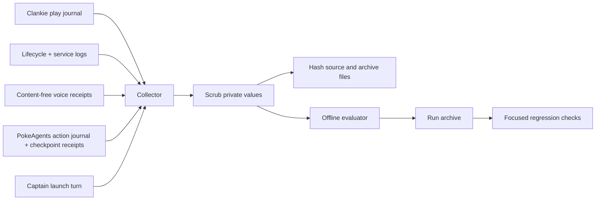

# PokeAgents trial run archive

Date: 2026-08-18 America/Chicago

Run: `embodiment-ec40ffac-19be-48c5-ad63-27075a2af99e`

Hosted session: `ses_e14ccfa45a09c8b092b20fd49c3c8b60`

Environment: live hosted `pokemon-firered`

Evidence status: complete for every durable run trail found on the host; scrubbed
of operator, Discord, filesystem, and player identifiers. ROM, state bytes,
framebuffer bytes, full room/voice transcripts, and audio remain excluded by
policy; bounded interjections that reached a play turn remain in its causal
journal.

## Verdict

This was a productive 65-minute run. Clankie completed FireRed's introduction,
named himself and his rival, chose Charmander, beat Gary, won three wild
battles, reached Viridian City, collected Oak's Parcel, and correctly began the
return to Pallet. The service, hosted body, semantic observations, action path,
watch surface, and voice delivery all remained live until an orderly SIGTERM
stopped play at the next turn boundary.

The run also isolated four Clankie-owned feedback failures. Structured
navigation refusals dropped their actionable coordinates, an unverified route
stop was called an NPC, unsuccessful A presses could be mistaken for ambient
screen changes, and a positionless battle retired a valid route objective.
Each now has a focused regression check. The remaining generic hosted map names
come from PokeAgents and require separately scoped work in that repository.

## Run outcome

| Metric                        |                                   Value |
| ----------------------------- | --------------------------------------: |
| Duration                      |                               65m 12.2s |
| Turns                         |                                     315 |
| Accepted actions              |                             290 (92.1%) |
| Adapter rejections            |                               24 (7.6%) |
| Invalid decisions             |                                1 (0.3%) |
| Distinct turn-end tiles       |                                      80 |
| Accepted actions per new tile |                                    3.67 |
| Movement effects              | 99 effective, 57 ineffective, 6 unknown |
| Narration                     |     37 played, 9 suppressed, 1 unspoken |
| Viewer frames                 |         41,602 published, 5,568 dropped |
| Terminal outcome              |  `stopped`; lifecycle record consistent |

The evaluator's coherence score is `0.4266`. That metric penalizes intent/action
drift but does not erase the concrete milestones above; both are retained in
the evidence rather than collapsed into one quality score.

## What the run exposed

### 1. Hosted refusal detail stopped at the body seam

Fourteen `walk_to` actions were rejected. The PokeAgents refusal included
facts such as `nearestOpen` and map bounds, but the free-play error translator
only carried detail found after an em dash. The hosted body emitted JSON with
no such suffix, so the mind received only “that tile is a wall or obstacle.”
Turn 140, for example, lost the answer that `(17,16)` was the nearest open tile
to the rejected Route 1 target.

The hosted body now appends protocol refusal detail in the same bounded suffix
the free-play loop already reads. The formatter covers budgets, bounds, nearest
open/reachable tiles, unsupported exits, and available menu entries.

### 2. An unknown route stop was invented as an NPC

The hosted action result uses `blockedBecause: "state_changed"` when a planned
step fails without a classified cause. Clankie's effect formatter treated every
unknown value as an NPC. During the return from Viridian, turns 276–282 called
three adjacent westward stops “hidden blockers” even though the decoded
occupants listed nobody on those tiles; directional terrain is one plausible
cause, but the trace does not prove it.

Only a verified `npc`, battle, or transition is now named. An unclassified
stop keeps its cause unknown and directs the player to compare the occupants
before choosing another approach.

### 3. A house was pursued as the Pokémon Center

Turns 173–255 held the objective `heal at the Viridian Pokemon Center` for
17m 34.9s. Clankie first entered the Trainer School, corrected course, then
entered generic map `firered-map-5-0` and assumed it was the Center. Its decoded
occupants placed nobody behind the north counter, while direct interactions
read dishes, a TV, Speary the Spearow, and cooking smells. He nevertheless made
23 A-button interaction actions around that counter before abandoning the
objective.

Two feedback gaps reinforced the bad premise:

- an A press with unchanged semantic state could report “screen changed though
  the decoded state did not,” which made ambient animation sound like evidence
  of an interaction;
- the mind knew `occupants` omitted furniture, but did not have the explicit
  inverse: if an expected person is absent, furniture cannot secretly be that
  person.

An overworld A press that opens no dialog, menu, or battle now says exactly
that, even when the frame digest changes. The mind prompt also states that a
person is never scenery and tells the player to leave or gather new evidence
when the expected person is absent.

### 4. A battle retired the correct route objective

Turn 301 retired `deliver Oak's Parcel to Pallet Town` while the position was
unavailable during a recurring Pidgey battle state. After the battle, turn 306
recreated the objective as `deliver Oak's Parcel in Viridian`, even though the
actions continued south toward Pallet.

Objective staleness now requires a current overworld position. Battles,
transitions, and other positionless interruptions preserve the standing route
objective.

### Remaining external weakness

Hosted Viridian locations arrive as generic identifiers such as
`firered-map-3-1` and `firered-map-5-0`. That ambiguity helped the false room
identity persist. The authoritative fix belongs in PokeAgents' map metadata or
observation adapter; hard-coding FireRed identities in Clankie would create a
second, drifting map catalog. No PokeAgents files are changed in this archive.

## Evidence flow



The Clankie embodiment id joins play, lifecycle, launch, and service records.
The independent PokeAgents `ses_...` id is taken from V2 world provenance and
joins the host action journal and checkpoint receipts. These ids are different
by design.

## Evidence index

Use the [shared read-only archive viewer](../archive-viewer.html) to browse the
manifest, filter the 315-turn causal timeline, inspect captured images, and
search every raw archived source. Browsers do not allow the viewer to fetch
local evidence from a `file://` page, so launch its dependency-free localhost
server:

```bash
pnpm testing:view docs/testing/2026-08-18-pokeagents-trial-run
```

Then open <http://127.0.0.1:4173>. To verify the server's routing, MIME types,
HEAD handling, and traversal protection:

```bash
pnpm testing:view docs/testing/2026-08-18-pokeagents-trial-run --check
```

| File                                                                                | What it preserves                                                                                                                                                      |
| ----------------------------------------------------------------------------------- | ---------------------------------------------------------------------------------------------------------------------------------------------------------------------- |
| [`01-play-journal.jsonl`](evidence/01-play-journal.jsonl)                           | Complete V2 causal play journal: decisions, immediate pre-action state, structured action results, post-action state, progress, narration joins, and terminal summary. |
| [`02-lifecycle-events.jsonl`](evidence/02-lifecycle-events.jsonl)                   | Claimed, started, stopping, and stopped embodiment lifecycle records.                                                                                                  |
| [`03-voice-receipts.jsonl`](evidence/03-voice-receipts.jsonl)                       | Content-free voice and narration delivery receipts for the run's active stay.                                                                                          |
| [`04-service-events.jsonl`](evidence/04-service-events.jsonl)                       | Service host startup, listener, SIGTERM request, and settled shutdown records around the run.                                                                          |
| [`05-world-action-journal.jsonl`](evidence/05-world-action-journal.jsonl)           | Independent PokeAgents record of every hosted action and refusal.                                                                                                      |
| [`06-world-checkpoint-receipts.jsonl`](evidence/06-world-checkpoint-receipts.jsonl) | Start and stop checkpoint digests and metadata, without state bytes.                                                                                                   |
| [`07-captain-launch.json`](evidence/07-captain-launch.json)                         | Curated launch sequence showing voice retry, watch admission, world join, first observation, and operator-request redaction.                                           |
| [`08-evaluation-summary.json`](evidence/08-evaluation-summary.json)                 | Standard evaluator run and aggregate metrics.                                                                                                                          |
| [`09-turn-timeline.tsv`](evidence/09-turn-timeline.tsv)                             | Greppable one-row-per-turn objective, action, effect, and advice timeline.                                                                                             |
| [`10-capture-environment.json`](evidence/10-capture-environment.json)               | Toolchain, scrubbed source paths, and later repository-state snapshot with revision caveat.                                                                            |
| [`manifest.json`](evidence/manifest.json)                                           | SHA-256 and byte size for every archive file and raw source, plus explicit exclusions.                                                                                 |

The checked-in archive is about 4 MiB. It contains no screenshots because the
durable play trail stores framebuffer hashes, not frame bytes. It contains no
generated narration wording or PCM because those are intentionally not logged.
Later runs capture bounded milestone and terminal screenshots beside the play
journal; this archive's collector verifies their hashes, copies them with the
scrubbed evidence, and the viewer presents each frame on its causal turn.

## Debug log

1. At 23:15:15 CDT, the hosted FireRed session started. The first voice join
   failed; the retry succeeded. The first watch request raced admission and
   failed, then succeeded after the voice stay became active.
2. Clankie completed the introduction and lab sequence, chose Charmander, and
   beat Gary. He then won two Rattata battles on Route 1, reaching level 7 and
   learning Ember.
3. He reached Viridian, explored the Trainer School and the house mistaken for
   the Center, then entered the Mart and received Oak's Parcel.
4. He navigated south, worked around several unclassified route stops, won a
   Pidgey battle, and continued toward Pallet. A final Rattata battle was in
   progress when shutdown arrived.
5. At 00:20:27 CDT, SIGTERM requested shutdown. Play stopped at the next turn
   boundary and wrote a summary; the matching lifecycle event records
   `stopped`, not a crash or lease lapse.
6. Archive tracing found that a hosted play uses two session ids. The collector
   now derives the PokeAgents id from V2 provenance rather than assuming the
   play-journal header contains it.
7. Focused regression tests cover refusal detail, unknown route-stop wording,
   no-op A interactions, expected-person absence guidance, and route-objective
   preservation through positionless battles.

## Rebuild and evaluate

The collector uses only Node's standard library and the repository's existing
evaluator:

```bash
node docs/testing/2026-08-18-pokeagents-trial-run/flows/collect-run-evidence.mjs \
  ~/.local/state/clankie/gba-play/2026-08-19T04-15-15-707Z-embodiment-ec40ffac-19be-48c5-ad63-27075a2af99e.jsonl

pnpm --filter @clankie/gba-emulator gameplay:evaluate-journal -- \
  ../../docs/testing/2026-08-18-pokeagents-trial-run/evidence/01-play-journal.jsonl \
  --events ../../docs/testing/2026-08-18-pokeagents-trial-run/evidence/02-lifecycle-events.jsonl \
  --voice-receipts ../../docs/testing/2026-08-18-pokeagents-trial-run/evidence/03-voice-receipts.jsonl
```

Recollection assumes the raw trails still exist under `~/.local/state/clankie`,
`~/.clankie`, and `~/.pokeagent-mmo`, plus working Clankie and PokeAgents
checkouts at `~/dev/clankie` and `~/dev/pokeagents`. The journals do not record
the exact source revision that launched each process; the captured Git heads
are later snapshots and are not represented as stronger evidence.
