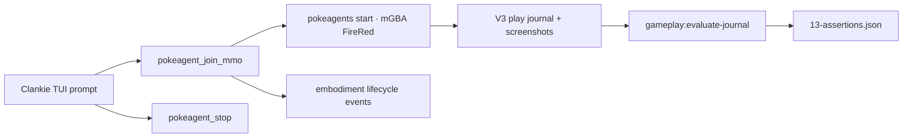

# Hosted FireRed intro on current Clankie (post-ADR 0145)

Date: 2026-08-30 America/Chicago

Run: `embodiment-7c0493bc-d431-413c-b919-d15f5243c510`

Hosted session: `ses_d6d572aeec79f6b565c7185c83d7d023`

Environment: live hosted `pokemon-firered` on local `pokeagents start` (unix socket, real mGBA)

Code: Clankie `a7a2bf2`, PokeAgents `37dc628`. The Clankie service (pid 42709) and world host (pid 41839) were already running. Play-path source was not dirty at prompt time.

Driver: operator TUI prompt in Herdr pane `w1C:pW` (`originLane: "operator"`). Not the `free-play-live` script, not Discord voice.

## Verdict

**Pass.** Eleven of eleven working-state assertions held. After retiring the local emulator, Clankie still joins a hosted PokeAgents FireRed body from the TUI, observes, acts, names himself `CLANKIE`, confirms it, and stops on request. Journal provenance is `body: "world"` on every causal stage. Lifecycle is `claimed → running → stop_requested → stopping → stopped`, consistent with the play-journal summary.

This does **not** re-prove the August 18 65-minute overworld campaign (Viridian, Parcel, battles). It proves the post-0145 join path still plays a real cartridge.

## Assertions

All pass in [`evidence/13-assertions.json`](evidence/13-assertions.json):

| Check                      | Meaning                                                             |
| -------------------------- | ------------------------------------------------------------------- |
| `clankie_ready`            | `clankie status` → `ok` / `ready`                                   |
| `services_healthy`         | clankie, relay, discord-bridge, activity, tunnel healthy            |
| `pokeagent_mmo_enabled`    | `gameplay.pokeagentMmoEnabled` true                                 |
| `world_credential_present` | broker id `pokeagent_mmo_world` present (secret not archived)       |
| `join_venue_world`         | journal header `venue: "world"`, `environmentId: "pokemon-firered"` |
| `provenance_world_only`    | every turn `evidence.decision.provenance.body === "world"`          |
| `named_clankie`            | accepted `enter_text` `"CLANKIE"`                                   |
| `confirmed_name`           | accepted `select_menu_entry` `yes` on `intro-name-confirmation`     |
| `orderly_stop`             | summary `stopped` and lifecycle `embodiment.session.stopped`        |
| `accepted_majority`        | 11 accepted / 1 adapter rejection, recovered next turn              |
| `no_local_emulator_venue`  | header venue is not local                                           |

## Run outcome

| Metric                 |                                                 Value |
| ---------------------- | ----------------------------------------------------: |
| Wall time              |                                              2m 33.7s |
| Turns                  |                                                    12 |
| Accepted               |                                            11 (91.7%) |
| Adapter rejections     | 1 (`semantic_state_unavailable` on the gender screen) |
| Named                  |           `CLANKIE` (turn 8), confirmed Yes (turn 10) |
| Viewer frames          |                          2,265 published, 179 dropped |
| Mean decision / action |                                           6.0s / 4.0s |
| Terminal               |                       `stopped`; lifecycle consistent |
| World occupancy        |                       1/8 during play, 0/8 after stop |

## What the run exposed

One expected intro refusal: turn 5 called `advance_dialog` on the boy/girl screen, which has no decoded dialog. The harness said so (`semantic_state_unavailable` / “this screen carries no decoded state”). Turn 6 confirmed BOY with A. Recovery is `recovered` in the evaluator.

Coherence `0.2` is not a play-quality score for a 12-turn intro with no overworld tiles. Keep the milestones; do not collapse this run into that number.

## Evidence flow



## Debug log

1. Preflight: `clankie status` ready; doctor `pokeagentMmoEnabled: true`; broker listed `pokeagent_mmo_world`; `pokeagents start` showed kanto, mgba, firered+emerald, 0/8 bodies, socket `~/.pokeagent-mmo/world/host.sock`.
2. `herdr agent prompt` refused (`agent_not_ready` / not an active named agent). The TUI is detected as agent `clankie` in `herdr agent list` but does not accept `agent prompt`. Typed the request with `herdr pane run w1C:pW`.
3. Join returned `action: "joined"` for `pokemon-firered`. World pane went to 1/8 bodies. Journal header `schemaVersion: 3`, `venue: "world"`.
4. Turns 0–4 mashed A then `advance_dialog` through Oak. Turn 5 refused on the gender screen; turn 6 confirmed boy.
5. Turn 8 typed `CLANKIE` (37 inputs, confirmed). Turn 10 selected Yes. Turn 11 read Oak's rival intro. TUI: “Name confirmed as CLANKIE. Stopping.” then `pokeagent_stop` → `action: "stopped"`.
6. After stop, `clankie play status` was `session: null` and the world returned to 0/8.
7. While this run was in flight, a sibling session dirtied unrelated Discord channel files in the Clankie worktree. Those paths are not on the play seam; the running service had already loaded `a7a2bf2`. PokeAgents had an unrelated dirty doc (`docs/hosting-emerald-multiplayer.md`).

## Evidence index

| File                                                                      | What it proves                                                                           |
| ------------------------------------------------------------------------- | ---------------------------------------------------------------------------------------- |
| [`00-clankie-status.json`](evidence/00-clankie-status.json)               | Service ready before play                                                                |
| [`00-clankie-doctor.json`](evidence/00-clankie-doctor.json)               | MMO enabled; world credential id present; credential secrets omitted                     |
| [`00-games.json`](evidence/00-games.json)                                 | `pokeagentMmoEnabled: true`                                                              |
| [`01-play-journal.jsonl`](evidence/01-play-journal.jsonl)                 | V3 journal, world venue, causal evidence, naming, stop                                   |
| [`02-lifecycle-events.jsonl`](evidence/02-lifecycle-events.jsonl)         | claimed / running / stop_requested / stopping / stopped                                  |
| [`05-world-action-journal.jsonl`](evidence/05-world-action-journal.jsonl) | Independent PokeAgents action record for `ses_d6d572ae…`                                 |
| [`08-evaluation-summary.json`](evidence/08-evaluation-summary.json)       | Evaluator aggregate; terminal consistent                                                 |
| [`09-turn-timeline.tsv`](evidence/09-turn-timeline.tsv)                   | One row per turn                                                                         |
| [`10-capture-environment.json`](evidence/10-capture-environment.json)     | Git heads; dirty-tree caveat                                                             |
| [`11-tui-recent.txt`](evidence/11-tui-recent.txt)                         | Operator TUI: join, observe still, stop, closing line                                    |
| [`12-world-host-tui.txt`](evidence/12-world-host-tui.txt)                 | Host panel after stop (0/8)                                                              |
| [`13-assertions.json`](evidence/13-assertions.json)                       | Mechanical pass/fail                                                                     |
| [`screenshots/`](evidence/screenshots/)                                   | Bounded 240×160 frames, including Oak after name confirm                                 |
| [`activity/`](evidence/activity/)                                         | Live Activity UI (`http://127.0.0.1:4320`) during a follow-up hosted session             |
| [`blog-stills/`](evidence/blog-stills/)                                   | Curated GBA frames for the post: Oak, name keyboard, grandson, bedroom, lab, Pallet Town |
| [`manifest.json`](evidence/manifest.json)                                 | SHA-256 of every evidence file                                                           |

ROM, save bytes, framebuffer bytes beyond the bounded PNGs, voice PCM, and credential secrets are excluded.

## Re-run

Assumes `pokeagents start` and `clankie` are already up, MMO enabled, world credential in the broker.

```bash
# from a Herdr pane that can type into the Clankie TUI
herdr pane run <clankie-tui-pane> "Play FireRed in the PokeAgents hosted world. Join with pokeagent_join_mmo. Get through Oak intro, name yourself CLANKIE, confirm the name, then stop playing."

pnpm --filter @clankie/play gameplay:evaluate-journal -- \
  ~/.local/state/clankie/gba-play/<new-journal>.jsonl \
  --events ~/.clankie/events.jsonl
```

Browse this archive:

```bash
pnpm testing:view docs/testing/2026-08-30-hosted-firered-intro
```

## Outcome

The hosted body is the live play path on today's Clankie. A TUI ask is enough to join FireRed, get through Oak's intro, write the name, and stop cleanly. Use this archive for the post-0145 “it still works” claim; keep the 2026-08-18 trial for the long-run / Speary story.
