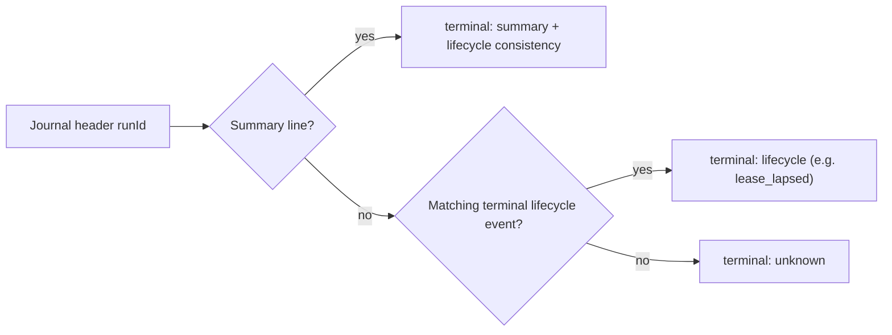

# PokeAgent evidence sweep: every journal this machine has kept

Date: 2026-09-05 America/Chicago

Scope: all 40 play journals under `~/.local/state/clankie/gba-play`, from the
2026-07-27 local-emulator runs to the 2026-08-30 hosted FireRed sittings, each
put through the shipped evaluator with the real lifecycle and voice-receipt
trails joined. This is the archive-wide counterpart to the single-run
[2026-08-16 PokeAgent performance](../2026-08-16-pokeagent-performance/README.md)
report: it asks whether the evidence model holds across every run that exists,
not whether one run went well.

Code: Clankie `fd6d7134` plus the journal-archive fix this record documents
(ADR 0160). Evidence in `evidence/01-archive-sweep.json`, regenerated by
`flows/sweep-play-archive.mjs`.

## Verdict

Terminal accounting is fixed and the fix is visible in production data: every
one of the 14 runs started after the launcher grace change carries its own
summary, against 11 of 26 before it. The 15 gaps the work started from are all
older runs, and 12 of them now resolve to an explicit `lease_lapsed` lifecycle
event rather than to silence.

The archive itself had a second, quieter defect. Retiring the local body's
checkpoint actions with the emulator (ADR 0145) made one 129-turn run
unparseable, and because the parser rejects a whole file, that run had dropped
out of evaluation, journey continuity, and the operator's trail read at once.
Reading a journal against its own history (ADR 0160) restores it: 40 of 40
journals now parse.

## Terminal accounting

The launcher gave every service a flat 10-second stop grace while Clankie's own
play finalization owned 15 seconds, so a restart killed him mid-summary. The
launcher now derives Clankie's grace from `CLANKIE_PLAY_SHUTDOWN_DEADLINE_MS`
plus a two-second reporting cushion; generic services keep 10 seconds.

| Runs started                     | Runs | Own summary | Lifecycle only | No terminal |
| -------------------------------- | ---: | ----------: | -------------: | ----------: |
| Before the grace fix             |   26 |          11 |             12 |           3 |
| After the grace fix (2026-08-17) |   14 |          14 |              0 |           0 |

All 12 lifecycle-only runs resolve to `lease_lapsed`, which stays distinct from
a completed summary — an interrupted run is accounted, never re-narrated as a
clean finish. The 3 remaining unknowns are 2026-08-02/03 runs whose lifecycle
events predate the durable event trail; unknown is the honest answer and the
evaluator says so rather than inventing an outcome.



## Archive readability

| Journals | Readable before ADR 0160 | Readable after | Turns | Turns carrying causal evidence |
| -------: | -----------------------: | -------------: | ----: | -----------------------------: |
|       40 |                       39 |             40 | 2,438 |                          1,305 |

Evidence coverage tracks the schema, not the run: 27 V1 journals (1,133 turns)
predate causal evidence and correctly evaluate to `unknown` rather than to a
guess, while all 1,305 turns in the 11 V2 and 2 V3 journals carry the full
decision → pre-action → structured result → post-action packet.

Ten turns in the 2026-08-11 run hold `load_checkpoint`, an action this build can
no longer execute. They read as themselves with `actionRetired: true` and
`unknown` verdicts, and `aggregate.retiredActionTurns` counts them so a reader
knows why those unknowns are there.

## What the archive says about the agent

Across all 2,438 evaluated turns:

| Signal                      | Result                                                                        |
| --------------------------- | ----------------------------------------------------------------------------- |
| Outcomes                    | 2,094 accepted · 331 adapter rejections · 11 mind failures · 2 invalid        |
| Mean decision / action time | 7.7s thinking · 3.9s acting (1,305 turns with timing evidence)                |
| Intent → action             | 1,719 aligned · 696 misaligned · 23 unknown                                   |
| Movement effectiveness      | 307 effective · 201 ineffective · 372 unknown · 1,558 not a movement action   |
| Scene appropriateness       | 849 appropriate · 8 inappropriate · 1,581 unknown (mostly V1)                 |
| Rejection recovery          | 167 recovered · 119 repeated the rejected action · 37 changed without success |
| Narration                   | 290 played · 192 suppressed · 60 attempted with no receipt · 51 unspoken      |

The two standing costs are legible here without opening a single frame: roughly
one press in seven is rejected, and when one is, he repeats the identical
rejected action more than a third of the time (119 of 331) instead of adapting. Narration is the
other: 60 attempts have no receipt at all, so nothing establishes whether the
room ever heard them.

## Privacy boundary

The evaluator and this archive read the journal, the lifecycle event trail, and
content-free voice receipts. Frame PNGs stay in the operator-local
`.screenshots/` sidecar at `0600` and are referenced only by path, size, hash,
and capture reason; voice PCM, the wording a voice generated, and the room's
transcript are never written anywhere. `evidence/01-archive-sweep.json` carries
counts and verdicts only — no monologue, note, reply, narration wording, or
session bearer leaves the operator machine.

## Rerun

```bash
node docs/testing/2026-09-05-pokeagent-evidence-sweep/flows/sweep-play-archive.mjs \
  > docs/testing/2026-09-05-pokeagent-evidence-sweep/evidence/01-archive-sweep.json

# One run, with the lifecycle and receipt joins spelled out
pnpm --filter @clankie/play gameplay:evaluate-journal -- \
  ~/.local/state/clankie/gba-play/<run>.jsonl \
  --events ~/.clankie/events.jsonl \
  --voice-receipts ~/.local/state/clankie/discord-live-receipts.jsonl
```

The sweep re-reads whatever journals exist on the machine it runs on, so its
numbers move with the archive; the committed evidence file is the 2026-09-05
state.
