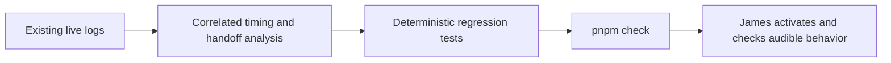

# Discord empty stays and false speech interruptions

The original grace-timer approach below was **superseded by James's correction**
in the same session. Current behavior is participant context plus a model turn
and a local departure tool; no automatic leave timer remains. BUG 2 is unchanged.
See [the agency correction](#agency-correction) for the replacement proof.

2026-09-28 · [VUH-1440](https://linear.app/vuhlp/issue/VUH-1440/fix-empty-discord-voice-stays-and-false-speech-interruptions)

Historical source: live stay `97b29808-4e01-4315-bb31-b8ae36eae825`,
23:10–23:15Z, plus its eventual 23:18:48Z leave. Validation of the fixes used
injected gateway, Vox, realtime and TTS ports with Vitest 4.1.10 on macOS.
No service restart, voice join/leave, paid synthesis, or live activation was
performed during this investigation. The audible result remains untested.

## Root causes and evidence

1. **No empty-room lifecycle existed.** Gateway departures revoked capture and
   invalidated the conversation, but never left voice. `client_disconnect`
   removed a capture and member; floor decay only made the floor dormant.
   At 23:13:19.219 Vox logged participant disconnect and DAVE reinitialization.
   The floor became dormant at 23:14:57.609 without leaving. The later leave at
   23:18:48.696 used `session_leave`; gateway detachment followed at
   23:18:48.783. This was not automatic empty-room behavior.
2. **The requested departure was omitted from the handoff.** The private,
   consented transcript included a request to leave and investigate. The lane's
   23:13:09.712 `heard` entry asked only for an investigation. The captain's
   23:13:56.476 answer was the investigation findings. Thus `call_CZ40pmVOP1IAjYVp`
   did not carry a leave instruction that its dropped result could lose.
   Departure closes the realtime conversation through roster invalidation;
   the returned findings therefore got `result_not_submitted` at 23:13:56.497.
   The original auto-leave workaround was subsequently rejected. The replacement
   exposes departure directly to the realtime model, preserves the conversation,
   and carries the original compound utterance into captain handoff context.
3. **Loudness alone caused the confirmed cutoff.** The old floor-holder path
   truncated as soon as a capture accumulated 350 ms above RMS 1200, including
   audio preceding playback. At 23:11:05.067 the interruption receipt and Vox
   `stop_tts_playback` agree. Playback `c01526d4-a408-4590-a8c8-52ac7704f761`
   started at 23:11:03.515, so it lasted about 1.553 s. Its triggering fragment
   had six characters, peak RMS 7283, and was finalized at 23:11:08.130—after
   the speech had already been stopped. The private transcript identifies it
   as a short incomplete phrase, not evidence of intentional interruption.
4. **Post-close TTS errors were reported as synthesis failures.** The
   ElevenLabs socket error callback lacked a closed guard even before
   `e85ea26b`. Roster departure closes the external conversation and TTS socket;
   late socket errors still propagated. The 23:13:19.227 failure came about
   8 ms after participant disconnect and 1.69 s after the preceding playback
   drained. This strongly fits teardown noise, not a v4 dialogue synthesis
   failure. The old receipt has no item/delivery/playback ids, so the exact
   socket event cannot be proven retrospectively. Regression tests reproduce
   the reporting bug for both Flash and v4 Turbo and preserve live errors.

## Greeting: what can and cannot be concluded

The greeting used delivery `75016fd4-8341-45a4-b22c-594d298d7290` and playback
`0017cb70-d65e-4e4c-a703-90e2df8814cf`. DAVE was ready at 23:10:25.158, over
20 seconds before first greeting PCM reached Vox at 23:10:45.460517. Vox
satisfied its prebuffer at 23:10:45.498570 with 284.625 ms of audio and emitted
`Started` at 23:10:45.499450, about 39 ms after buffering began. It drained at
23:10:53.354567, matching the 7856 ms response receipt, with no interruption.
The playback supervisor emits `Started` only after transmitting a TTS-containing
RTP frame and fails a playback on encryption/send failure.

This evidence does not show a DAVE-readiness or prebuffer loss. It also does not
prove the recipient heard every phoneme: there is no received-audio recording
or retained PCM, and no independent provider-first-chunk timestamp in these
logs. Vox `Buffered` is the earliest observed PCM boundary, not the provider's
production timestamp. No speculative warm-up delay was added.

## Initial implementation (superseded for BUG 1)

| Piece                                    | Behavior                                                                                                                                                                                                                                                     |
| ---------------------------------------- | ------------------------------------------------------------------------------------------------------------------------------------------------------------------------------------------------------------------------------------------------------------ |
| Shared voice session and gateway rosters | Five-second human-empty grace, cancelled on rejoin and leave; bots excluded; consent/subscription counts never establish emptiness; `left.reason = room_empty`. Both Discord bodies provide rosters. Unknown user bot status conservatively counts as human. |
| Barge-in                                 | Requires speech-level overlap with the same playback and a meaningful final transcript. Short fragments and acknowledgements survive; stop/wait/hold-on, longer speech, and direct re-address still interrupt.                                               |
| TTS lifecycle                            | Intentional-close errors suppressed; active failures carry provider item context before settlement removes it.                                                                                                                                               |
| Receipts                                 | Interrupted speech, completed playback and synthesis failure gain delivery/playback/item correlation where available. Before audio there is no playback id; explicitly idle socket errors do not borrow an earlier utterance's ids.                          |
| ADRs and guides                          | ADR 0057 records body hygiene and transcript-confirmed interruption; ADR 0070 and trace skill describe teardown and correlation.                                                                                                                             |

## Initial verification



Focused tests: 113 passed for empty-room/session and user gateway behavior;
165 passed for cutoff, external-voice, ElevenLabs and protocol evidence behavior.
The empty-room cases cover remaining bots, an unconsented human rejoining,
other guilds, subscription disconnects, and replacement stays. Cutoff cases
cover loud fragments, acknowledgements, deliberate short controls, room tone,
pre-playback speech, delayed transcripts, and post-model-completion failure ids.

Full workspace check: **passed**, exit 0. All 353 Vitest files passed (2,948
tests passed, 2 skipped); 123 Rust tests passed and the Vox IPC smoke reached
ready. Formatting, lint, dead-code, documentation, infrastructure, and all 27
typecheck tasks passed. The first run overlapped a last attribution test edit
and is superseded by this run on the final tree.

## Debug chronology and limits

1. The historical trail contains a later leave, so “still sitting” was true in
   the test window but is not evidence that the stay remained open forever.
2. The lane disproved the hypothesis that a dropped handoff result lost the
   departure action: the action never entered the handoff.
3. Sender timing did not explain the reported greeting loss. Adding startup
   silence without receiver-side evidence would hide rather than establish it.
4. Moving cutoff from PCM to confirmed content fixes the observed false
   positive, at the cost of final-transcription latency. Thresholds and the
   small English control/acknowledgement vocabulary need a consented live
   interruption test; they are heuristics, not a semantic intent classifier.
5. Synthesis correlation needed to retain the playing job after model
   completion and distinguish an idle socket failure from an active utterance.

## Evidence index

| File                                                  | What it establishes                                                                                                                   |
| ----------------------------------------------------- | ------------------------------------------------------------------------------------------------------------------------------------- |
| [live-receipts.jsonl](evidence/live-receipts.jsonl)   | Selected original content-free receipts for this stay, including interruption, failure, tool outcome, floor decay and eventual leave. |
| [vox-timing.txt](evidence/vox-timing.txt)             | Selected original Vox log lines with ANSI formatting removed: DAVE, buffer/start/drain/stop, participant disconnect and later leave.  |
| [empty-room-tests.txt](evidence/empty-room-tests.txt) | Focused deterministic empty-room/gateway check output.                                                                                |
| [cutoff-tests.txt](evidence/cutoff-tests.txt)         | Focused deterministic barge-in/TTS/correlation check output.                                                                          |

[Final workspace check summary](evidence/workspace-check.txt) retains the gate
commands and terminal results; verbose fixture-service logs are omitted.

Private source trails remain local: `discord-live-receipts.jsonl`,
`discord-voice-transcripts.jsonl`, and `discord-bridge.log` in the Clankie state
directory; the room's `discord_voice` JSONL lane in the captain directory.
Full human transcripts and model responses are not copied into this archive.

## Re-run

From the repository root:

```sh
pnpm exec vitest run packages/discord-presence-core/test/voice-session.test.ts apps/discord-user-session/test/gateway.test.ts
pnpm exec vitest run packages/discord-presence-core/test/voice-session.test.ts packages/discord-presence-core/test/external-voice.test.ts packages/discord-presence-core/test/elevenlabs-tts.test.ts packages/protocol/test/discord-voice-evidence.test.ts
pnpm check
```

No live credentials or Discord session are required for these fixture checks.
Activation and a consented recipient-side recording remain James's next step.

## Agency correction

James rejected the grace timer as a substitute for Clankie's decision. The
replacement removes it completely, with no hours-alone backstop. Existing
metered-listener idle timeouts and conversation expiry remain resource guards;
neither chooses to leave Discord.

- Gateway joins/leaves and a human headcount enter realtime context as ordinary
  observations. The initial roster includes bots and humans separately; human
  counts include unconsented participants without opening their microphones.
- A membership event creates a speakerless turn, including when the room is
  empty. Events received during a response, playback or captain work remain
  visible and receive a turn after that work, coalescing to the latest roster.
- The realtime `voice_leave` tool can end only the current stay, with no target
  parameters. Its result and `left.reason = self_decided` carry the stay id.
  Tests demonstrate both choices: remaining silently and calling leave.
- Departures revoke capture while retaining the conversation and pending
  captain results. Explicit consent opt-out still invalidates that context.
- Every captain handoff gets bounded current-room observations and the original
  attributed utterance as untrusted context. The original speaker remains the
  authority owner; membership events cannot borrow that identity for shell work.
- A closed or previous conversation cannot act on the current stay.

**What blocked 23:13:** a captain `voice_leave` tool already existed and the
voice lane could reach it through `ask_clankie`; departure does not require the
requester to remain in voice. The realtime model had no direct leave tool and
sent only the investigation request. Thus no departure tool ran. The later
`result_not_submitted` lost the investigation's spoken result, not a leave
operation. Roster-triggered conversation closure also removed the opportunity
for the realtime side to reconsider after the participant left. The fix repairs
all three mechanisms: direct reach, complete handoff context, and room-event
awareness without closing the conversation.

This is a capability and scheduling proof with fake model decisions. It does
not prove that the live model will choose to leave for a particular event or
phrase; that choice intentionally remains his. No live activation was performed.

Replacement verification passed:

- [Focused agency and cutoff tests](evidence/agency-tests.txt): 8 files, 207 tests.
- [Bridge tool wiring](evidence/agency-wiring-tests.txt): 1 file, 4 tests.
- [Final `pnpm check`](evidence/agency-workspace-check.txt): all gates passed;
  353 JavaScript test files, 2,954 tests passed and 2 skipped; 123 Rust tests;
  Vox IPC smoke passed.

The first replacement full check found a stale bridge integration expectation
that omitted the new `voice_leave` tool. Updating that expectation, rerunning
the wiring test and then the entire workspace check resolved it.
