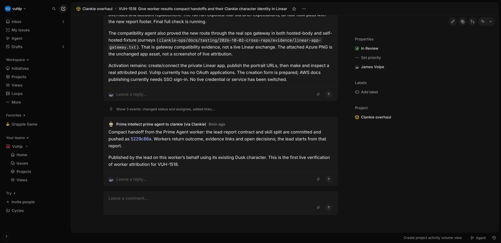

# Linear worker appearances and compact handoffs — 2026-10-02

Work: [VUH-1518](https://linear.app/vuhlp/issue/VUH-1518/give-worker-results-compact-handoffs-and-their-clankie-character).
Decision: [ADR 0207](../../adr/0207-workers-publish-through-one-clankie-app.md).
Setup: [worker posts](../../linear-worker-posts.md).

## Boundary

The initial full suite sampled the shared checkout based on `6b4da6e4`,
including unrelated pre-existing edits. The landing tree is isolated on
`5229c86a` (origin/main), containing only this work. Its native-hire regression
was adapted to the newer native-only adapter tests without restoring terminal
fallback behavior.

With James's approval, the private Clankie application was created in Vuhlp
with client credentials and read/write scope. The verified app replaced the
old bot-seat connection in the credential broker, and the local service was
restarted. No credentials are included in these artifacts.

## Landing verification

The final isolated landing tree passes all 65 focused tests in 9 files,
formatting, lint, dead-code, docs, infrastructure and all 26 typecheck tasks.
Its 124 Rust tests and Vox IPC smoke check pass too.

`pnpm check` exits 1 at the full JavaScript suite: 3,315 passed, 4 skipped,
5 failed. All five failures reproduce unchanged on clean `5229c86a`:
`app-smoke.test.ts` expects the old Swarm response fields;
`codex-seat-driver.test.ts` expects queued rather than steered native input;
`herdr-startup.test.ts` expects `not_ready` rather than `start_unconfirmed`.
No unrelated test or runtime behavior was changed to hide these failures.
[Landing and clean-baseline output](landing-check.txt) records that boundary.

## Verified behavior

- App token exchange verifies `viewer.app` and workspace, rejects user tokens,
  omits credentials from output and preserves account binding on renewal.
- Two existing personas create an issue and threaded comment with their own
  name/icon fields through one app credential. Receipts persist persona identity.
- Unknown personas and arbitrary author overrides cannot write. Delegated
  publishing requires an exact persona restriction. Replacing the account
  invalidates the prior grant; an uncertain mutation is not automatically retried.
- CLI secret input comes through stdin; rejected tool writes produce `ok: false`.
  TUI setup uses concealed secret entry and reports the verified workspace.
- The new app-connect route requires Take Control on paired devices. Its secret
  stays inside the encrypted envelope; plaintext gateway use is rejected.
- Pi, Claude and Codex native hires receive the original brief plus the compact
  final-report instruction exactly once. Native continuation preserves the seat
  identity and report instruction. Completion wakes begin with the final report.

The focused auth/host/grants/webhook/seat/CLI campaign initially passed 116 tests.
Additional CLI, app wizard and gateway tests exposed a missing public gateway
allowlist entry, which was fixed. The gateway/public protocol rerun passed
20 tests. Expanded publishing passed 7 tests; native brief and continuation
reruns passed 7 tests. The first full suite found four stale exact-brief
expectations; those tests now verify brief preservation plus the report footer.

Initial shared-tree `pnpm check` exited 0: 392 test files, 3,318 tests passed and 4 skipped;
123 Rust tests passed, followed by the Vox IPC smoke check. Formatting, lint,
dead-code checks, documentation, infrastructure and all 26 typecheck tasks also
passed. See [selected command output](check.txt). Documentation checks were rerun
after adding this record: 321 local Markdown files and all 10 public pages pass.

## Reused artwork

This is an actual source asset, not a live Linear screenshot. All six files are
byte-identical to the app's `assets/garden/clankie-*-x8.png` exports and the built
docs copies. `pnpm docs:public:build` passed (10 pages, 36 network routes,
113 API operations). Asset checksums are in [assets.sha256](assets.sha256).
An unchanged Azure PNG is also attached to VUH-1518 for inspection.

## Cross-repo evidence

The compatibility owner reports a passing real ops gateway/connector journey
into the current AccountsPort fixture for both hosted and self-hosted bodies,
including the app route and hidden outer-envelope secret. Their private record
is `clankie-ops/docs/testing/2026-10-02-cross-repo/evidence/linear-app-gateway.txt`.
No new ops handler is needed: transport still uses gateway challenge/encrypted
routes. This is gateway compatibility evidence, not a live Linear exchange;
the earlier Linux image predates the new route and needs rebuilding.

## Live activation

- The six public portrait URLs returned HTTP 200, `image/png`, with bytes
  identical to the source exports. Only those six assets were uploaded.
- `clankie access linear verify` and the official MCP `get_user` both resolved
  the new **Clankie app** in Vuhlp, rather than the former Gmail bot seat.
- The lead published the Prime Agent worker's actual committed result using
  its existing Dusk persona. [The live comment](https://linear.app/vuhlp/issue/VUH-1518/give-worker-results-compact-handoffs-and-their-clankie-character#comment-1ecf3cfc)
  visibly shows its character and **Prime intellect prime agent to clankie
  (via Clankie)**. Linear fetched and hosted the supplied portrait.
- A real unknown-persona CLI request returned `ok: false` and exit 1 without
  posting. This exposed and fixed the lane envelope's nested refusal handling;
  the final targeted regression run passed 24 tests.
- The app's official MCP notifications call succeeded with an empty result
  after its own post. This establishes app/MCP acceptance, not human reply wake.

Actual Linear UI after the attributed post. The older comment above it records
an earlier pending-activation state; the worker comment below is the live proof.

## Remaining limits

- A real human reply and its notification/wake path were not exercised. Reply
  provenance and self-filtering have fixture coverage, not a live human journey.
- Native hires still need an explicitly installed grant bridge or lead-mediated
  writes. This change does not implement inherited tracker connector isolation.
- Existing fleet personas are required. The observed externally launched Codex
  panes had no Herdr native session identity, so the census did not expose them
  as personas. This does not invent identities for unrecognized panes.
- Hosted app setup passed the compatibility owner's encrypted gateway fixture
  journey, but a rebuilt hosted body and full live hosted ticket bridge were
  not exercised by this campaign.
