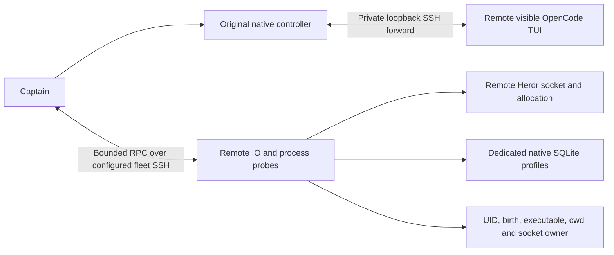

# VUH-1555 remote OpenCode implementation

Remote Mac POSIX native workers use the configured fleet SSH target and existing
native TUI/controller contract. No remote machine, model provider or owner store
was contacted for this change. The source base is core origin/main `57a9080c`,
including batch 17's captain/conversation/protocol split. Captain options live in
`captain-types.ts`; fleet/controller composition remains in `captain.ts` and
`index.ts`, and original-controller reuse remains in `herdr-watch.ts`.

The remote helper carries data/probes over the existing multiplexed fleet SSH
connection. Each controller has one private reverse loopback forward using the
same SSH options as the fleet link. The helper observes that machine's UID,
precise process birth, executable/cwd, Herdr socket/session and allocation. The
controller additionally proves the held local SSH socket owner and the exact
remote native TCP owner. Before/after probes and host/conversation admission
remain mandatory; no fallback, controller reconnection or cold metadata adoption exists.
The helper is an IO/probe process, never an agent or another OpenCode server.

History and seat control cache separate helper generations, so history cannot
replace Captain admission or capture a revoked seat guard. Advancing a fleet
revision revokes, closes and evicts older helpers and forwards for that fleet;
subsequent history reads can create a fresh read-only generation while old
controllers remain unavailable.

The independently landable [native hire ordering fix](../2026-10-05-native-hire-role-flush/README.md)
flushes its own project role assignment before starting new completion/status
watches and publishing the fleet change. Existing watches and live-controller
reuse serialize their project guard snapshots with these adoption writes, keeping
the project and conversation authority fences intact.

Dedicated native SQLite profiles stay on the remote machine. The unchanged
bounded reader checks profile ownership, DB/sidecar identity, native schema and
source/session/cwd. The agent APIs/CLI expose `<fleet>:ses_…` history and preserve
SSH target identity for live-controller reuse. Files staged by this service stay
private; retirement removes owned launch config and forwards, never history or
an unproved native pane. A dropped link can leave inert private staging files;
it never authorizes a replacement connection.

The existing fleet lifecycle integration journey now crosses the remote SSH/RPC,
UNIX-socket Herdr API, actual loopback proxy/controller, plugin/runtime, native
SQLite registration and Captain hire/resume/session API boundaries. OS/SSH/SDK
inputs use fixture-owned data grounded in the existing 1.18.18 journey. Negative
cases cover birth/UID/socket ownership, fleet disconnect/retarget, link loss,
route switches, uncertain delivery and cold control refusal. No unit suite was
added.

Requirements: a linked Mac POSIX fleet, Herdr, Node 24+, Python 3 and a direct
native OpenCode 1.18.18 executable. Windows needs different process proof and is
explicitly unsupported. General owner-profile discovery, cold/new-process resume
and restart reattachment remain unsupported. Remote subagent tray surfacing is
outside this slice. The local/remote live matrix (idle/busy, owner draft, approval,
interrupt, resume and disconnect/recovery) remains an owner check; fixture results
do not close VUH-1555 by themselves.

Focused check receipts and final commit are recorded in the worker handoff under
`.local/evidence/VUH-1555/`; the integrator owns the composed gate and landing.
