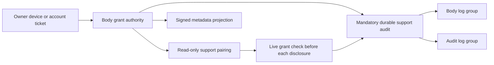

# Customer-issued support grants — VUH-1367

The body now owns time-limited support grants. An owner chooses Read state or
Shell, a support reference and a duration of at most 72 hours; active grants
are visible and revocable. Captain authority cannot create them. The owner API
also serves `clankie support` and `/support`.

Read-state offers bind a read-only support device to the live grant. They
permit conversation history and Clankie state, but no mutations or terminal
content. Tokens expire no later than their grant and every request rechecks
the live grant. Parked polls and established streams recheck before disclosing
an event/frame, including after backpressure. Revocation and expiry close them.

Hosted account commands use single-use, short-lived tickets bound to the exact
command, account, tenant, body, browser key and nonce. Replies are authenticated
body ciphertext; ticket replay remains refused after a body restart. Support
references do not enter the metadata snapshot or central audit.



Mandatory support audit has its own spool, independent of diagnostics consent
and age/size pruning. A failed durable append refuses admission or disclosure.
Revocation stays closed during audit failure, with durable missing lifecycle
records retried after restart. The host ships to both destinations with
independent cursors and removes completed prior-hour files only after both
acknowledge. An outage longer than CloudWatch's event-age limit preserves the
original event time in the payload, using ingestion time for the log timestamp.
Transport retries are at least once across a crash between acceptance and cursor
persistence.

The fleet projection is bounded to unexpired original grant windows, including
revoked tombstones until their original expiry. Full lifecycle history stays
on the body. More than 1,024 ended grants cannot permanently exhaust the
projection or revive a restored ended window; 1,024 concurrent unexpired
windows produce a clear capacity refusal.

## Focused evidence

```sh
pnpm exec vitest run --config vitest.config.ts \
  apps/clankie/test/support-access.test.ts \
  apps/clankie/test/hosted-pairing.test.ts \
  apps/clankie/test/devices.test.ts \
  apps/relay/test/operator-conversations.test.ts \
  packages/observability/test/body-telemetry.test.ts \
  packages/observability/test/body-telemetry-shipper.test.ts \
  packages/observability/test/support-audit-http.test.ts \
  apps/tui/test/telemetry-support-http.test.ts \
  apps/tui/test/support-http.test.ts
```

Passed: **111/111**, 9 files. The final support HTTP file then passed **7/7**
after adding the encrypted owner-device regression (112 distinct focused tests
in total). That regression pairs a genuine Take Control device through the
encrypted SDK and exercises create/list/pair/revoke through the hosted owner
bridge; outer HTTP bytes contain neither its device bearer nor support reference.
New tests use real HTTP body/relay peers, actual
grant storage, Ed25519/ECDH/AES-GCM, restart replay, real filesystem failure and
signed HTTP log-shipping requests routed only to local fixture peers. The CLI
and console lifecycle test crosses the same owner HTTP API. Captain/provider
execution is a fixture; no model calls or live service were involved.

Relevant package typechecks passed for protocol, API client, observability,
service and TUI. Scoped lint/format and whitespace checks passed. Local docs
links and retired-claims checks passed. No full `pnpm check` or evals ran.

## Limits and integration

The companion app and hosted control-plane changes live in their own repos
and require coordinated integration. This is code evidence, not proof of a
deployed hosted service or AWS IAM/SSM enforcement. Deployment and privacy
publication remain with the owner; no live-service restart, AWS change,
account change, sign-in or spend occurred in this task.
