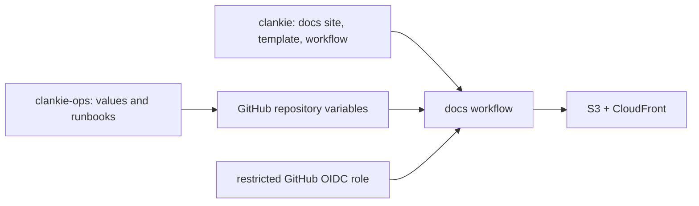

# AWS infrastructure boundary

This public repo deploys only the public docs site:

- [Docs](public-docs/README.md): S3/CloudFront deployment through GitHub OIDC.

The hosted service's infrastructure — the public gateway, Cognito accounts, and
their templates, deploys and production values — lives in the private
`Volpestyle/clankie-ops` repo ([ADR 0183](../../docs/adr/0183-the-harness-is-public-the-hosted-service-is-private.md)).
That repo also owns hosted-service values, operator runbooks, AWS support
correspondence, contact addresses, and operational evidence. Credentials remain
in their existing credential stores, never in either repo.

The docs workflow consumes repository variables populated from private
configuration. Keep resource IDs and operator records out of public source.
GitHub variables do not hide values from workflow logs or authorized repository
users.

