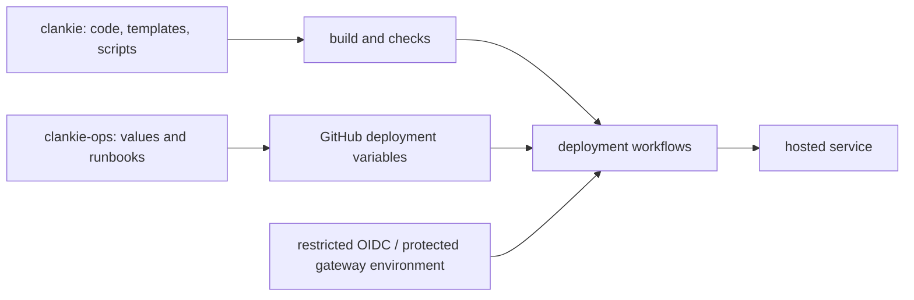

# AWS infrastructure boundary

This public repo contains reusable templates, deployment scripts, example
configuration, and architecture. The private `Volpestyle/clankie-ops` repo owns
hosted-service values, operator runbooks, AWS support correspondence, contact
addresses, and operational evidence. Credentials remain in their existing
credential stores, never in either repo.

- [Accounts](accounts/README.md): Cognito and SES provisioning and administration.
- [Gateway](public-gateway/README.md): Lightsail, Caddy, and private release access.
- [Docs](public-docs/README.md): S3/CloudFront deployment through GitHub OIDC.

Public GitHub workflows consume repository or environment variables populated
from private configuration. Keep resource IDs and operator records out of public
source; keep public product origins and protocol documentation here. GitHub
variables do not hide values from workflow logs or authorized repository users.

A private repo gives operational records a separate audience without duplicating
application code or moving release authority. Publishing infrastructure is not a
substitute for authorization checks, and moving a file does not remove earlier
copies from public Git history.
