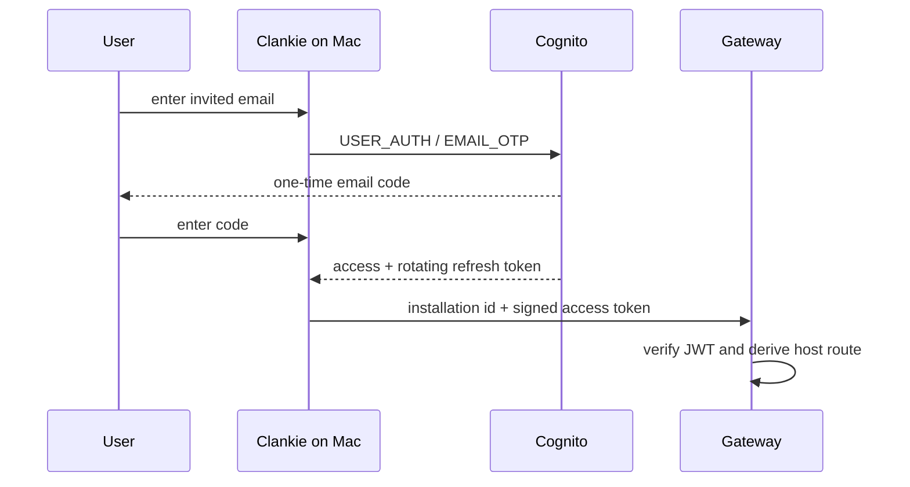

# AWS accounts

Clankie uses one Amazon Cognito Essentials user pool for passwordless Mac
enrollment. The Mac calls Cognito's public JSON API directly, stores its rotating
refresh token in Keychain, and presents one-hour access tokens to the public
gateway. There is no hosted UI, client secret, IAM credential, or account
database in the gateway.

Cognito currently rejects pool creation when `EMAIL_OTP` is the only declared
first factor, so the pool also declares `PASSWORD`. Clankie creates users
without passwords and its public client requests only `EMAIL_OTP`; the product
journey remains passwordless.



## Provision and invite

```bash
export CLANKIE_AWS_REGION=us-east-1
export CLANKIE_ACCOUNT_EMAIL_IDENTITY=verified-sender@example.com
infra/aws/accounts/deploy.sh provision
infra/aws/accounts/deploy.sh invite tester@example.com
infra/aws/accounts/deploy.sh config
```

The default is an invite-only beta. `invite` suppresses Cognito's admin-created
user message; the tester receives the normal OTP only after entering the email
in Clankie's `/gateway` flow. The command is idempotent for an existing email.
Set `CLANKIE_ACCOUNT_SELF_SIGNUP=true` and provision the same stack when signup
should open to any email address.

Cognito passwordless email OTP requires a verified Amazon SES sender. The stack
owns the `clankie.bot` domain identity and outputs its three Easy DKIM CNAMEs.
On the first deployment, leave the existing verified address active, publish
those CNAMEs as DNS-only records, and wait for the domain identity to report
`SUCCESS`. Then make the production sender active:

```bash
export CLANKIE_ACCOUNT_EMAIL_IDENTITY=clankie.bot
export CLANKIE_ACCOUNT_EMAIL_FROM=no-reply@clankie.bot
infra/aws/accounts/deploy.sh provision
```

The identity and From address are separate because one verified domain covers
every sender at that domain. Keep SES in its sandbox only for a private smoke
test: sandbox delivery is limited to verified recipients. Request SES
production access before inviting ordinary testers. Cognito Essentials has no
identity charge for the first 10,000 direct monthly active users; SES delivery
and later paid tiers remain separate.

The user pool has deletion protection and a retained resource policy. Access
tokens last one hour; refresh tokens rotate and last 90 days. Removing or
disabling a Cognito user revokes the account across its Mac installations.
