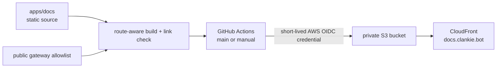

# AWS public docs deployment

The public product docs at [`docs.clankie.bot`](https://docs.clankie.bot) use
the existing private S3 bucket `clankie-bot-docs` behind CloudFront distribution
`E2SL4SXV9RAPNU`. The current `Volpestyle/clankie` repository owns the site and
deployment. The retired repository has no production role.



## Configure deployment identity

An AWS administrator runs this once, and again if the repository or branch
owner changes:

```bash
infra/aws/public-docs/setup-deploy-role.sh provision
```

The script creates or updates `clankie-docs-deploy`. Its trust is limited to
`repo:Volpestyle/clankie:ref:refs/heads/main`, and its inline policy can only
list and synchronize the docs bucket and invalidate the one docs distribution.
GitHub stores no reusable AWS access key.

## Build and deploy

```bash
pnpm docs:public:check
```

Pull requests build and validate the site. A docs-affecting push to `main`
builds the same artifact, synchronizes it to S3, and invalidates CloudFront.
The **Docs** workflow can also deploy the selected `main` commit manually. A
docs-affecting change includes the canonical files the site renders — the CLI
contract, the OpenAPI document, the console source and README, and the
architecture document — as listed in the workflow's path filters. The site has
no runtime, database, or JavaScript bundle; its only build-time dependencies
are a Markdown renderer and a YAML parser already in the lockfile.

CloudFront already owns the certificate, domain alias, and directory-index
rewrite. This deployment does not mutate DNS or those resources.
