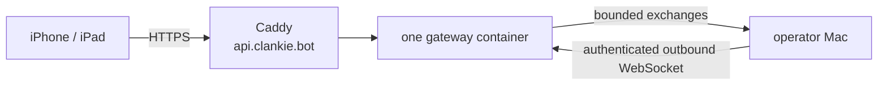

# AWS public gateway deployment

The first public doorway is one 1 GB Amazon Linux 2023 Lightsail instance with
an attached static IPv4 address. Caddy terminates HTTPS for `api.clankie.bot`
and reverse-proxies the existing gateway container. Cloudflare remains the
authoritative DNS provider; the gateway does not create or mutate DNS records.



The Linux bundle with public IPv4 costs USD $7/month and includes the static IP
while it stays attached. It is the only billed resource in this shape. The
instance's 2 TB transfer allowance is far above the first invited-user load;
transfer overage and snapshots are separate charges.

## Prerequisites

- AWS CLI access to the target region and an existing Lightsail key pair.
- Docker with Buildx on the release Mac.
- The matching private key file for SSH.
- The operator's current public IPv4 address as a `/32`; only that CIDR reaches
  port 22. Ports 80 and 443 are public for Caddy.

## Provision the instance

Provisioning creates AWS resources. It does not deploy the gateway or change
Cloudflare DNS.

```bash
export CLANKIE_AWS_REGION=us-east-1
export CLANKIE_GATEWAY_KEY_PAIR_NAME=clankie-operator
export CLANKIE_GATEWAY_OPERATOR_CIDR=203.0.113.10/32
infra/aws/public-gateway/deploy.sh provision
```

The stack uses the `micro_3_0` public-IPv4 bundle and the
`amazon_linux_2023` blueprint. If AWS retires either identifier, pass an active
equivalent to CloudFormation's `BundleId` or `BlueprintId` parameter rather
than changing the gateway contract.

Add a Cloudflare **DNS-only** A record from `api.clankie.bot` to the printed
`GatewayIp`. DNS-only keeps the existing streaming and WebSocket semantics
direct between the clients and Caddy. Caddy obtains and renews the public TLS
certificate after the record resolves and ports 80 and 443 reach the instance.

## Enroll the first Mac

Generate one opaque host id and one bearer of at least 32 random characters.
Store the same pair in two places:

1. Run `/gateway` in Clankie's operator console. Use
   `https://api.clankie.bot`, the host id, and the bearer. The URL and host id
   go to settings; the bearer goes to Keychain.
2. SSH to the instance, run
   `sudoedit /etc/clankie-gateway/host-tokens.json`, and enter a JSON map such
   as `{"mac_example_123456":"replace-with-a-random-32-plus-character-token"}`.
   Then enforce the runtime ownership:

```bash
sudo chown root:clankie-gateway-secrets /etc/clankie-gateway/host-tokens.json
sudo chmod 0640 /etc/clankie-gateway/host-tokens.json
```

The container receives that file read-only and runs as its unprivileged Node
user with only the file's supplemental group. The bearer is absent from the
image, source tree, process environment, `docker inspect`, and logs.

## Release

Releases require a clean committed tree. The script builds an immutable amd64
image locally, copies it over SSH, verifies the secret file, replaces the one
gateway container, checks `/health`, and starts the pinned Caddy image. A failed
gateway health check restores the previous image when one exists.

```bash
export CLANKIE_AWS_REGION=us-east-1
export CLANKIE_GATEWAY_SSH_KEY=/absolute/path/to/lightsail-key.pem
infra/aws/public-gateway/deploy.sh release
curl --fail https://api.clankie.bot/health
```

Inspect metadata-only logs with:

```bash
sudo docker logs --since 30m clankie-gateway
sudo docker logs --since 30m clankie-caddy
```

## Rotate and operate

Token rotation has a short, explicit disconnect because one host id accepts one
bearer. Update the root-owned JSON file, run
`sudo docker restart clankie-gateway`, immediately update the Mac's `/gateway`
Keychain entry, and restart Clankie. The Mac reconnects and republishes fresh
pairing routes; paired devices retry their existing host route.

Apply OS security updates with `sudo dnf upgrade -y` and reboot during a small
maintenance window. Docker restarts both containers; the Mac reconnects. Caddy
certificate state lives in the `clankie-caddy-data` Docker volume. The gateway
holds no durable user state, so the stack and release assets recreate the host
if the instance is lost.

## Deliberate ceiling

This single process is sufficient for App Review and a small invited beta. It
is not a general multi-tenant service: TLS terminates at Caddy, one instance is
one failure domain, host enrollment is manual, and gateway routing is in
memory. Before unrelated customers share it, add application-layer end-to-end
encryption and automatic public host enrollment. Add an external live
connection broker only when measured load requires a second gateway process.
Tailscale remains the optional private/direct lane throughout.
