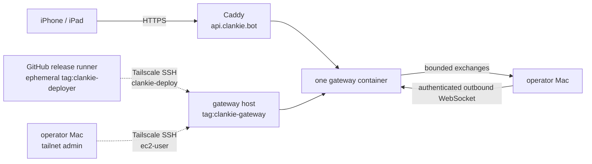

# AWS public gateway deployment

The first public doorway is one 1 GB Amazon Linux 2023 Lightsail instance with
an attached static IPv4 address. Caddy terminates HTTPS for `api.clankie.bot`
and reverse-proxies the existing gateway container. Cloudflare remains the
authoritative DNS provider; the gateway does not create or mutate DNS records.



The Linux bundle with public IPv4 costs USD $7/month and includes the static IP
while it stays attached. It is the only billed resource in this shape. The
instance's 2 TB transfer allowance is far above the first invited-user load;
transfer overage and snapshots are separate charges.

## Prerequisites

- AWS CLI access to the target region and an existing Lightsail key pair.
- Docker with Buildx on the release Mac.
- The matching private key and the operator's current public IPv4 `/32` for the
  one-time bootstrap.
- Admin access to the production tailnet and the GitHub repository.

## Provision the instance

Provisioning creates AWS resources. It does not deploy the gateway or change
Cloudflare DNS.

```bash
export CLANKIE_AWS_REGION=us-east-1
export CLANKIE_GATEWAY_KEY_PAIR_NAME=clankie-operator
export CLANKIE_GATEWAY_OPERATOR_CIDR=203.0.113.10/32
infra/aws/public-gateway/deploy.sh provision
infra/aws/public-gateway/deploy.sh bootstrap
```

The stack uses the `micro_3_0` public-IPv4 bundle and the
`amazon_linux_2023` blueprint. If AWS retires either identifier, pass an active
equivalent to CloudFormation's `BundleId` or `BlueprintId` parameter rather
than changing the gateway contract.

Add a Cloudflare **DNS-only** A record from `api.clankie.bot` to the printed
`GatewayIp`. DNS-only keeps the existing streaming and WebSocket semantics
direct between the clients and Caddy. Caddy obtains and renews the public TLS
certificate after the record resolves and ports 80 and 443 reach the instance.

## Establish the private deployment plane

Public SSH is a bootstrap path, not the steady-state release path. Merge the
entries in [`tailnet-policy.fragment.hujson`](tailnet-policy.fragment.hujson)
into the tailnet's existing policy; preserve unrelated SSH rules and tests. If
the policy still has the default `"src": ["*"]` wildcard grant, replace it with
the fragment's `autogroup:member` grant. Human member devices retain their
existing access, while tagged automation receives only the explicit gateway
SSH grant. The policy lets tailnet admins use `ec2-user` with reauthentication
and lets an ephemeral `tag:clankie-deployer` runner use only
`clankie-deploy`. That account can elevate only through the audited
`clankie-gateway-activate` command.

From the initial public SSH session, enroll the host and enable Tailscale SSH:

```bash
sudo tailscale up \
  --hostname=clankie-public-gateway \
  --advertise-tags=tag:clankie-gateway \
  --ssh
```

Complete the displayed Tailscale login, then verify the private path from the
operator Mac. The exact MagicDNS suffix is tailnet-specific.

```bash
tailscale ping clankie-public-gateway
ssh ec2-user@clankie-public-gateway
```

Close the public SSH firewall rule after the private path works:

```bash
export CLANKIE_GATEWAY_PUBLIC_SSH=false
infra/aws/public-gateway/deploy.sh provision
```

Create a Tailscale OpenID Connect trust credential with these settings:

- issuer: GitHub (`https://token.actions.githubusercontent.com`)
- subject: `repo:Volpestyle/clankie:environment:production`
- scope: Auth Keys write, restricted to the exact `tag:clankie-deployer` tag

Tailscale generates the client id and audience. Configure the GitHub
`production` environment with required reviewer protection, allow only `main`
and `v*` refs, and add those values as secrets alongside this variable:

| Kind     | Name                           | Value                                            |
| -------- | ------------------------------ | ------------------------------------------------ |
| secret   | `TS_OAUTH_CLIENT_ID`           | Tailscale workload-identity client id            |
| secret   | `TS_AUDIENCE`                  | audience configured on that federated credential |
| variable | `CLANKIE_GATEWAY_TAILNET_HOST` | the gateway's full MagicDNS name                 |

The GitHub runner receives a short-lived, tagged tailnet identity. It receives
no AWS credential and no SSH private key. See Tailscale's
[GitHub workload identity federation](https://tailscale.com/kb/1581/github-actions-workload-identity-federation)
for the issuer and subject fields used by the OAuth client's trust credential.

## Enroll the first Mac

Generate one opaque host id and one bearer of at least 32 random characters.
Store the same pair in two places:

1. Run `/gateway` in Clankie's operator console. Use
   `https://api.clankie.bot`, the host id, and the bearer. The URL and host id
   go to settings; the bearer goes to Keychain.
2. SSH to the instance, run
   `sudoedit /etc/clankie-gateway/host-tokens.json`, and enter a JSON map such
   as `{"mac_example_123456":"replace-with-a-random-32-plus-character-token"}`.
   Then enforce the runtime ownership:

```bash
sudo chown root:clankie-gateway-secrets /etc/clankie-gateway/host-tokens.json
sudo chmod 0640 /etc/clankie-gateway/host-tokens.json
```

The container receives that file read-only and runs as its unprivileged Node
user with only the file's supplemental group. The bearer is absent from the
image, source tree, process environment, `docker inspect`, and logs.

## Release

Releases require a clean committed tree. The script builds an immutable amd64
image, copies it over the private Tailscale path, and invokes the root-owned
activator. The activator validates the unprivileged upload and host-token
permissions, replaces the gateway, checks `/health`, and starts the pinned
Caddy image. Failed gateway or Caddy startup restores the previous working
component when one exists.

```bash
export CLANKIE_GATEWAY_TARGET=clankie-public-gateway.example-tailnet.ts.net
infra/aws/public-gateway/deploy.sh release
curl --fail https://api.clankie.bot/health
```

Pushing a `v*` tag runs the same deployment between the release build and
GitHub Release publication. The protected `production` environment is the
approval boundary. The **Deploy public gateway** workflow can also redeploy the
current commit manually. A host activator version mismatch fails closed; run
`deploy.sh bootstrap` through operator access before releasing that change.

Inspect metadata-only logs with:

```bash
sudo docker logs --since 30m clankie-gateway
sudo docker logs --since 30m clankie-caddy
```

## Rotate and operate

Token rotation has a short, explicit disconnect because one host id accepts one
bearer. Update the root-owned JSON file, run
`sudo docker restart clankie-gateway`, immediately update the Mac's `/gateway`
Keychain entry, and restart Clankie. The Mac reconnects and republishes fresh
pairing routes; paired devices retry their existing host route.

Apply OS security updates with `sudo dnf upgrade -y` and reboot during a small
maintenance window. Docker restarts both containers; the Mac reconnects. Caddy
certificate state lives in the `clankie-caddy-data` Docker volume. The gateway
holds no durable user state, so the stack and release assets recreate the host
if the instance is lost.

## Deliberate ceiling

This single process is sufficient for App Review and a small invited paid beta.
It is not a general multi-tenant service: TLS terminates at Caddy, one instance
is one failure domain, host enrollment is manual, and gateway routing is in
memory. Before unrelated customers share it, add application-layer end-to-end
encryption and automatic public host enrollment. Add an external live
connection broker only when measured load requires a second gateway process.
Tailscale remains the private operator and deployment lane throughout.
