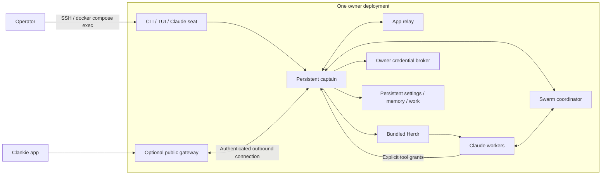

# Hosted Clankie

This Compose deployment runs one owner's captain, embedded Swarm coordinator,
Herdr workers and app relay on a Linux host. It does not need an owner's desktop
or an open TUI. Each Compose project has separate state and workspace volumes;
use a dedicated VM for mutually untrusted owners. Containers within one deployment
are trusted parts of that owner's machine, not security sandboxes between workers.



## Start and configure

Run these commands from the repository on a Docker host with Compose v2.
The build supports Linux arm64 and x64; the retained smoke proof names the tested
architecture. It installs pinned Node, Claude Code and the verified official Herdr
binary. The existing release bundler produces compiled entrypoints, shipped skills,
plugins and dependency license inventory. No local credential/configuration files
or `node_modules` enter the allowlisted build context.

```sh
docker compose -p my-clankie -f infra/hosted/compose.yaml up -d --build --wait
docker compose -p my-clankie -f infra/hosted/compose.yaml exec captain clankie doctor
docker compose -p my-clankie -f infra/hosted/compose.yaml exec captain clankie
```

The last command opens the TUI as a portal to the already-running service. Use
`/auth` to connect model credentials, `/model` to choose the captain's model and
`/connect` for connected services. Claude workers use Claude Code's own supported
login: run `exec captain claude` through the same Compose command to authenticate.
Model billing and connected-service delegation are separate: connecting Linear
does not authenticate a worker's model, and a worker login grants no Linear tools.
The pinned npm installation follows the [Claude setup documentation](https://code.claude.com/docs/en/setup#install-with-npm).
The image contains no owner subscription, API key or personal skill.

Headless setup uses the same [CLI](../../docs/cli.md), including `model`, `persona`,
`fleet`, `workdir`, `herdr`, `swarm` and `access`. Its first start selects `/workspace`
only if no workdir preference exists; subsequent starts preserve owner settings.
Clone project repositories there. User-installed skills live in
`/state/home/.agents/skills` or the project's own skill roots. SSH and Git are
installed; authorize remote machines using this deployment's own SSH configuration
and credentials. No owner machine names or personal remote-control skills ship.

## Remote portals and lifecycle

Captain and relay listen on loopback inside their shared network namespace. Compose
publishes no host ports. Run `clankie` through SSH/Compose for administrative access;
configure `/gateway` in that TUI for the existing app pairing and outbound gateway
connection. Gateway provisioning lives in the private `clankie-ops` repository and is
independent of this deployment; see [the repository boundary](../../docs/adr/0183-the-harness-is-public-the-hosted-service-is-private.md). Pairing, provider logins and actual remote-app traffic require
owner setup; the synthetic smoke does not establish those live integrations.

Use Compose for process lifecycle:

```sh
docker compose -p my-clankie -f infra/hosted/compose.yaml logs --tail 100
docker compose -p my-clankie -f infra/hosted/compose.yaml restart
docker compose -p my-clankie -f infra/hosted/compose.yaml down
```

A VM that runs one owner's body without Compose can run the whole stack in one
container under the launcher, which starts Clankie and its relay and keeps
them healthy:

```sh
docker run -d --init --name clankie --cap-drop ALL --security-opt no-new-privileges \
  -v clankie-state:/state -v clankie-workspace:/workspace clankie-hosted:local clankie-body
```

`--init` is required: the launcher's services are reparented to PID 1, which
must reap them. `docker stop` runs `clankie down`, so every service settles
before the container exits. The image's `CLANKIE_SERVICES=clankie,relay` is its
loadout: the launcher never starts Discord bodies, the activity surface or its
tunnel, which would keep a body busy without a paired device asking for
anything. Set it to another comma-separated list of service ids to widen it.

`down` preserves named volumes; adding `--volumes` destroys that owner's stored
work and credentials. Upgrade with `up -d --build --wait`. Back up both volumes
with the deployment stopped. Replacing a container ends its live processes;
persisted tasks and dispatch intents require reconciliation, not blind reassignment.
This is different from restarting only the captain while Herdr remains alive.

`state` holds the owner home, settings, memory, broker, Swarm databases and Herdr
state. `workspace` holds project files. Both run as UID 1000; the file credential
broker writes mode 0600. Do not share these volumes between owners or mount a
host home/Docker socket into a worker. The Docker host administrator can access
container state. Managed multi-tenant provisioning, backups, quotas and stronger
isolation remain deployment work.

## Scope and verification

This is the headless coding bundle. Browser/tldraw hosts are disabled by default;
Vox, screen capture, local voice and media binaries are not included. Discord body
processes require their own configured deployment; the image retains compiled
entrypoints but the base Compose file starts captain and relay only. Additional
capabilities need their actual executables and platform support.

```sh
docker build -f scripts/release/clankie-linux.Dockerfile -t clankie-hosted:local .
node scripts/smoke-hosted.mjs
```

The smoke creates and removes two isolated Compose deployments. A real Claude
process in Herdr executes a file tool under canned, local model responses after
an assignment through Clankie's MCP/Swarm path. The captain also completes a
conversation through its compiled model client. It checks non-root execution,
private broker files, distinct owner credentials/workspaces, and preservation of
settings, credentials and work after container replacement. It never authenticates
to a real model/provider or reads the operator's accounts.

## Managed body bootstrap

The managed tenant image sets `CLANKIE_HOSTED_BOOTSTRAP_FILE` to a private JSON
file readable by the service user (mode 0600). Unset means self-hosted, including
ordinary Compose installations: their gateway sign-in and lifecycle are unchanged.
The provisioner delivers this file to its own instance; never put it in image
layers, user data, command arguments or logs. Its exact fields are:

```json
{
  "hostCredential": "<fleet-signed Ed25519 host credential>",
  "credentialExpiresAtMs": 1790021600000,
  "gatewayOrigin": "https://api.clankie.bot",
  "tenantId": "tn_<20 lowercase base32 characters>",
  "accountId": "<account subject>",
  "installationId": "<22 base64url characters>",
  "fleetVerifyKeysJson": "{\"keys\":[{\"publicKeyPem\":\"<Ed25519 public PEM>\"}]}"
}
```

The body validates this configuration and the signed credential's identity before
connecting. It derives its host id from the account and installation, uses the
host credential as its gateway bearer, and renews through
`POST /fleet/v1/body/host-credential` before half-life. The same credential
serves fleet calls. Renewals live in the credential broker so a restart does not
revert to an old bootstrap token; the bootstrap file itself is not rewritten.
A fleet `403` stops the connector and further fleet requests. Invalid bootstrap
configuration fails startup instead of falling back to a different account.

Managed bodies also register paired-device P-256 wake keys with the fleet via
`POST /v1/devices/wake-key`, inside the existing encrypted device channel. The
live session chooses the device id; device revocation immediately denies local
access and retries fleet key removal on failure and after restart. Self-hosted
bodies answer 404, including through the encrypted gateway.

Idle accounting reports actual work to `/fleet/v1/body/heartbeat`: human and
owner-configured external-event captain turns, running owner-goal continuations,
and working Herdr/headless seats. Self-wakes, presence and polling earn no busy
credit. Successful pairing and operator writes update customer activity; tails,
fleet reads and token refresh do not. Reports go out on changes, each minute
while busy, and every five minutes while idle. The fleet remains responsible for
sleep and budget enforcement; the service records its returned desired state and
uses the ordinary graceful shutdown when the instance stops.
