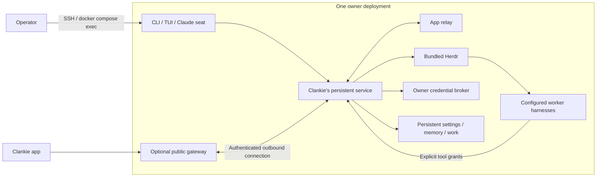

# Self-hosted Clankie on Linux

This is the advanced deployment guide for operators maintaining their own
Linux host. For the managed product and app onboarding, use
[Get started](https://docs.clankie.bot/get-started/). Running this image does not
provision a managed account or promise the same enabled features.

This Compose deployment runs one owner's Clankie service,
Herdr workers and app relay on a Linux host. It does not need an owner's desktop
or an open TUI. Each Compose project has separate state and workspace volumes;
use a dedicated VM for mutually untrusted owners. Containers within one deployment
are trusted parts of that owner's machine, not security sandboxes between workers.


```mermaid
flowchart LR
  Operator[Operator] -->|SSH / docker compose exec| CLI[CLI / TUI / Claude seat]
  App[Clankie app] --> Gateway[Optional public gateway]
  subgraph Owner[One owner deployment]
    CLI --> Captain[Clankie's persistent service]
    Gateway <-->|Authenticated outbound connection| Captain
    Captain <--> Relay[App relay]
    Captain --> Herdr[Bundled Herdr]
    Herdr --> Workers[Configured worker harnesses]
    Workers -->|Explicit tool grants| Captain
    Captain --> Broker[Owner credential broker]
    Captain --> State[Persistent settings / memory / work]
  end
```

## Start and configure

Run these commands from the repository on a Docker host with Compose v2.
The build supports Linux arm64 and x64; the retained smoke proof names the tested
architecture. It installs pinned Node, Claude Code, pi and the verified official
Herdr binary. The existing release bundler produces compiled entrypoints, shipped skills,
plugins and dependency license inventory. No local credential/configuration files
or `node_modules` enter the allowlisted build context.

```sh
docker compose -p my-clankie -f infra/hosted/compose.yaml up -d --build --wait
docker compose -p my-clankie -f infra/hosted/compose.yaml exec captain clankie doctor
docker compose -p my-clankie -f infra/hosted/compose.yaml exec captain clankie
```

The last command opens the TUI as a portal to the already-running service. Use
`/auth` to connect model credentials, `/model` to choose the captain's model and
`/connect` for connected services. Claude workers use Claude Code's own supported
login: run `exec captain claude` through the same Compose command to authenticate,
or set `ANTHROPIC_API_KEY` on the body. Each body start prepares Claude for hires
nobody watches (ADR 0238): the image approves the `clankie-worker` channel in
`/etc/claude-code/managed-settings.json`, and the body installs that plugin
(disabled until a hire enables it) and Herdr's Claude hook, marks onboarding
done, trusts `/workspace` and sets Claude's default permission mode to `auto`
unless the owner chose one.
Pi workers use pi's own provider configuration under `/state/home/.pi/agent`
(`exec captain pi`, then `/login`). Clankie installs Herdr's pi integration there
before each pi hire; the session it reports is the seat's durable identity.
Model billing and connected-service delegation are separate: connecting Linear
does not authenticate a worker's model, and a worker login grants no Linear tools.
The pinned npm installation follows the [Claude setup documentation](https://code.claude.com/docs/en/setup#install-with-npm).
The image contains no owner subscription, API key or personal skill.

Headless setup uses the same [CLI](../../docs/cli.md), including `model`, `persona`,
`fleet`, `workdir`, `herdr` and `access`. Its first start selects `/workspace`
only if no workdir preference exists; subsequent starts preserve owner settings.
Clone project repositories there. User-installed skills live in
`/state/home/.agents/skills` or the project's own skill roots. SSH and Git are
installed; authorize remote machines using this deployment's own SSH configuration
and credentials. No owner machine names or personal remote-control skills ship.

## Remote portals and lifecycle

One container runs the whole body under the launcher (`clankie-body`): Clankie
and its relay listen on loopback inside it. Compose publishes no host ports. Run `clankie` through SSH/Compose for administrative access;
configure `/gateway` in that TUI for the existing app pairing and outbound gateway
connection. Gateway provisioning lives in the private `clankie-ops` repository and is
independent of this deployment; see [the repository boundary](../../docs/adr/0183-the-harness-is-public-the-hosted-service-is-private.md). Pairing, provider logins and actual remote-app traffic require
owner setup; the synthetic smoke does not establish those live integrations.

Use Compose for process lifecycle:

```sh
docker compose -p my-clankie -f infra/hosted/compose.yaml logs --tail 100
docker compose -p my-clankie -f infra/hosted/compose.yaml restart
docker compose -p my-clankie -f infra/hosted/compose.yaml down
```

A VM that runs one owner's body without Compose runs the same single container,
whose launcher starts Clankie and its relay and keeps them healthy:

```sh
docker run -d --init --name clankie --cap-drop ALL --security-opt no-new-privileges \
  -v clankie-state:/state -v clankie-workspace:/workspace clankie-hosted:local clankie-body
```

`--init` is required: the launcher's services are reparented to PID 1, which
must reap them. `docker stop` runs `clankie down`, so every service settles
before the container exits. The image's `CLANKIE_SERVICES=clankie,relay` is its
loadout: the launcher never starts Discord bodies, the activity surface or its
tunnel, which would keep a body busy without a paired device asking for
anything. Set it to another comma-separated list of service ids to widen it.

`down` preserves named volumes; adding `--volumes` destroys that owner's stored
work and credentials.

The body updates itself to official releases (ADR 0237). The image's
`/opt/clankie` is a seed: at start the entrypoint copies it to
`/state/install/releases/<version>` and points `/state/install/current` at the
newer of the seed and any release the body already installed, keeping one
previous release for rollback. The service then checks hourly and installs the
latest official `clankie-linux-<arch>` release while idle, with the same health
rollback as a Mac install; `clankie update auto off` leaves installs to
`clankie update`. Rebuilding the image (`up -d --build --wait`) still updates the
base system, Node tooling and global harnesses, and a newer seed takes over. Back up both volumes
with the deployment stopped. Replacing a container ends its live processes;
persisted tasks and dispatch intents require reconciliation, not blind reassignment.
This is different from restarting only the captain while Herdr remains alive.

`state` holds the owner home, settings, memory, broker and Herdr
state. `workspace` holds project files. Both run as UID 1000; the file credential
broker writes mode 0600. Do not share these volumes between owners or mount a
host home/Docker socket into a worker. The Docker host administrator can access
container state. Managed multi-tenant provisioning, backups, quotas and stronger
isolation belong to the private operations deployment.

## Optional runtime provider

The public image starts with an empty runtime provider. It adds no managed
credit routes, heartbeat accounting, plan model routing or hire limits.
[`RuntimeProvider`](../../apps/clankie/src/runtime-provider.ts) defines optional
quota routes and capacity, heartbeat activity and lifetime, and model hooks. Routes use
the service's existing owner/device authorizer; their exact gateway route
declarations are supplied only when the provider is installed. These hooks do
not change tool, account, device or machine authority.

`CLANKIE_RUNTIME_PROVIDER_MODULE` selects an absolute installed JavaScript
module exporting `createRuntimeProvider(context)`. The service loads it on every
index restart, including restarts started by the launcher. An invalid or
unavailable selected module fails startup. An ordinary self-hosted installation
leaves the variable unset and uses its configured models and connections.

Managed composition lives in private `clankie-ops/apps/body`: credits, quotas,
control-plane heartbeat accounting, included-usage forwarding and customer-model
policy. Its image extends this public runtime and persists the module path in
image configuration. The generic transport, launcher lifecycle, signed body
requests, pairing and device-security recovery remain public. See
[ADR 0183](../../docs/adr/0183-the-harness-is-public-the-hosted-service-is-private.md)
for the repository boundary. Managed deployment/build instructions and business
wire schemas live in the private repository.

## Scope and verification

This is the headless coding bundle. Browser/tldraw hosts are disabled by default;
Vox, screen capture and media binaries are not included. Discord body
processes require their own configured deployment; the image retains compiled
entrypoints but the image's loadout starts Clankie and its relay only. Additional
capabilities need their actual executables and platform support.

```sh
docker build -f scripts/release/clankie-linux.Dockerfile -t clankie-hosted:local .
node scripts/smoke-hosted.mjs
```

The smoke creates and removes two isolated Compose deployments. A real Claude
process in Herdr executes a file tool under canned, local model responses after
a native hire through Clankie's MCP path, with no prompt answered for it. The
captain also completes a conversation through its compiled model client, then
asks to hire a briefed pi worker, which must refuse without starting a seat while
pi briefs are opt-in (`CLANKIE_PI_NATIVE_ENABLED`). It checks non-root execution,
private broker files, distinct owner credentials/workspaces, and preservation of
settings, credentials and work after container replacement. It never authenticates
to a real model/provider or reads the operator's accounts.

## Managed body bootstrap

The managed tenant host sets `CLANKIE_HOSTED_BOOTSTRAP_FILE` to a private JSON
file readable by the service user (mode 0600). Unset means self-hosted, including
ordinary Compose installations: their gateway sign-in and lifecycle are unchanged.
The provisioner delivers it to that instance only: a managed host receives it as
the instance's raw JSON user-data before every create and start, and writes it on
each boot to a tmpfs file mounted read-only into the body, so the body itself
never reaches instance metadata. Never put it in image layers, the container
environment, command arguments or logs. Its exact fields are:

```json
{
  "hostCredential": "<fleet-signed Ed25519 host credential>",
  "pairingKeyRegistrationToken": "<single-use fleet registration token>",
  "credentialExpiresAtMs": 1790021600000,
  "gatewayOrigin": "https://api.clankie.bot",
  "tenantId": "tn_<20 lowercase base32 characters>",
  "accountId": "<account subject>",
  "installationId": "<22 base64url characters>",
  "fleetVerifyKeysJson": "{\"keys\":[{\"publicKeyPem\":\"<Ed25519 public PEM>\"}]}"
}
```

The optional `tenantTelemetryKey` is the fleet-derived 32-byte tenant telemetry
key, encoded as 43 base64url characters. Treat it as a secret with the other
bootstrap fields.

The private provider reads any additional managed-plan fields. The public
bootstrap reader validates the generic transport identity and does not apply
plan policy.

The body validates this configuration and the signed credential's identity before
connecting. It derives its host id from the account and installation, uses the
host credential as its gateway bearer, and renews through
`POST /fleet/v1/body/host-credential` before half-life. The same credential
serves fleet calls. Renewals live in the credential broker so a restart does not
revert to an old bootstrap token; the bootstrap file itself is not rewritten.
A fleet `403` stops the connector and further fleet requests, except
`pairing_key_required`: the body re-registers its persisted key and retries the
call once. Invalid bootstrap
configuration fails startup instead of falling back to a different account.

## Body telemetry

A managed body can record metadata-only operational events: boot phases,
service restarts and crashes, gateway doorway changes, each settled turn's
outcome, duration and tool-call count, and CPU, memory and disk pressure every
five minutes. The schema is in
[`body-telemetry.ts`](../../packages/observability/src/body-telemetry.ts): ids,
closed codes, numbers and booleans only. No message, prompt, tool argument,
file or repository name, command, error message or credential is ever a field,
and an event that does not match its schema is dropped.

It is off unless `CLANKIE_BODY_TELEMETRY_DIR` names a directory on the state
volume. The whole-body command and the service then append diagnostic hourly JSONL files
there, bounded to 1 MiB and 48 hours. Support grant/access audit uses a separate
mandatory `support-audit/` child directory, without diagnostic consent or
age/size pruning; an unauditable support access fails closed. Nothing leaves the container on its own:
the body holds no cloud credentials. A managed host ships the spool with the
same pinned image, outside the body's network namespace:

```sh
docker run --rm --network host --read-only --cap-drop ALL \
  -v /var/lib/clankie/state/telemetry:/spool:ro -v /var/lib/clankie-telemetry:/cursor \
  -v /var/lib/clankie/state/telemetry/support-audit:/spool/support-audit \
  "$image" clankie telemetry ship --spool /spool --cursor /cursor/cursor.json \
  --log-group <body-group> --audit-log-group <audit-group>
```

The shipper reads the tenant and instance ids and its credentials from
instance metadata, so a body cannot choose whose stream it writes. The
instance role needs only `logs:CreateLogStream` and `logs:PutLogEvents` on that
groups. Support records ship to both groups through independent cursors;
completed prior-hour support files are removed only after both acknowledge.
Create the support child directory with the same body write ownership as the
parent before mounting it. See [`telemetry ship`](../../docs/cli.md) for its output.

Managed bodies also register paired-device P-256 wake keys with the fleet via
`POST /v1/devices/wake-key`, inside the existing encrypted device channel. The
live session chooses the device id; device revocation immediately denies local
access and retries fleet key removal on failure and after restart. Self-hosted
bodies answer 404, including through the encrypted gateway.

## Managed web pairing

The body keeps an Ed25519 pairing signing key in the volume-backed credential
broker and registers its public half directly over HTTPS with
`POST /fleet/v1/body/pairing-key` at service startup. The first registration or
a key replacement requires the bootstrap’s `pairingKeyRegistrationToken`;
confirmation of the same persisted key requires only the current host credential.
A provisioned boot delivers a fresh registration token; it is optional on a
service restart that retains the same key. It never enters the gateway socket,
logs, or an offer response.

Registration completes before other authenticated body calls.
A lost registration response or `5xx` retries with the same token and public
key (three attempts). Once registered, that same Ed25519 private key signs
authenticated body requests, including wake-key registration/revocation and
`/fleet/v1/body/host-credential`. Private providers use the same signed transport
for their routes. Renewal sends `{}`. Registration itself is unsigned.

Signed requests retain the bearer credential and add `x-clankie-body-timestamp`
(epoch milliseconds), `x-clankie-body-nonce` (16 random bytes, base64url), and
`x-clankie-body-signature` (Ed25519, base64url). The signature covers eight UTF-8
lines with no trailing newline: `clankie-body-request-v1`, `POST`, path only,
tenant id, installation id, timestamp header, nonce header, and the base64url
SHA-256 digest of the exact request body bytes. That digest is also sent as
`x-clankie-body-digest`, so a verifier can check the signature before reading
the body; the fleet's model proxy requires it. Every retry gets a fresh nonce
and timestamp. The fleet allows five minutes of clock skew and accepts each
nonce once. A `401 body_signature_invalid` gets at most three attempts, then
emits only that error code; check clock skew or a pairing-key mismatch.

`POST /v1/hosted/pair-offer` accepts only protocol v2:
`{ version: 2, pairTicket, browserPublicKey, nonce }`. The body verifies the
fleet’s Ed25519 signature, audience, tenant, host, lifetime, browser public-key
hash (`bkh`) and nonce (`non`). Ticket consumption and the five-per-minute mint
limit persist across service restarts. Ordinary ADR 0173 pairing offers remain
single-use and short-lived.

The response is `{ version: 2, ephemeralPublicKey, iv, ciphertext, signature }`.
ECDH P-256 and HKDF-SHA256 derive the AES-256-GCM key using the decoded nonce as
salt and `clankie-hosted-pair-v2\n<hostId>` as info and additional data. The
plaintext is `{ link, expiresAtMs }`. The Ed25519 signature covers the newline
join of the domain, host id, ticket `jti`, browser public key, nonce, ephemeral
public key, IV and ciphertext. The account page obtains the body’s public
signing key directly from the fleet and verifies the signature before decrypting.
This prevents an active gateway relay from substituting either party’s key.
It does not protect against compromise of the fleet or the origin serving the
account page. No ticket, link or private key is logged.

### Security state on boot and disk restore

Before admitting a device, a managed body reads the fleet's signed security
state with a fresh request nonce. It checks the fleet signature, tenant,
installation, nonce, lifetime and generation, and persists the fleet's device
revocation tombstones into its local projection. A restored event log cannot
reactivate a device revoked after that snapshot.

Pairing-key registration must run first because the security-state request
itself needs that signature. A retired pairing key is replaced with a fresh
broker key using the bootstrap registration token; the replacement is saved
before registration so a lost response can retry the same key. No device is
admitted during this bootstrap sequence.

The device-session key and its random fleet identity are saved atomically in
`<deviceSessionKeyPath>.hosted.json` (mode `0600`). On first enrollment only, an
existing local signing key is retained. After enrollment, a missing or stale
identity gets new key bytes and a new identity, declared against the fleet's
current key. Old bearers then require pairing again. Never restore or rotate
the key file independently of this bundle; hosted admission uses the bundle.
Self-hosted bodies keep the ordinary local-key behavior.

If state cannot be read or verified, device authentication, hosted pairing
and health remain unavailable. The body retries boot reconciliation every
30 seconds; it never admits devices from cached authority while waiting.
A successful boot does not poll the fleet on every device request: ordinary
bearer verification and the live local grant projection still apply. Device
revocation is recorded locally immediately, acknowledged only after the fleet
has persisted its tombstone and removed the wake key, and retried after a
failure or restart.

This fences body-volume rollback, not a rollback of the fleet's own security
records. Customer provider keys are outside this contract: the fleet never
holds them or an authoritative revision for them. Tests cover disk restore,
valid-device admission, unavailable authority, signed-response binding and
retired-key replacement in `apps/clankie/test/restore-authority.test.ts`,
`hosted-device-security.test.ts` and `hosted-security-wire.test.ts`.
