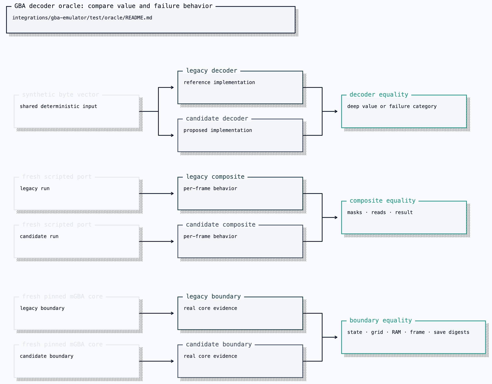

# FireRed extraction oracle

This directory is the answer key for extracting FireRed knowledge without
changing Clankie's live behavior. It adds no production import and stores only
source/schema/artifact digests and canonical JSON test receipts. ROM bytes,
savestates, RAM, framebuffer bytes, and decoded cartridge state stay local and
ephemeral.

Phase A freezes the public behavior already asserted by
`GbaEmulatorSession.startAction` and `observe`: the dialog, doorway, naming, and
menu suites are pinned by source digest rather than copied into a second suite.
`boundary-receipt.jsonl` records the exact cases that passed at the pinned
commit. Intentional behavior changes require a separate baseline update.

Phase B provides three gates:



[Editable Turbopuffer tldraw source](../../../../docs/diagrams/clankie-docs-diagrams-2.tldraw)

Run the legal gate:

```sh
pnpm exec vitest run --config vitest.config.ts \
  integrations/gba-emulator/test/advance-dialog.test.ts \
  integrations/gba-emulator/test/enter-text.test.ts \
  integrations/gba-emulator/test/select-menu-entry.test.ts \
  integrations/gba-emulator/test/map-exits.test.ts \
  integrations/gba-emulator/test/oracle/oracle.test.ts
```

The real A/B runs when the pinned operator-local ROM and bedroom savestate are
installed. The bedroom state proves deterministic comparison infrastructure,
but it is not a dialog-open state; slice 2 still needs an operator-local,
digest-pinned dialog savestate to make the real-core dialog gate meaningful.
Artifact paths are conveniences, not identities; the SHA-256 values are the
pins. Host OS, CPU, and filesystem paths are recorded only as unpinned
environment facts because Node, pnpm, the package version, WASM, ROM, and
savestate are the reproducibility boundary we can actually enforce.
