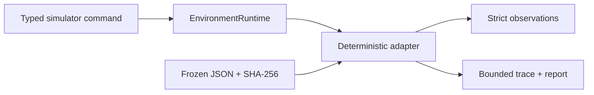

# @clankie/pokemmo-simulator

Deterministic, simulator-only PokeMMO-shaped environment adapter. It runs through
`@clankie/environment-runtime`, so lease ownership, stale-goal rejection,
idempotent action IDs, cancellation, timeouts, lease loss, and emergency stop use
the same trusted machinery as other embodied environments.

The adapter accepts strict `pokemmo_simulator` v2 session bounds and typed
navigation, interaction, menu-choice, battle-move, party-switch, item-use, and
wait actions. It accepts no connection material or credentials. Simulator state
is authoritative; success comes from final state plus a bounded hash-chained
trace, never from a model-authored claim.



The frozen fixture lives at
`scenarios/pokemmo/navigation-trainer-battle/v1`. It uses fictional local state
and contains no account, live-client, screenshot, packet, or ROM data.

There is no live PokeMMO adapter. The live capability boundary permits only the
names `pokemmo.live.observe` and `pokemmo.live.coach`; it registers and projects
no client action or tampering capability. This matches PokeMMO's published
[macroing](https://support.pokemmo.com/knowledgebase/article/macroing-faq),
[enforcement](https://support.pokemmo.com/knowledgebase/article/penalty-policy),
and [Terms of Service](https://pokemmo.com/en/tos/) boundary.

Focused checks:

```sh
pnpm --filter @clankie/pokemmo-simulator fixture:check
pnpm --filter @clankie/pokemmo-simulator typecheck
pnpm --filter @clankie/pokemmo-simulator test
pnpm --filter @clankie/pokemmo-simulator scenario:validate [evidence-directory]
```
