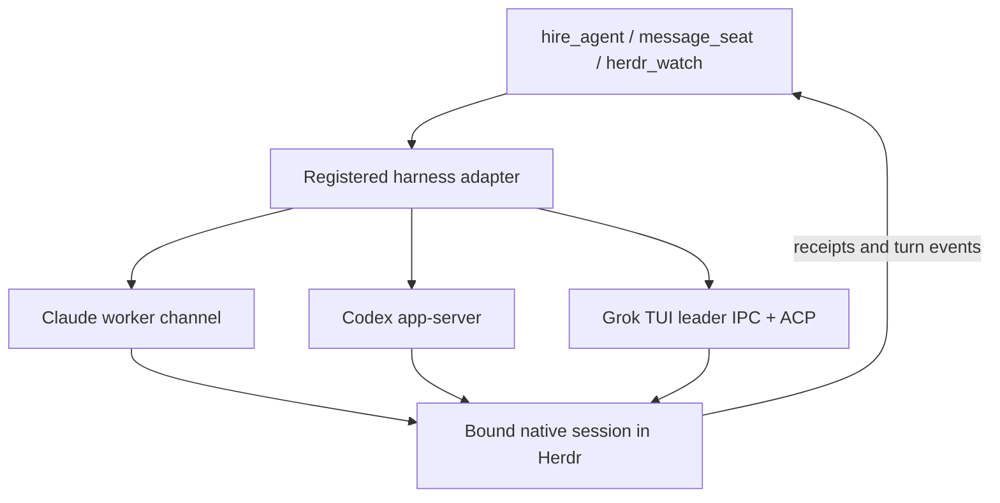

# Agent hosts

Discovery and byte-range access to Claude, Codex, Grok and Pi JSONL transcripts,
independent of terminal placement, process control.
`AgentHost` exposes `list` and `readBytes`; `@clankie/agent-transcript` owns parsing
and pagination. Modification time describes a file, never proves a live agent.

The local reader uses the current user's `.claude/projects`, `.codex/sessions`,
`.grok/sessions` (only `chat_history.jsonl`), and `.pi/agent/sessions`.
Clankie's own captain history is not a discovery root.
Named SSH hosts use those same directories beneath the remote user's home. POSIX
hosts need standard `sh`, `find`, `stat` (GNU or BSD), `tail`, `head`, and `base64`;
Windows hosts use Windows PowerShell and .NET. No Clankie or Node installation is
required remotely. Custom harness history roots are not supported yet.

Owners configure `agentHosts.connections` through `clankie agents hosts`; a host
has `id`, `ssh` (an OpenSSH destination or configured alias), and `shell`
(`posix` or `powershell`). Authentication, ports and jump hosts belong in the
owner's SSH configuration. Calls use batch authentication and normal host-key
verification, with a 10-second connection and 30-second read command deadline. The
reserved `local` host needs no configuration. An unavailable host never falls
back to another one.

Listings return at most 1,000 files (100 by default), ordered newest first.
Discovery currently scans history directories on each request. Reads return at
most 4 MiB per call and are confined to transcript roots; canonical local/POSIX
paths cannot escape through a symlink and Windows reads reject reparse points.
These checks prevent arbitrary file reads through transcript references; this
is not a sandbox against another process with the same account racing file
replacement. Transcript content remains untrusted input.

Tests run POSIX commands against a temporary home, exercise local path boundaries,
and inspect encoded PowerShell commands through a fake SSH runner. The initial
PowerShell implementation was additionally checked against a live Windows PC:
discovery, byte-range reads, and outside-root refusal. Tests do not require that PC.

Reading never starts or resumes a harness. Continuing a session is the seat's
job: a hired seat stays the real interactive harness in its Herdr pane (ADR 0203).

## Seat adapters

`seat.ts` is the harness-adapter seam (ADR 0187 amendment, VUH-1458). A
`HarnessSeatAdapter` starts a hired seat in its herdr pane (`SeatView`) as the
real interactive harness, and controls it through the harness's own extension
points: a `SeatControl` with `send` acknowledged by the harness, `settled`
completion, `interrupt`, and `close`. `attach` looks up control using the harness's
session ID; recovery after a service restart depends on the adapter. Failures are typed outcomes; `blocked`
names an owner decision (such as approving a channel). Automated delivery never
falls back to typing into the owner's terminal. Missing control and uncertain
delivery remain explicit outcomes; neither authorizes a second launch or resend.
The Claude adapter lives in the
service (`apps/clankie/src/captain/claude-worker-seat.ts`), as does Codex's.

### Tool flow and current support

Clankie calls `hire_agent`, `message_seat`, and `herdr_watch`. Same-fleet worker
messages reuse the native seat delivery path with agent-output framing and receipts.
Adapters must honor `SeatControl.send`'s optional `beforeDispatch` guard after
asynchronous preparation, immediately before the native mutation. A denied guard
returns a known unavailable receipt without sending. Channel delivery preserves
the peer source and exact recipient binding; peer messages confer no owner authority.
The service selects
the registered adapter, which owns the harness-specific delivery and receipts.
The adapter is runtime code. The shipped `this-machine` skill and captain
instructions explain how to use those tools and interpret their outcomes; the
no-terminal-fallback behavior is enforced in the delivery code itself.

| Harness     | Mechanism                                            | Local hire adapter                                        |
| ----------- | ---------------------------------------------------- | --------------------------------------------------------- |
| Claude Code | Native worker-plugin channel and turn hooks          | Implemented; requires the owner's channel consent         |
| Codex       | App-server shared with the native TUI's bound thread | Implemented; starts or steers a turn                      |
| Pi          | Process-bound native extension follow-up messages    | Opt-in only; Pi 0.87.1; live acceptance held              |
| OpenCode    | Injected SDK in the process-bound native worker TUI  | Implemented locally; pinned to OpenCode 1.18.18           |
| Grok Build  | Leader IPC/ACP on the exact interactive TUI session  | Implemented locally on macOS; pinned to Grok 1.0.46       |
| Prime Agent | Daemon-backed messages to the active session         | Researched for PrimeIntellect's CLI; not implemented here |

Transcript discovery and an available native CLI
do not imply a local hire adapter exists. Unsupported automated briefs fail
without creating a worker or typing into a terminal. Upstream source links and
the distinction between automated checks and live evidence are recorded in the
[delivery verification notes](../../docs/testing/2026-10-01-native-agent-delivery/README.md).

Pi uses the original process-bound extension and causal native custom-message
receipts. The service registers this local adapter only with
`CLANKIE_PI_NATIVE_ENABLED=1`; it is off by default until live acceptance.
Without opt-in, ordinary unbriefed Pi launches preserve their hosted model/provider
preparation and automated briefs remain unavailable. Opt-in requires the pinned
Pi 0.87.1 files; upgrades need compatibility validation before opting in.
Hosted model preparation has fixture coverage; native hosted/billing
and the independently owned fleet-tool projection remain unverified. See the
[Pi acceptance boundary](../../docs/testing/2026-10-04-pi-workers/README.md).

Work records stay in the repo's [tracker or files](../work-items/README.md).
Remote agents use the per-fleet link and native adapters.

`SeatLaunch.resumeSessionId` continues an exact session in the native view.
The normal hire path resolves its transcript, reuses a live seat on that host,
and confirms native identity before delivering a brief. Transcript hosts remain
read-only. See [native continuation](../../docs/adr/0189-agent-sessions-read-from-their-transcripts.md#native-continuation)
for host matching, original Codex account selection, and uncertain-start behavior.

An adapter contract is not proof of restart recovery: the current Codex adapter's
control map is in memory, so a saved session reference alone cannot reattach it
after a service restart. Codex sends stay bound to the original thread: if the
owner switches the TUI to another thread, this connection does not follow UI
focus. Report unavailable control without falling back to terminal input.
Hired Codex 0.160 sync and async questions use that same native controller and
reach the exact hiring conversation. `SeatControl.statusReason` projects a
pending question into the roster without settling its completion watch. Sync
answers respond to the app-server request and verify the winning tool output;
async answers use the TUI's attributed user-input envelope and verify its exact
client ID and content in the native thread. Async questions remain nonblocking
and survive normal completion. Matching interrupted/failed turns release stale
questions and active dispatch; idle alone requires a read-only terminal-turn
proof. See [question protocol evidence](../../docs/testing/2026-10-05-codex-worker-questions/README.md).
See [ADR 0207](../../docs/adr/0207-work-records-and-native-agent-delivery.md)
for the boundary between task records, native terminals and harness delivery.

The Grok Build operator seat uses `clankie seat --harness grok` (or
`clankie grok`). It starts the visible TUI with a private leader socket, loads
the selected service conversation's persona/memory and operator MCP tools, and
provides selected skills as readable paths. Briefs, messages and service wakes
use the same native session; no ACP headless process or terminal typing is used.
Native process birth, socket, TUI session and pane proofs are checked independently.
Owner permission prompts remain native. Worker saved-history resume and adopting
a controller after restart are unsupported; unsupported versions/platforms refuse.
See [the CLI guide](../../docs/cli.md#grok-build-worker-and-operator-seats) and
[ADR 0224](../../docs/adr/0224-grok-build-shares-the-visible-native-session.md).

The OpenCode **operator** seat is available separately through
`clankie opencode`. Its plugin uses the native injected SDK client
for the exact interactive session; the shared dispatch implementation lives in
`integrations/opencode-plugin/runtime.mjs`. The local worker hire adapter uses
the separate `worker-tui.mjs` and `worker-server.mjs` entries. OpenCode 1.18.18
loads the TUI entry's default `{ id, tui }` object; named exports alone do not
initialize its session. The prepared host observes the fresh pane with
`pane.get` before native TUI detection, then requires the exact bound harness
and session while retaining the process, socket and allocation fences. After
binding, it registers the hire's stable Herdr name so census preserves its
persona and conversation through native title changes. Owned live workers close
through their original TUI's `app.exit` command; success requires the original
terminal to disappear. Cold, replaced or switched sessions cannot use this
control, and there is no unconditional physical pane-close fallback. Worker
history comes only from its registered profile, not an owner-wide store. See
the [subagent verification](../../docs/testing/2026-10-04-opencode-subagents/README.md)
and the
[operator seat guide](../../integrations/opencode-plugin/README.md) for current
capabilities and verification limits.

### Prepared OpenCode workers

Local worker control requires macOS and a direct native OpenCode **1.18.18**
executable. One new Herdr tab starts its initial argv process. The controller
proves the original foreground process lifetime, held socket, canonical cwd and
displayed native session before briefing. Its separate TUI plugin uses the
in-process SDKv2 client; the server plugin selects `clankie mcp --fleet` without
operator credentials. Native permissions and questions remain owner decisions.
Models use `provider/model`; effort selects a supported variant of that model.
Account, skill, Chrome and extra-argv overrides are refused.

Native queue acceptance does not prove the model saw a brief or finished work.
Completion requires the matching final native reply. Lost receipts, changed
routes and endpoint loss remain unavailable or uncertain; they never authorize
a replacement launch or resend. Exact-session interrupt remains supported.

`clankie agents list` and `clankie agents read` expose bounded stored v1 history
from registered dedicated worker SQLite profiles. Full text is redacted before
chunking through the existing transcript parser. Read-only SQL may still perform
normal WAL/SHM reader coordination in those profiles; it is not a zero-filesystem-write
guarantee. No owner-wide database, migration or parallel transcript store is used.
`clankie agents resume … --conversation ID` can reuse only the original live
controller after fresh process, session and cwd checks. Saved metadata grants no
control. General profile discovery, remote control, restart reattachment and
new-process continuation remain unavailable. The
[worker checkpoint](../../docs/testing/2026-10-04-opencode-workers/README.md)
separates the original deterministic proof from later native persona/exit
verification and the remaining live acceptance checks.

### External Codex active-turn delivery

For an owner-started Codex session with a known Herdr thread identity, the service
tries the existing app-server connection on that machine before the native queue.
Windows control supports an existing dedicated backend with the native TUI
attached by `--remote`; both must retain the pane's private environment, cwd and
configuration. This adapter does not establish automatic supervision of new
Windows launches; native launcher verification remains open.
Control uses the fleet's SSH link only after proving current native ancestry,
lifetimes, pane/session and the actual connected TCP owner's backend. It does not
enable or select the account's shared daemon. Embedded `--no-daemon` sessions and
explicit named profiles retain their launch mode, but pane-targeted delivery
refuses when no private endpoint can be proven. Private-backend queue delivery
uses the same proven connection and native `thread/queue/add`, preserving the
private home and waiting until an active turn settles.
On other supported machines, `codex app-server proxy`
carries a WebSocket upgrade and frames over stdio (also through SSH); it never
starts a daemon. The exact thread must report active and its current turn is
fenced with `expectedTurnId`. No thread is resumed, no approval answered, and no
terminal draft touched. A lost steering receipt is unconfirmed and is never
replayed through the queue. The selected machine never falls back to another.

When the proxy cannot reach that active thread, queue acceptance reports
`state: queued` with an explicit until-turn-end detail. It does not mean the agent
has seen the message; a goal may hold it until the goal ends. Shared-daemon
Herdr identity and MCP membership are separate limitations; see the
[external Codex verification notes](../../docs/testing/2026-10-03-external-codex-control/README.md).
