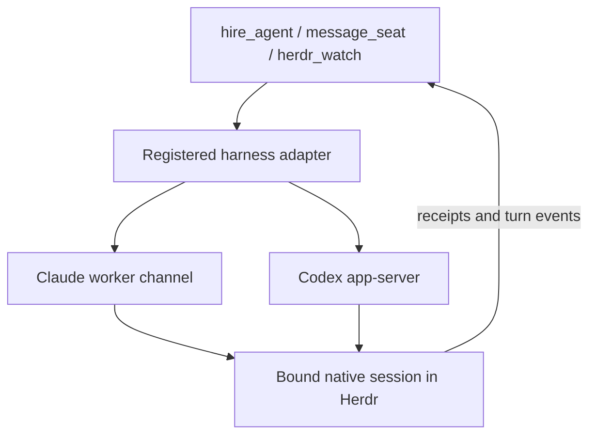

# Agent hosts

Discovery and byte-range access to Claude, Codex, Grok and Pi JSONL transcripts,
independent of terminal placement, process control.
`AgentHost` exposes `list` and `readBytes`; `@clankie/agent-transcript` owns parsing
and pagination. Modification time describes a file, never proves a live agent.

The local reader uses the current user's `.claude/projects`, `.codex/sessions`,
`.grok/sessions` (only `chat_history.jsonl`), and `.pi/agent/sessions`.
Clankie's own captain history is not a discovery root.
Named SSH hosts use those same directories beneath the remote user's home. POSIX
hosts need standard `sh`, `find`, `stat` (GNU or BSD), `tail`, `head`, and `base64`;
Windows hosts use Windows PowerShell and .NET. No Clankie or Node installation is
required remotely. Custom harness history roots are not supported yet.

Owners configure `agentHosts.connections` through `clankie agents hosts`; a host
has `id`, `ssh` (an OpenSSH destination or configured alias), and `shell`
(`posix` or `powershell`). Authentication, ports and jump hosts belong in the
owner's SSH configuration. Calls use batch authentication and normal host-key
verification, with a 10-second connection and 30-second read command deadline. The
reserved `local` host needs no configuration. An unavailable host never falls
back to another one.

Listings return at most 1,000 files (100 by default), ordered newest first.
Discovery currently scans history directories on each request. Reads return at
most 4 MiB per call and are confined to transcript roots; canonical local/POSIX
paths cannot escape through a symlink and Windows reads reject reparse points.
These checks prevent arbitrary file reads through transcript references; this
is not a sandbox against another process with the same account racing file
replacement. Transcript content remains untrusted input.

Tests run POSIX commands against a temporary home, exercise local path boundaries,
and inspect encoded PowerShell commands through a fake SSH runner. The initial
PowerShell implementation was additionally checked against a live Windows PC:
discovery, byte-range reads, and outside-root refusal. Tests do not require that PC.

Reading never starts or resumes a harness. Continuing a session is the seat's
job: a hired seat stays the real interactive harness in its Herdr pane (ADR 0203).

## Seat adapters

`seat.ts` is the harness-adapter seam (ADR 0187 amendment, VUH-1458). A
`HarnessSeatAdapter` starts a hired seat in its herdr pane (`SeatView`) as the
real interactive harness, and controls it through the harness's own extension
points: a `SeatControl` with `send` acknowledged by the harness, `settled`
completion, `interrupt`, and `close`. `attach` looks up control using the harness's
session ID; recovery after a service restart depends on the adapter. Failures are typed outcomes; `blocked`
names an owner decision (such as approving a channel). Automated delivery never
falls back to typing into the owner's terminal. Missing control and uncertain
delivery remain explicit outcomes; neither authorizes a second launch or resend.
The Claude adapter lives in the
service (`apps/clankie/src/captain/claude-worker-seat.ts`), as does Codex's.

### Tool flow and current support

Clankie calls `hire_agent`, `message_seat`, and `herdr_watch`. Same-fleet worker
messages reuse the native seat delivery path with agent-output framing and receipts.
Adapters must honor `SeatControl.send`'s optional `beforeDispatch` guard after
asynchronous preparation, immediately before the native mutation. A denied guard
returns a known unavailable receipt without sending. Channel delivery preserves
the peer source and exact recipient binding; peer messages confer no owner authority.
The service selects
the registered adapter, which owns the harness-specific delivery and receipts.
The adapter is runtime code. The shipped `this-machine` skill and captain
instructions explain how to use those tools and interpret their outcomes; the
no-terminal-fallback behavior is enforced in the delivery code itself.

| Harness     | Mechanism                                            | Local hire adapter                                        |
| ----------- | ---------------------------------------------------- | --------------------------------------------------------- |
| Claude Code | Native worker-plugin channel and turn hooks          | Implemented; requires the owner's channel consent         |
| Codex       | App-server shared with the native TUI's bound thread | Implemented; starts or steers a turn                      |
| Pi          | Native extension follow-up or steering messages      | Researched; not implemented in this local hire path       |
| OpenCode    | Injected SDK in the process-bound native worker TUI  | Implemented locally; pinned to OpenCode 1.18.18           |
| Prime Agent | Daemon-backed messages to the active session         | Researched for PrimeIntellect's CLI; not implemented here |

Transcript discovery and an available native CLI
do not imply a local hire adapter exists. Unsupported automated briefs fail
without creating a worker or typing into a terminal. Upstream source links and
the distinction between automated checks and live evidence are recorded in the
[delivery verification notes](../../docs/testing/2026-10-01-native-agent-delivery/README.md).

Work records stay in the repo's [tracker or files](../work-items/README.md).
Remote agents use the per-fleet link and native adapters.

`SeatLaunch.resumeSessionId` continues an exact session in the native view.
The normal hire path resolves its transcript, reuses a live seat on that host,
and confirms native identity before delivering a brief. Transcript hosts remain
read-only. See [native continuation](../../docs/adr/0189-agent-sessions-read-from-their-transcripts.md#native-continuation)
for host matching, original Codex account selection, and uncertain-start behavior.

An adapter contract is not proof of restart recovery: the current Codex adapter's
control map is in memory, so a saved session reference alone cannot reattach it
after a service restart. Codex sends stay bound to the original thread: if the
owner switches the TUI to another thread, this connection does not follow UI
focus. Report unavailable control without falling back to terminal input.
See [ADR 0207](../../docs/adr/0207-work-records-and-native-agent-delivery.md)
for the boundary between task records, native terminals and harness delivery.

The OpenCode **operator** seat is available separately through
`clankie seat --harness opencode`. Its plugin uses the native injected SDK client
for the exact interactive session; the shared dispatch implementation lives in
`integrations/opencode-plugin/runtime.mjs`. The local worker hire adapter uses
the separate `worker-tui.mjs` and `worker-server.mjs` entries. OpenCode 1.18.18
loads the TUI entry's default `{ id, tui }` object; named exports alone do not
initialize its session. The prepared host observes the fresh pane with
`pane.get` before native TUI detection, then requires the exact bound harness
and session while retaining the process, socket and allocation fences. Worker
history comes only from its registered profile, not an owner-wide store. See
the [subagent verification](../../docs/testing/2026-10-04-opencode-subagents/README.md)
and the
[operator seat guide](../../integrations/opencode-plugin/README.md) for current
capabilities and verification limits.

### External Codex active-turn delivery

For an owner-started Codex session with a known Herdr thread identity, the service
tries `codex app-server proxy` on that machine before the native queue. The proxy
carries a WebSocket upgrade and frames over stdio (also through SSH); it never
starts a daemon. The exact thread must report active and its current turn is
fenced with `expectedTurnId`. No thread is resumed, no approval answered, and no
terminal draft touched. A lost steering receipt is unconfirmed and is never
replayed through the queue. The selected machine never falls back to another.

When the proxy cannot reach that active thread, queue acceptance reports
`state: queued` with an explicit until-turn-end detail. It does not mean the agent
has seen the message; a goal may hold it until the goal ends. Shared-daemon
Herdr identity and MCP membership are separate limitations; see the
[external Codex verification notes](../../docs/testing/2026-10-03-external-codex-control/README.md).
