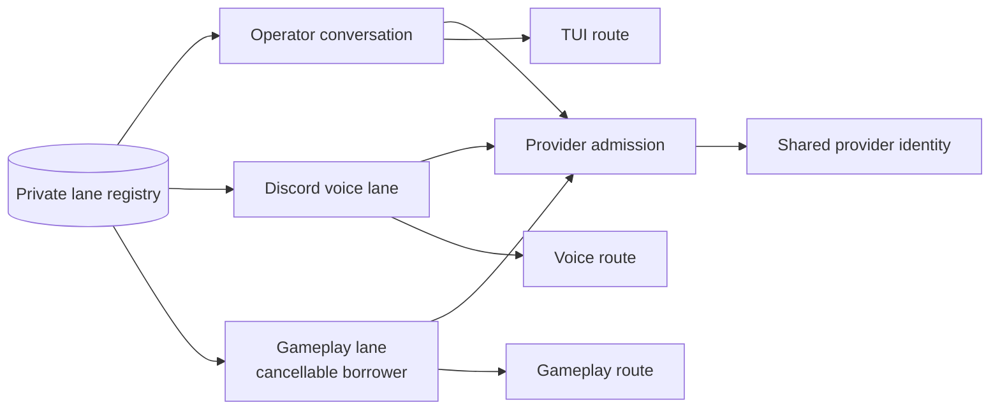

# @clankie/captain-runtime

Deterministic conversation/session ownership and provider-call admission for one
Clankie identity. The package dual-reads the frozen v1 `CaptainLane` contract and
writes the conversation-scoped `CaptainSessionLaneV2` contract, but
does not implement channels, character state, Minecraft, or model providers.
The transitional background-lane registry uses the named compatibility boundary
so an existing v1 TUI row remains readable while `discord_presence` belongs only
to the v2 wire enum.

## Invariants

- An operator lane is uniquely keyed by its server-owned conversation ID.
- The private SQLite registry stores each lane's Eve session and continuation
  token under mode-0700/mode-0600 paths. Redacted snapshots and runtime events
  cannot contain continuation tokens.
- A session or continuation token has exactly one lane owner. Cross-lane reuse,
  live-session replacement, character mismatch, and identity drift fail closed.
- Reopening the registry restores the same Discord/gameplay lane rows; register
  is idempotent and never duplicates a target.
- One registry has one agent definition, soul, provider, and character identity.
- Each lane has a FIFO burst queue. Different lanes can hold provider permits
  concurrently; there is no application-wide turn mutex.
- Every operator conversation has the highest admission priority, voice and
  presence follow, and gameplay is the cancellable borrower. There is no TUI,
  mobile, macOS, or per-device reserved capacity.
- `doStream` model permits remain held until the response stream closes,
  errors, or is cancelled; a returned stream is not mistaken for a completed
  model call.
- `CaptainLaneExecutor` gives a callback only its own resume token and routes
  its result only to the originating address.

Provider pressure parks the admitted request and emits bounded metadata. The
controller never creates an unbounded global retry loop; retry policy remains a
caller decision.
