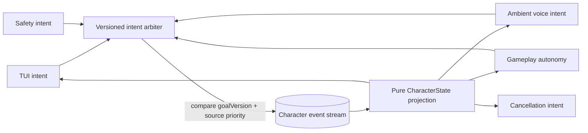

# @clankie/character-state

Authoritative, replayable cross-lane state for one Clankie identity. This
package accepts frozen v1 intent and environment contracts, but it neither
executes Minecraft actions nor connects an Eve channel.

## Invariants

- Source priority is total and deterministic:
  `safety > authenticated TUI > ambient voice > gameplay autonomy`.
- Safety authority is denied by default. A caller must inject an
  `isTrustedSystemPrincipal` predicate into the arbiter or repository before a
  system principal can receive the top tier; command shape alone grants no
  authority.
- Every write supplies an expected stream revision. SQLite compares and appends
  in one transaction; concurrent stale writers receive
  `OptimisticConcurrencyError` instead of overwriting state.
- Every command independently carries frozen `expectedGoalVersion`. A delayed
  command is recorded as `rejected_stale` and cannot mutate the goal.
- One accepted `set_goal` decision is one event and increments
  `goalVersion` once. Replaying the same idempotency key returns that event.
- A replacement goal emits accepted/changed/superseded semantic events and, if
  a Minecraft action is active, a cancellation intent for the runner boundary.
- Accepted non-goal intents remain projected until a higher-authority intent
  invalidates them. The winning decision records their ids and emits
  `captain.lane.preempted`, so a lower-priority physical write cannot remain
  authoritative after a same-version race.
- Shared memory is capped at 64 strict factual records and 64 strict bounded
  references. Private transcript/reasoning markers and token-scheme URIs are
  rejected case-insensitively in every stored fact/reference string.
- `CharacterState` and `MinecraftPresence` carry schema and monotonic
  revisions. Projection is a pure fold over the ordered stream.

The package stores one atomic decision event rather than separate
accept/supersede/cancel mutations, so a crash cannot expose a partially applied
goal replacement.
