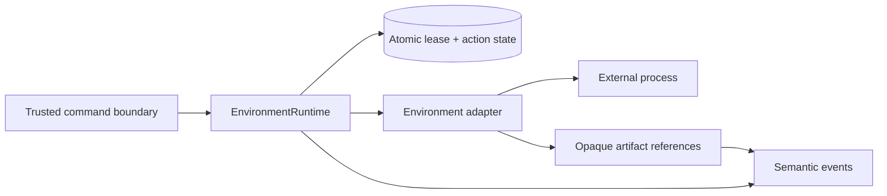

# @clankie/environment-runtime

Runner-owned lifecycle and lease enforcement for durable interactive
environments. Adapters implement provider-neutral start, attach, heartbeat,
pause, resume, action, cancellation, and stop operations using the frozen v1
contracts from `@clankie/interactive-environment`.

Exactly one unexpired writer lease may own a character/world pair. Capability
tokens and connection credentials stay in runner memory; durable records hold
only a token fingerprint and the strict credential-free v1 lease. Every action
ID is registered before adapter dispatch, so a repeated command or restart
returns the recorded result instead of repeating an external side effect.
One live runner owns each state directory; a replacement runner takes ownership
through restart reconciliation rather than concurrent file access.

Lease expiry, revocation, pause, timeout, explicit cancellation, and emergency
stop invalidate pending motor work immediately. Emergency stop is a direct
runner operation and never waits for a model turn. Restart reconciliation
attaches each live recorded session once, fails missing adapter sessions closed,
and keeps completed action results terminal.

Semantic events contain bounded lifecycle metadata only. Model-visible action
outcomes are recursively redacted, and telemetry must use an opaque
`artifact://` reference; raw packets, ticks, credentials, and capability tokens
never enter the semantic stream.
