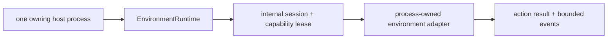

# @clankie/environment-runtime

Service-owned lifecycle and lease enforcement for durable interactive
environments. Adapters implement start, attach, pause, resume, action,
cancellation, and stop operations. Start actions use the concrete GBA command
contract from `@clankie/interactive-environment`; persisted legacy session
profiles remain readable through the historical normalization seam.

The older
[environment-runtime JPG](../../docs/diagrams/environment-runtime.jpg) is a
historical snapshot. The current ownership boundary is:

```mermaid
flowchart LR
  Host[one owning host process] --> Runtime[EnvironmentRuntime]
  Runtime --> Lease[internal session + capability lease]
  Lease --> Adapter[process-owned environment adapter]
  Adapter --> Result[action result + bounded events]
```

Exactly one unexpired writer lease may own a character/world pair. Capability
tokens and connection credentials stay in host memory; durable records hold
only a token fingerprint and the strict credential-free v2 lease. The runtime
normalizes persisted v1 sessions through the `legacy_v1` migration profile and
writes v2 records. Every action ID is registered before adapter dispatch, so a
repeated command or restart
returns the recorded result instead of repeating an external side effect.
One live host process owns each state directory; a replacement takes ownership
through restart reconciliation rather than concurrent file access.

The lease is an internal action, expiry, and recovery fence. It does not let a
different process attach to, steal, suspend, or impersonate the owning process's
environment ([ADR 0129](../../docs/adr/0129-each-player-owns-a-body.md)).

Lease expiry, revocation, pause, timeout, explicit cancellation, and emergency
stop invalidate pending motor work immediately. Emergency stop is a direct
runtime operation and never waits for a model turn. Restart reconciliation
attaches each live recorded session once, fails missing adapter sessions closed,
and keeps completed action results terminal. An adapter may return a bounded
synchronous completion for deterministic local work or leave an action running
behind its handle. Typed non-retryable adapter errors preserve fail-closed
uncertainty instead of inviting input replay.

Semantic events contain bounded lifecycle metadata only. Model-visible action
outcomes are recursively redacted, and telemetry must use an opaque
`artifact://` reference; raw packets, ticks, credentials, and capability tokens
never enter the semantic stream.
