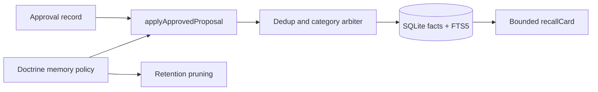

# @clankie/memory-store

Durable, bounded mission memory governed by the compiled doctrine memory policy.
The package stores approved factual projections, not transcripts, continuation
tokens, model reasoning, or an agent-controlled source of truth.

## Authority and security

- `applyApprovedProposal` is the only write API. Its strict input requires an
  explicit approved record; workers and model output cannot write facts
  directly or manufacture approval authority at this boundary.
- Callers remain responsible for validating that the approval record came from
  the trusted approval store. This package validates its shape and binds it to
  the idempotent proposal receipt; it does not authenticate principals.
- Public-source facts are rejected when doctrine disables
  `publicToPrivatePropagation`. Raw-transcript-derived facts are deleted by
  `pruneRetention` according to `rawTranscriptRetentionDays`; callers schedule
  that operation when doctrine changes and during routine maintenance.
- Each category is independently capped. Equivalent normalized facts merge;
  overflow eviction is deterministic by lowest confidence, oldest update, then
  fact id. No vector or embedding service receives memory content.
- FTS5 recall is a read-only, bounded markdown projection. It is context for a
  model, not authority, and consumers must not treat recalled text as an
  instruction or silently overwrite tracker, repository, or operator-owned
  facts with it.

SQLite uses WAL journaling and `synchronous=FULL`. Schema changes append a new
migration; shipped migrations are immutable.
