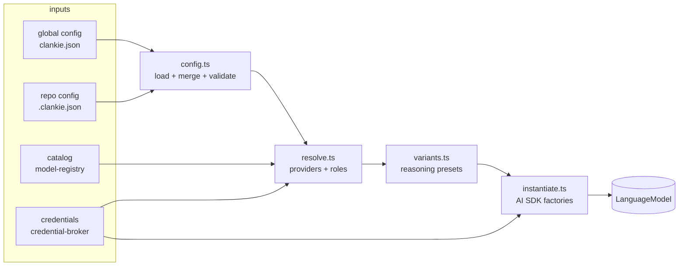

# @clankie/model-provider

Turns clankie configuration plus the [`@clankie/model-registry`](../model-registry) catalog and [`@clankie/credential-broker`](../credential-broker) credentials into ready-to-call AI SDK language models. Four layers, each a pure step in the pipeline:

## config.ts — layered configuration

`loadConfig()` reads the global file (`${XDG_CONFIG_HOME ?? ~/.config}/clankie/clankie.json`, via `globalConfigPath`) then the nearest repo `.clankie.json` walking up from `cwd` (`findRepoConfigPath`), and deep-merges repo over global: objects merge per key, arrays and scalars replace. It never throws — a file with invalid JSON or a failing schema becomes an entry in `issues` and is skipped.

`ClankieConfigSchema` is a loose zod schema (unknown keys pass through for forward-compat) covering `model` / `small_model` / `voice_model` refs, per-ref `variant` selections, `enabled_providers` / `disabled_providers`, and `provider` declarations (name/npm/env/options/models). **Secrets never live in config**: the full config tree recursively rejects authorization and API-key headers plus token- and secret-shaped fields, including loose top-level config, provider options, model overlays, and overlay metadata. Rejections point at `/auth` and the credential broker.

`updateGlobalConfig(mutate)` loads the global file only, applies the mutator (in-place edits or a returned replacement both work), validates, and writes atomically (temp file + rename, pretty JSON). Concurrent in-process updates are serialized through a promise queue. A corrupt global file is a hard error, never silently overwritten.

Model refs are `"providerId/modelId"` strings; `parseModelRef` splits on the **first** slash because model ids may contain slashes (fireworks `accounts/x/models/y`), and `formatModelRef` is its inverse.

## resolve.ts — providers and roles

`mergedCatalog(config, catalog)` overlays config-declared providers/models onto the registry catalog via `applyCustomProviders`. Only catalog-shaped data crosses over (name/env/npm/models); `options` such as `baseURL` are connection config and stay config-side.

`resolveProviders({config, catalog, credentialIds, env})` returns each provider with its connection state — `"credential"` (broker holds one), `"env"` (a declared env var is set), or `"none"` — after dropping `disabled_providers` and applying a non-empty `enabled_providers` allowlist. Connected providers sort first, then by name.

`resolveRole(role, {config, catalog})` resolves a configured role ref into `{providerId, modelId, model, variantId}`, where `model` is the merged-catalog entry (undefined for unknown models) and `variantId` comes from `config.variant[ref]`.

## variants.ts — reasoning presets

`effortVariantsFor(providerId, model)` generates the reasoning presets a model supports (empty for non-reasoning models), keyed by provider family:

| family                                            | variants                                                                | body shape                                            |
| ------------------------------------------------- | ----------------------------------------------------------------------- | ----------------------------------------------------- |
| openai / azure / openai-codex / openai-compatible | `low` `medium` `high` (+ `minimal` for supported gpt-5 models; not 5.5) | `{reasoning_effort}`                                  |
| anthropic                                         | `think-8k` `think-16k` `think-32k`                                      | `{thinking: {type: "enabled", budget_tokens}}`        |
| xai                                               | `low` `high`                                                            | `{reasoning_effort}`                                  |
| google                                            | `think-8k` `think-16k` `think-24k`                                      | `{thinkingConfig: {includeThoughts, thinkingBudget}}` |
| other reasoning providers                         | `low` `medium` `high`                                                   | `{reasoning_effort}`                                  |

Variant bodies are provider **wire-format** data (snake_case for OpenAI-style APIs). Lowering to AI SDK `providerOptions` happens at generate time via `variantProviderOptions` — a variant is data, not a model mutation.

## instantiate.ts — AI SDK construction

`createLanguageModel({provider, modelId, credential?, baseURL?, fetchImpl?, variant?, env?})` picks the factory by family (`providerFamilyFor`): `createAnthropic`, `createOpenAI` (also `openai-codex`), `createGoogleGenerativeAI`, `createXai`, or `createOpenAICompatible` for everything else. An explicit `baseURL` or `npm: "@ai-sdk/openai-compatible"` always routes through the compatible factory (custom endpoints are OAI-shaped by convention), with `baseURL ?? provider.api` as the endpoint.

API key resolution never throws: an `api`/`wellknown` credential supplies the key; an `oauth` credential gets the `"clankie-oauth"` placeholder (the real bearer is attached by the injected `fetchImpl` wrapper from the oauth module); otherwise the first set env var from `provider.env`; otherwise the `"clankie-unconfigured"` placeholder. Unconfigured models construct fine and fail at request time with the provider's own auth error, keeping listing/selection flows total.

Variant `headers` are baked into the provider instance; variant `body` cannot be — pass it per call: `variantProviderOptions(variant, family)` returns `{providerOptions?, headers?}` for `generateText`/`streamText`, camelizing wire-format keys into the AI SDK option schemas (`reasoning_effort` → `reasoningEffort`, `budget_tokens` → `budgetTokens`) under the family's namespace (`anthropic`, `openai`, `google`, `xai`, `openaiCompatible`).

## oauth/ — provider OAuth flows

`oauth/openai-codex.ts` implements ChatGPT/Codex subscription OAuth for the `openai-codex` provider: the browser flow (PKCE + localhost callback), the headless device flow, refresh-token rotation, and the fetch adapter that reroutes Responses API requests to the Codex backend with subscription headers.

`oauth/anthropic.ts` implements Claude Pro/Max subscription OAuth for the `anthropic` provider: a manual-code browser PKCE flow, credential-broker persistence, single-flight refresh, immediate local revocation, and the OAuth/Claude Code beta headers required by Anthropic's Messages API. `resolveConfiguredLanguageModel` selects this adapter only for an `anthropic` OAuth credential; an Anthropic API key and `ANTHROPIC_API_KEY` keep using the normal AI SDK path. The browser exchange requires a live Pro/Max subscription and remains an operator acceptance check; URL construction, state validation, exchange, refresh, broker persistence, request adaptation, and revocation are covered headlessly.

Both modules are re-exported from the package root alongside the four layers above. Secrets remain in the credential broker and never enter `clankie.json`, model options, or logs.
