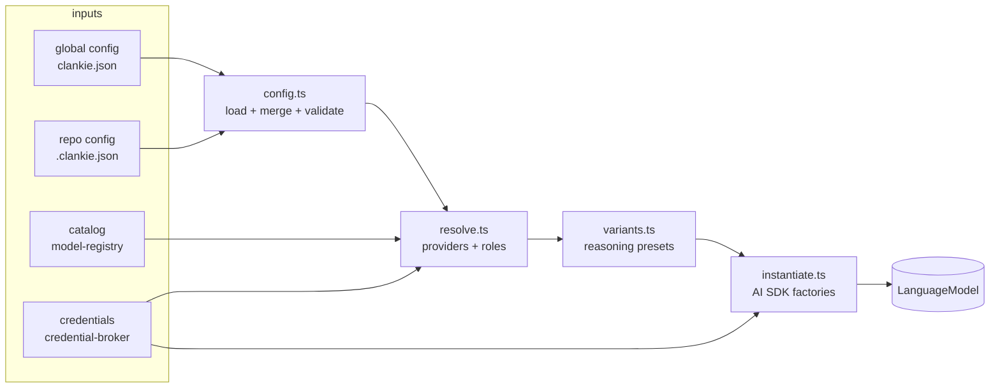

# @clankie/model-provider

Turns clankie configuration plus the [`@clankie/model-registry`](../model-registry) catalog and [`@clankie/credential-broker`](../credential-broker) credentials into ready-to-call AI SDK language models. Four layers, each a pure step in the pipeline:


```mermaid
flowchart LR
  subgraph inputs
    G["global config<br/>clankie.json"]
    R["repo config<br/>.clankie.json"]
    C["catalog<br/>model-registry"]
    B["credentials<br/>credential-broker"]
  end
  G --> CFG[config.ts<br/>load + merge + validate]
  R --> CFG
  CFG --> RES[resolve.ts<br/>providers + roles]
  C --> RES
  B --> RES
  RES --> VAR[variants.ts<br/>reasoning presets]
  VAR --> INST[instantiate.ts<br/>AI SDK factories]
  B --> INST
  INST --> M[(LanguageModel)]
```

## config.ts — layered configuration

`loadConfig()` reads the global file (`${XDG_CONFIG_HOME ?? ~/.config}/clankie/clankie.json`, via `globalConfigPath`) then the nearest repo `.clankie.json` walking up from `cwd` (`findRepoConfigPath`), and deep-merges repo over global: objects merge per key, arrays and scalars replace. It never throws — a file with invalid JSON or a failing schema becomes an entry in `issues` and is skipped.

`ClankieConfigSchema` is a loose zod schema (unknown keys pass through for forward-compat) covering `model` / `small_model` / `voice_model` / `settle_classifier_model` refs, per-ref `variant` selections, `enabled_providers` / `disabled_providers`, and `provider` declarations (name/npm/env/options/models). The dedicated settle-classifier role prevents terminal-tail classification from borrowing a captain model slot; its concrete adapter separately enforces an Ollama loopback endpoint. **Secrets never live in config**: the full config tree recursively rejects authorization and API-key headers plus token- and secret-shaped fields, including loose top-level config, provider options, model overlays, and overlay metadata. Rejections point at `/auth` and the credential broker.

`updateGlobalConfig(mutate)` loads the global file only, applies the mutator (in-place edits or a returned replacement both work), validates, and writes atomically (temp file + rename, pretty JSON). Concurrent in-process updates are serialized through a promise queue. A corrupt global file is a hard error, never silently overwritten.

Model refs are `"providerId/modelId"` strings; `parseModelRef` splits on the **first** slash because model ids may contain slashes (fireworks `accounts/x/models/y`), and `formatModelRef` is its inverse.

## resolve.ts — providers and roles

`mergedCatalog(config, catalog)` overlays config-declared providers/models onto the registry catalog via `applyCustomProviders`. Only catalog-shaped data crosses over (name/env/npm/models); `options` such as `baseURL` are connection config and stay config-side.

`withCodexSubscriptionProvider(catalog)` (codex-catalog.ts) adds `openai-codex` beside `openai` with the models verified against the streamed Codex backend — `gpt-5.6-sol`, `gpt-5.6-terra`, `gpt-5.6-luna`, `gpt-5.5`, `gpt-5.4`, `gpt-5.4-mini` — at zero cost and the backend's own 272k-input/128k-output window rather than the larger API-key window models.dev reports. The backend addresses gpt-5.6 by size slug, so the bare `gpt-5.6` alias stays API-only. First-party Codex client visibility is not evidence that a third-party `originator` may call a model ([ADR 0052](../../docs/adr/0052-subscription-precedence-over-metered-api-key.md)), so the list expands only after a streamed subscription request proves the model.

`resolveProviders({config, catalog, credentialIds, env})` returns each provider with its connection state — `"credential"` (broker holds one), `"env"` (a declared env var is set), or `"none"` — after dropping `disabled_providers` and applying a non-empty `enabled_providers` allowlist. Connected providers sort first, then by name.

`resolveRole(role, {config, catalog})` resolves a configured role ref into `{providerId, modelId, model, variantId}`, where `model` is the merged-catalog entry (undefined for unknown models) and `variantId` comes from `config.variant[ref]`.

### Subscription precedence

A stored ChatGPT subscription outranks the metered OpenAI API key for every model the Codex backend serves ([ADR 0052](../../docs/adr/0052-subscription-precedence-over-metered-api-key.md)). `subscriptionRefFor(role, config)` names the superseding ref (pure; `gpt-5.6` maps to `gpt-5.6-sol`, the slug the backend answers), and `subscriptionOverrideFor(role, {config, catalog, hasSubscriptionCredential})` applies it, carrying the configured effort across — both transports expose the same ladder, and an effort set against the subscription ref wins over the API-key one. `resolveConfiguredLanguageModel` performs the redirect before any credential lookup, and looks up the subscription credential only for refs it could serve.

This is not credential borrowing: the resolved provider identity becomes `openai-codex`, the request goes over the Codex transport, and the context window narrows to the backend's. `openai/<model>` still fails with "No credential is configured for openai" when the subscription cannot serve that model. Logging out (`/auth`) is the way back to metered access; `disabled_providers: ["openai-codex"]` (or an `enabled_providers` allowlist that omits it) is the explicit config opt-out.

## variants.ts — reasoning presets

`effortVariantsFor(providerId, model)` generates the reasoning presets a model supports (empty for non-reasoning models), keyed by provider family:

| family                                            | variants                                    | body shape                                            |
| ------------------------------------------------- | ------------------------------------------- | ----------------------------------------------------- |
| openai / azure / openai-codex / openai-compatible | the model's documented ladder (table below) | `{reasoning_effort}`                                  |
| anthropic                                         | `think-8k` `think-16k` `think-32k`          | `{thinking: {type: "enabled", budget_tokens}}`        |
| xai                                               | `low` `high`                                | `{reasoning_effort}`                                  |
| google                                            | `think-8k` `think-16k` `think-24k`          | `{thinkingConfig: {includeThoughts, thinkingBudget}}` |
| other reasoning providers                         | `low` `medium` `high`                       | `{reasoning_effort}`                                  |

The OpenAI ladder is per model, because the family disagrees with itself — `minimal` belongs only to gpt-5, gpt-5.1 and newer use `none`, `pro` models expose a narrower ladder than their base sibling, and only gpt-5.6 reaches `max`. First matching pattern wins:

| model                                      | ladder                                     |
| ------------------------------------------ | ------------------------------------------ |
| gpt-5.6 (+ sol / terra / luna)             | `none` `low` `medium` `high` `xhigh` `max` |
| gpt-5.5, gpt-5.4 (+ mini / nano)           | `none` `low` `medium` `high` `xhigh`       |
| gpt-5.2, gpt-5.2-codex                     | `none` `low` `medium` `high` `xhigh`       |
| gpt-5.3-codex (+ spark), gpt-5.1-codex-max | `low` `medium` `high` `xhigh`              |
| gpt-5.1 (+ codex / codex-mini)             | `none` `low` `medium` `high`               |
| gpt-5.2-pro, gpt-5.4-pro, gpt-5.5-pro      | `medium` `high` `xhigh`                    |
| gpt-5-pro                                  | `high`                                     |
| gpt-5 (+ mini / nano / codex)              | `minimal` `low` `medium` `high`            |

Both OpenAI transports share this ladder: streamed Codex-backend probes accept the same per-model tiers the API documents. The Codex client's own `ultra` tier is deliberately absent — the backend rejects it for Clankie's `originator` identity. Under-offering a tier only hides an option; offering one the model rejects fails the whole request, so unknown models fall back to `low`/`medium`/`high`.

Variant bodies are provider **wire-format** data (snake_case for OpenAI-style APIs). Lowering to AI SDK `providerOptions` happens at generate time via `variantProviderOptions` — a variant is data, not a model mutation.

## instantiate.ts — AI SDK construction

`createLanguageModel({provider, modelId, credential?, baseURL?, fetchImpl?, variant?, env?})` picks the factory by family (`providerFamilyFor`): `createAnthropic`, `createOpenAI` (also `openai-codex`), `createGoogleGenerativeAI`, `createXai`, or `createOpenAICompatible` for everything else. An explicit `baseURL` or `npm: "@ai-sdk/openai-compatible"` always routes through the compatible factory (custom endpoints are OAI-shaped by convention), with `baseURL ?? provider.api` as the endpoint.

API key resolution never throws: an `api`/`wellknown` credential supplies the key; an `oauth` credential gets the `"clankie-oauth"` placeholder (the real bearer is attached by the injected `fetchImpl` wrapper from the oauth module); otherwise the first set env var from `provider.env`; otherwise the `"clankie-unconfigured"` placeholder. Unconfigured models construct fine and fail at request time with the provider's own auth error, keeping listing/selection flows total.

Variant `headers` are baked into the provider instance; variant `body` cannot be — pass it per call: `variantProviderOptions(variant, family)` returns `{providerOptions?, headers?}` for `generateText`/`streamText`, camelizing wire-format keys into the AI SDK option schemas (`reasoning_effort` → `reasoningEffort`, `budget_tokens` → `budgetTokens`) under the family's namespace (`anthropic`, `openai`, `google`, `xai`, `openaiCompatible`).

## oauth/ — provider OAuth flows

`oauth/openai-codex.ts` implements ChatGPT/Codex subscription OAuth for the `openai-codex` provider: the browser flow (PKCE + localhost callback), the headless device flow, refresh-token rotation, and the fetch adapter that reroutes Responses API requests to the Codex backend with subscription headers.

`oauth/anthropic.ts` implements Claude Pro/Max subscription OAuth for the `anthropic` provider: a manual-code browser PKCE flow, credential-broker persistence, single-flight refresh, immediate local revocation, and the OAuth/Claude Code beta headers required by Anthropic's Messages API. `resolveConfiguredLanguageModel` selects this adapter only for an `anthropic` OAuth credential; an Anthropic API key and `ANTHROPIC_API_KEY` keep using the normal AI SDK path. The browser exchange requires a live Pro/Max subscription and remains an operator acceptance check; URL construction, state validation, exchange, refresh, broker persistence, request adaptation, and revocation are covered headlessly.

Both modules are re-exported from the package root alongside the four layers above. Secrets remain in the credential broker and never enter `clankie.json`, model options, or logs.

## codex-model-probe-cli.ts — subscription evidence

`pnpm models:codex-probe` streams one throwaway turn per model/effort pair through the real path (broker credential → codex fetch adapter → Responses transport) and prints the backend's own verdict. It is the check ADR 0052 requires before `CODEX_SUBSCRIPTION_MODEL_IDS` grows, and it is opt-in and credential-bearing, so it never runs in CI.

```bash
pnpm models:codex-probe                       # exposed models at their top tier
pnpm models:codex-probe gpt-5.7-x@max         # a candidate before exposing it
pnpm models:codex-probe --all-efforts --json  # full ladder sweep
```

A candidate need not be exposed yet: each probe declares its target into a throwaway config, so an unexposed id still reaches the backend and returns the reason it is refused.
