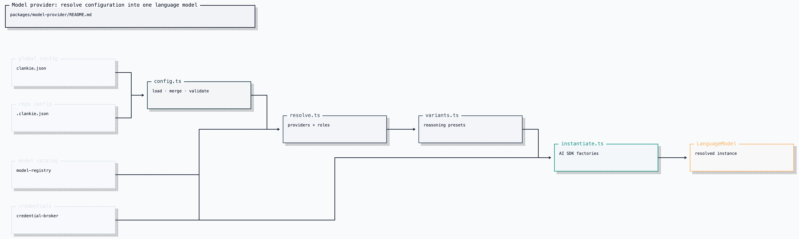

# @clankie/model-provider

Turns clankie configuration plus the
[`@clankie/model-registry`](../model-registry/README.md) catalog and
[`@clankie/credential-broker`](../credential-broker/README.md) credentials into
ready-to-call AI SDK language models and Pi provider declarations. The
non-captain AI SDK path has four pure layers:



[Editable Turbopuffer tldraw source](../../docs/diagrams/clankie-docs-diagrams-2.tldraw)

The captain takes a separate final branch: `registerConfiguredPiProviders`
projects custom Clankie provider declarations into Pi, while Pi's `ModelRuntime`
owns its catalog, auth, implementation, and thinking levels
([ADR 0101](../../docs/adr/0101-pi-owns-the-captain-model-runtime.md)). Gameplay
and image/video generation keep the AI SDK path above.

## config.ts — layered configuration

`loadConfig()` reads the global file (`${XDG_CONFIG_HOME ?? ~/.config}/clankie/clankie.json`, via `globalConfigPath`) then the nearest repo `.clankie.json` walking up from `cwd` (`findRepoConfigPath`), and deep-merges repo over global: objects merge per key, arrays and scalars replace. It never throws — a file with invalid JSON or a failing schema becomes an entry in `issues` and is skipped.

`ClankieConfigSchema` is a loose zod schema (unknown keys pass through for
forward compatibility) covering the primary language ref, media refs, per-ref
variants, provider allow/deny lists, and custom provider declarations. Legacy
`small_model` and `voice_model` fields remain readable and preserved for owner
config compatibility, but no picker or runtime writes or consumes them.
**Secrets never live in config**: the full tree rejects authorization/API-key
headers and token- or secret-shaped fields. Rejections point at `/auth` and the
credential broker.

`updateGlobalConfig(mutate)` loads the global file only, applies the mutator (in-place edits or a returned replacement both work), validates, and writes atomically (temp file + rename, pretty JSON). Concurrent in-process updates are serialized through a promise queue. A corrupt global file is a hard error, never silently overwritten.

Model refs are `"providerId/modelId"` strings; `parseModelRef` splits on the **first** slash because model ids may contain slashes (fireworks `accounts/x/models/y`), and `formatModelRef` is its inverse.

## resolve.ts — catalog and roles

`mergedCatalog(config, catalog)` overlays config-declared providers/models onto the registry catalog via `applyCustomProviders`. Only catalog-shaped data crosses over (name/env/npm/models); `options` such as `baseURL` are connection config and stay config-side.

`withCodexSubscriptionProvider(catalog)` adds `openai-codex` beside `openai`
using only models verified by a streamed subscription request. The current set,
aliases, and backend limits live in
[`src/codex-catalog.ts`](src/codex-catalog.ts), not in this README. First-party
Codex client visibility alone is not evidence that Clankie's third-party
`originator` may call a model
([ADR 0052](../../docs/adr/0052-subscription-precedence-over-metered-api-key.md)).

`resolveRole(role, {config, catalog})` resolves a configured role ref into `{providerId, modelId, model, variantId}`, where `model` is the merged-catalog entry (undefined for unknown models) and `variantId` comes from `config.variant[ref]`.

### Subscription precedence

A stored ChatGPT subscription outranks the metered OpenAI API key for every
model the Codex backend serves
([ADR 0052](../../docs/adr/0052-subscription-precedence-over-metered-api-key.md)).
`subscriptionRefFor` names the superseding ref and
`subscriptionOverrideFor` carries the configured effort across.
The captain applies that redirect before asking Pi for the model;
`resolveConfiguredLanguageModel` applies it for AI SDK consumers.

This is not credential borrowing: the resolved provider identity becomes `openai-codex`, the request goes over the Codex transport, and the context window narrows to the backend's. `openai/<model>` still fails with "No credential is configured for openai" when the subscription cannot serve that model. Logging out (`/auth`) is the way back to metered access; `disabled_providers: ["openai-codex"]` (or an `enabled_providers` allowlist that omits it) is the explicit config opt-out.

## variants.ts — reasoning presets

`effortVariantsFor(providerId, model)` returns no presets for non-reasoning
models and provider-appropriate request bodies for reasoning models. OpenAI
family ladders are model-specific; Anthropic and Google use token budgets; xAI
and generic compatible providers use their supported effort values. The live
patterns and fallback ladder are canonical in
[`src/variants.ts`](src/variants.ts), where tests can fail when a change offers
an unsupported wire value.

Variant bodies are provider **wire-format** data (snake_case for OpenAI-style APIs). Lowering to AI SDK `providerOptions` happens at generate time via `variantProviderOptions` — a variant is data, not a model mutation.

## instantiate.ts — AI SDK construction

`createLanguageModel({provider, modelId, credential?, baseURL?, fetchImpl?, variant?, env?})` picks the factory by family (`providerFamilyFor`): `createAnthropic`, `createOpenAI` (also `openai-codex`), `createGoogleGenerativeAI`, `createXai`, or `createOpenAICompatible` for everything else. An explicit `baseURL` or `npm: "@ai-sdk/openai-compatible"` always routes through the compatible factory (custom endpoints are OAI-shaped by convention), with `baseURL ?? provider.api` as the endpoint.

API key resolution never throws: an `api`/`wellknown` credential supplies the key; an `oauth` credential gets the `"clankie-oauth"` placeholder (the real bearer is attached by the injected `fetchImpl` wrapper from the oauth module); otherwise the first set env var from `provider.env`; otherwise the `"clankie-unconfigured"` placeholder. Unconfigured models construct fine and fail at request time with the provider's own auth error, keeping listing/selection flows total.

Variant `headers` are baked into the provider instance; variant `body` cannot be — pass it per call: `variantProviderOptions(variant, family)` returns `{providerOptions?, headers?}` for `generateText`/`streamText`, camelizing wire-format keys into the AI SDK option schemas (`reasoning_effort` → `reasoningEffort`, `budget_tokens` → `budgetTokens`) under the family's namespace (`anthropic`, `openai`, `google`, `xai`, `openaiCompatible`).

## oauth/ — provider OAuth flows

`oauth/openai-codex.ts` implements ChatGPT/Codex subscription OAuth for the `openai-codex` provider: the browser flow (PKCE + localhost callback), the headless device flow, refresh-token rotation, and the fetch adapter that reroutes Responses API requests to the Codex backend with subscription headers.

`oauth/anthropic.ts` implements Claude Pro/Max subscription OAuth for the `anthropic` provider: a manual-code browser PKCE flow, credential-broker persistence, single-flight refresh, immediate local revocation, and the OAuth/Claude Code beta headers required by Anthropic's Messages API. `resolveConfiguredLanguageModel` selects this adapter only for an `anthropic` OAuth credential; an Anthropic API key and `ANTHROPIC_API_KEY` keep using the normal AI SDK path. The browser exchange requires a live Pro/Max subscription and remains an operator acceptance check; URL construction, state validation, exchange, refresh, broker persistence, request adaptation, and revocation are covered headlessly.

`oauth/xai.ts` implements SuperGrok/X Premium device-code OAuth on the same
`xai` slot as an API key, including single-flight refresh and Bearer request
adaptation for language and media calls.

All three OAuth modules and the Pi projection are re-exported from the package
root alongside the AI SDK layers.
Brokered credentials and compatibility environment keys never enter
`clankie.json`, model options, or logs.

## codex-model-probe-cli.ts — subscription evidence

The package's `codex-probe` script streams one throwaway turn per model/effort
pair through the real path and prints the backend's own verdict. It is opt-in,
credential-bearing, and never runs in CI.

```bash
pnpm --filter @clankie/model-provider codex-probe
pnpm --filter @clankie/model-provider codex-probe -- <candidate>@<effort>
pnpm --filter @clankie/model-provider codex-probe -- --all-efforts --json
```

A candidate need not be exposed yet: each probe declares its target into a throwaway config, so an unexposed id still reaches the backend and returns the reason it is refused.
