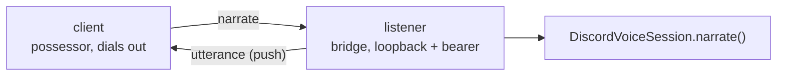

# @clankie/possessor-voice

The loopback seam that lets a possessor commentate
([ADR 0064](../../docs/adr/0064-possessor-voice-seam.md)).

A harness driving Clankie's GBA body holds no Discord gateway, so it holds no
live presence claim and cannot speak for itself. It reports what the body just
did; the process that owns the body in Discord speaks.

## Two halves

| Export                               | Who uses it | What it does                                                                                              |
| ------------------------------------ | ----------- | --------------------------------------------------------------------------------------------------------- |
| `createPossessorVoiceListener`       | the bridge  | Binds `127.0.0.1`, validates the bearer, hands reports to the voice session, pushes transcript lines back |
| `createBrokeredPossessorVoiceClient` | a possessor | Resolves the broker bearer and dials out; `say` / `subscribe`                                             |

The client's shape matches `ClankieSpeechPort` and `ClankieHearingPort` in
`@clankie/gba-mcp` structurally, so neither package imports the other to satisfy
a type.

## What it will not carry

The wire is two messages — `narrate` in, `utterance` out — and adding a third is
a decision, not a patch. A possessor cannot choose an audience, join or leave a
channel, or reach any other presence action from here. It drives the character;
it does not pick new rooms.

Narration is **context, never a script**: the bridge seeds it and the persona
composes the words. Anything needing verbatim speech belongs on the
presence-action path with a live claim.

## Direction and locks

The possessor dials **out**, mirroring the activity frame sink: the
credential-holding process opens no port for the less-trusted side to connect
into, and the listener never binds a routable interface. The broker-minted
`clankie_possessor_voice` bearer is the second lock, not the only one.

Both halves are deny-by-default. No credential, no bridge, or no live voice
session all resolve to a refusal with a reason rather than silence.

## Lossy on purpose

`say` refuses when the bridge is unreachable instead of queueing. A line about a
wall he bumped into is worth nothing thirty seconds later, and a possessor
deserves to learn the body is unreachable rather than believe it spoke.
Utterances published with nobody attached are dropped, never replayed on
connect.
