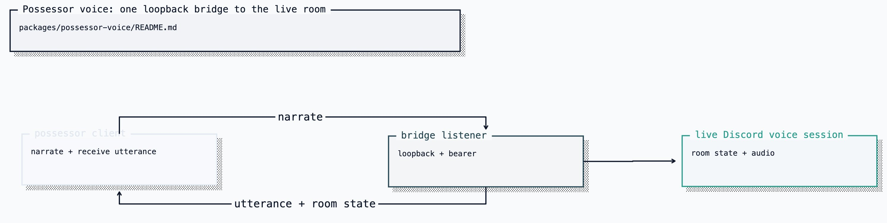

# @clankie/possessor-voice

The canonical loopback seam for gameplay commentary and room hearing
([ADR 0064](../../docs/adr/0064-possessor-voice-seam.md)).

A process driving Clankie's GBA body holds no Discord gateway or live presence
claim. It reports what happened; the Discord body decides whether and how to
speak, and pushes only room input it is already allowed to hear.

[Editable Turbopuffer tldraw source](../../docs/diagrams/clankie-docs-diagrams-2.tldraw)

## API

| Export                               | Consumer              | Responsibility                                                                                |
| ------------------------------------ | --------------------- | --------------------------------------------------------------------------------------------- |
| `createPossessorVoiceListener`       | Discord bridge        | Binds loopback, authenticates the bearer, accepts narration, pushes utterances and room state |
| `createBrokeredPossessorVoiceClient` | Asked play or GBA MCP | Resolves the broker bearer and dials the listener                                             |

The client exposes `narrate`, `subscribe`, `roomListening`, `connected`, and
`close`. The listener exposes `publishUtterance`, `publishRoom`,
`attachedCount`, and `close`. Their shapes satisfy the GBA MCP speech and
hearing ports structurally, so the packages do not import each other's types.

## Wire And Bounds

The wire has three messages: `narrate` enters the bridge; attributed `utterance`
and boolean `room` state are pushed back. Narration and utterances are capped at
2,000 characters; a socket payload is capped at 64 KiB.

Narration is context, never a script. The possessor cannot choose an audience,
join or leave a channel, or reach another presence action. Raw audio and member
identities never cross this seam.

## Direction And Credentials

The bridge opens only a loopback listener. The possessor dials it and presents
the broker-minted `clankie_possessor_voice` bearer, so local binding and
authentication are independent locks. The bridge owns first-run minting;
clients only resolve the stored bearer. `CLANKIE_POSSESSOR_VOICE_TOKEN` is a
hard error.

Enable the seam with `discord.possessorVoiceEnabled` in `/discord` or the
non-secret `CLANKIE_POSSESSOR_VOICE_ENABLED=true` override. The listener
defaults to `ws://127.0.0.1:4323/possessor`;
`CLANKIE_POSSESSOR_VOICE_PORT` changes the bridge port and
`CLANKIE_POSSESSOR_VOICE_URL` changes a GBA MCP client's target.

No credential, bridge, or live voice session returns a typed refusal rather
than false success.

## Loss And Evidence

Narration refuses while disconnected instead of queueing stale commentary.
Utterances published with nobody attached are dropped, never replayed. Current
room state is sent once on attach and on every change.

The listener's optional evidence contains only connection phase,
attached/delivered counts, listening state, delivery ids, and bounded refusal
codes. Narration and utterance text cannot enter the evidence type. A
narration-submission event means the live voice session accepted the report; a
rejected call emits only a refusal.
