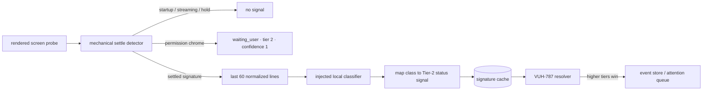

# @clankie/settle-classifier

ADR 0015 Tier-2 waiting-state detection for PTY escape-hatch workers and foreign panes. The package emits heuristic status signals; it does not own authoritative status or precedence.



## Mechanical boundary

`SettleThenClassifier.observe()` consumes rendered screen probes with a monotonic terminal-content sequence and a host timestamp. The defaults mirror the accepted Herdr/v1 constants:

- three quiet probes, counted no faster than every 100 ms;
- a 700 ms working-to-idle hold;
- a visible prompt-box bypass after startup;
- a 3-second startup grace;
- a stable SHA-256 screen signature.

Any rendered change or raw output-sequence change resets settle detection, so erased spinners and other byte activity cannot invoke classification while output is streaming. Permission chrome is a strict strong heuristic and emits `waiting_user` immediately after startup grace without calling a model. Each screen signature is classified at most once for the lifetime of a detector instance, including when a classification becomes stale while in flight.

## Local semantic boundary

The injected `LocalPaneClassifier` must declare `locality: "local"` and run in-process or through a loopback-only local-model transport. `OllamaLocalPaneClassifier` is the concrete transport: it accepts only credential-free `http://127.0.0.1` or `http://localhost` origins, rejects redirects and explicit Ollama cloud model tags, and sends the normalized tail to the local `/api/chat` endpoint with structured output, thinking disabled, temperature `0`, and seed `0`. It passes at most the last 60 lines to `classify`; the cache retains only SHA-256 signatures and status results, not pane text.

Model selection uses the existing layered `clankie.json` surface from `@clankie/model-provider` and needs no credential entry:

```json
{
  "settle_classifier_model": "ollama/qwen3:8b",
  "provider": {
    "ollama": {
      "options": { "baseURL": "http://127.0.0.1:11434/v1" }
    }
  }
}
```

`createConfiguredOllamaPaneClassifier(config)` reads that narrow projection. The base URL defaults to `http://127.0.0.1:11434`; an existing OpenAI-compatible `/v1` suffix is accepted and normalized to Ollama's local API origin. Unit tests inject `fetch` at this boundary, so the standard test suite performs no network I/O.

The classifier returns `finished`, `awaiting_input_required`, `finished_with_offer`, or `errored`. A closing offer is complete work and maps to `idle`; only a required answer maps to `waiting_user` and carries a one-line `questionSummary`. `errored` maps to a low-authority `failed` proposal.

## Authority boundary and follow-ups

Every output is shaped as `{state, tier: 2, source, confidence, observedAt, questionSummary?}`. These are untrusted proposals: the package has no API for Tier-0/1 inputs and cannot override them. VUH-787 owns resolver precedence, event-store integration, attention-queue delivery, and surface rendering. VUH-788 owns the frozen recorded corpus, precision/recall targets, and tier ablation. The fixtures here are implementation regression examples, not that frozen evaluation corpus.
