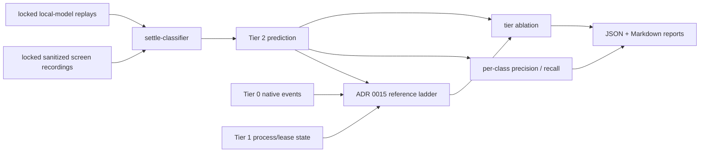

# @clankie/status-detection-evals

Frozen ADR 0015 status-detection evaluation corpus and measurement harness. The package evaluates the read-only `@clankie/settle-classifier` implementation and reports both Tier-2-only behavior and an eval-local Tier-0/1+2 reference ladder.



## Corpus boundary

`fixtures/v1` contains sanitized terminal recordings that preserve rendered Codex, Claude, Pi, and foreign-pane shapes while removing task content, paths, identifiers, and credentials. It covers:

- clean completion from Codex, Claude, and Pi;
- required prose questions without permission chrome;
- visible permission dialogs;
- explicit terminal errors and an externally observed crash/exit;
- a mid-turn quiet gap that resumes before the 700 ms settle hold;
- closing offers that are complete work, not required input.

`corpus-lock.json` fixes the exact file set and SHA-256 of the manifest and every transcript. A fixture or expectation change creates a new corpus version through an eval-owned change; implementation work does not update this corpus. Reports include the corpus identifier and a deterministic hash of the lock.

The local-model outputs are frozen replays so credential-free CI is deterministic. They measure the classifier boundary and the observed baseline, but do not claim live-model variance. Live model runs and hidden holdouts require separately versioned suites.

## Metrics and authority

The manifest records explicit precision and recall targets for `awaiting_input_required`, `finished_with_offer`, `finished`, and `errored`. The intentionally opaque crash fixture records the known Tier-2 limit: optimistic terminal prose cannot reveal a dead process, while Tier 1 can.

The ablation compares Tier 2 alone with a small reference fold that always selects the lowest available tier number. The fold exists only to measure ADR 0015 precedence. VUH-787 owns the production resolver, event-store integration, and TUI/mission-engine surfaces; this package neither imports nor implements them.

## Run

```bash
pnpm --filter @clankie/status-detection-evals test
pnpm --filter @clankie/status-detection-evals eval
```

The eval command writes `artifacts/evals/status-detection/report.json` and `report.md` inside this package. It exits nonzero when any class target, ablation target, or higher-tier precedence invariant fails.
