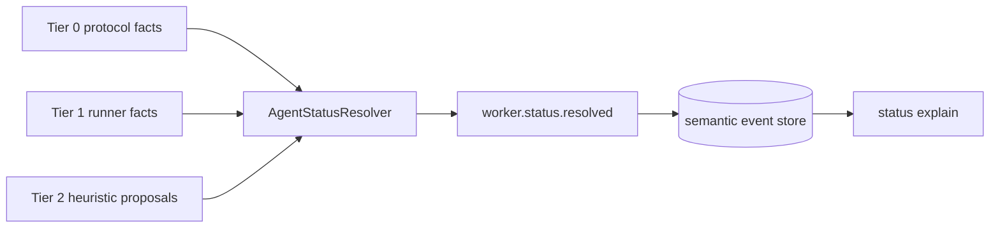

# @clankie/status-resolver

Deterministic ADR 0015 status precedence and explainability. The resolver consumes semantic Tier-0 native lifecycle facts, Tier-1 worker/lease facts, and Tier-2 heuristic proposals, then emits an authoritative `worker.status.resolved` control event. It never consumes terminal frames or pane text.

Known Tier-0/1 state always outranks Tier 2. A Tier-2 attention signal is retained in `attention` and the explain trail without changing the authoritative state. Tier 2 wins only when no known Tier-0/1 state exists. A terminal Tier-1 worker fact invalidates earlier turn facts because the worker lifecycle has ended.

Turn and worker settlement are deliberately distinct:

- `worker.turn.settled` → `idle`, basis `turn_settled`;
- terminal `worker.settled` → `completed`, `failed`, or `blocked`, basis `worker_settled`.

`AgentStatusResolver.replay(events)` rebuilds the same status and signal chain from ordered domain events after a crash. `formatStatusExplain` renders the winning signal, tier, source, confidence, timestamp, every suppressed or invalidated signal, and attention-only proposals.

Tier-2 `unknown` signals may include bounded semantic `degradation` metadata (`code`, underlying
`error`, consecutive failure count, and optional retry time). Replay and resolved-status event data
retain that metadata, and status explain renders it without promoting the degraded heuristic into a
classification.

## Herdr Tier-2 ingestion

`herdrAgentStatusSignalFromEvent` is the pure boundary for parsed
`pane.agent_status_changed` socket events. It maps Herdr's
`working | blocked | idle | done | unknown` vocabulary into Tier-2 resolver
signals with source `herdr`, the host receive timestamp, and bounded
workspace/pane/agent provenance. Herdr `done` maps to resolver `completed`;
"done" remains a presentation label rather than a resolver state.

`registerHerdrStatusIngest` is the optional runtime seam. It does not call its
registrar unless `HERDR_ENV=1`. The runtime supplies the event registrar, a
canonical status-subject lookup, and the ingest callback. That lookup is
required because Herdr pane ids are session-local request locators and are not
durable worker identities.

Captain presence uses a distinct trusted domain rather than a fake worker run.
The resolver accepts typed `captain.turn.*` and
`captain.waiting_dependency` Tier-0 events plus Tier-1
`captain.presence.*`/sparse-heartbeat events. Generic
`worker.status.signal` still rejects Tier 0. A lease-expiry `offline` event
invalidates earlier turn facts, and a later authenticated online generation
starts a fresh status epoch.
